# Asynchronous Multicamera SLAM Using Sparse Gaussian Process Regression

Jinjiang $\operatorname { L i } ^ { \mathbb { P } }$ , Wei Wang , and Yueri Cai

Abstract—Visual simultaneous localization and mapping (VSLAM) is a key technique that enables autonomous systems to localize themselves and incrementally build a map of an unknown environment using only visual information. Despite its importance, conventional VSLAM systems frequently experience drift and tracking failures in complex environments, which limits their overall effectiveness. Multicamera systems have enhanced VSLAM accuracy by incorporating diverse viewpoints. However, they generally rely on synchronous data capture, restricting their applicability in multisensor setups where asynchronous data acquisition is necessary. To address this limitation, a continuoustime asynchronous multicamera simultaneous localization and mapping (AMC-SLAM) framework is proposed, utilizing sparse Gaussian process (GP) regression. The method integrates outlier removal, continuous-time trajectory optimization, and multiview loop closing to achieve robust pose estimation. Combining GP interpolation with bundle adjustment (BA) strengthens intercamera data correlation and reduces the number of state variables, while the derived analytical Jacobians enhance optimization efficiency. Additionally, online estimation of multicamera extrinsic parameters is incorporated to improve the system’s generality. Experimental results on the AMV-Bench dataset demonstrate an absolute translation error (ATE) of less than $0 . 5 \%$ over a $\bf { 1 0 k m }$ trajectory, indicating significant improvements in accuracy over existing stereo and multicamera SLAM systems. The method also exhibits robustness and generalizability on the Newer College dataset in real-world scenarios. These findings underscore the potential of AMC-SLAM for high-precision, robust applications in challenging environments.

Index Terms—Continuous-time trajectory estimation, Gaussian process (GP) regression, multicamera, simultaneous localization and mapping (SLAM).

# I. INTRODUCTION

IMULTANEOUS localization and mapping (SLAM) is critical for enabling a robot to navigate effectively within unknown environments. Visual SLAM (VSLAM), in particular, has gained widespread popularity due to the costeffectiveness of visual sensors and their ability to capture rich environmental details around the robot. While modern VSLAM systems [3], [4], [5] can accurately estimate the robot’s state and construct environmental maps in simple

Received 5 March 2025; revised 29 April 2025; accepted 10 June 2025. Date of publication 27 June 2025; date of current version 3 July 2025. This work was supported by the Fundamental Research Funds for the Central Universities under Grant JK2024-50-02. The Associate Editor coordinating the review process was Dr. Dan Zhang. (Corresponding author: Yueri Cai.)

The authors are with the School of Mechanical Engineering and Automation, Beihang University, Beijing 100191, China (e-mail: ljjbuaa@ buaa.edu.cn; wangweilab@buaa.edu.cn; caiyueri@buaa.edu.cn).

Digital Object Identifier 10.1109/TIM.2025.3582329

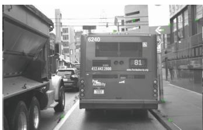  
(a）

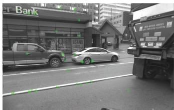  
(b)

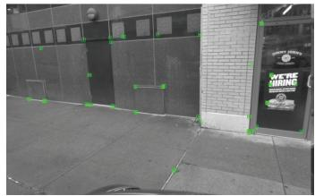  
（c）  
Fig. 1. Performance of AMC-SLAM in a dynamic environment. The proposed method effectively discards features from moving vehicles by utilizing additional static features captured from the left and right cameras. (a) Front camera. (b) Left camera. (c) Right camera.

conditions, they often experience drift and tracking failures in challenging environments. Thus, enhancing the robustness of VSLAM is essential for reliable performance under diverse operating conditions.

Dynamic environments present a challenging setting for SLAM, as the presence of dynamic objects often leads to severe failures. As a result, many studies have focused on addressing the SLAM problem in dynamic environments. These issues are typically tackled using two approaches. Deep learning-based methods leverage neural networks to extract semantic information from the environment and combine this with geometric constraints to mitigate the effects of dynamic objects [6], [7], [8], [9]. However, these methods generally require GPU support, preventing real-time operation on the CPU and resulting in high computational costs. Geometric constraint-based methods [10], on the other hand, combine IMU data with various geometric constraints, such as coplanarity constraints, to remove dynamic points, achieving robust and high-precision localization in dynamic environments even on a CPU. While these SLAM systems can enhance robustness in dynamic environments, they may fail in other complex scenarios, such as glare or low-texture conditions, where a single camera may become unreliable.

Multicamera systems, however, can avoid this issue by providing a broader field of view (FOV), offering not only

TABLE I COMPARATIVE ANALYSIS OF AMC-SLAM SYSTEMS   

<table><tr><td>Method</td><td>Sensor</td><td>Online Calibration</td><td>Outlier Rejection</td><td>Loop Closing</td><td>Asynchronous Data Processing</td></tr><tr><td>AMC-SLAM (Proposed)</td><td>Multi-camera</td><td>Yes</td><td>All cameras jointly</td><td>Yes</td><td>Sparse GP Regression</td></tr><tr><td>AMV-SLAM [1]</td><td>Multi-camera</td><td>No</td><td>Not implemented</td><td>Yes</td><td>B-spline</td></tr><tr><td>MIMC-VINS [14]</td><td>Multi-camera + IMU</td><td>Yes</td><td>Per-camera individual</td><td>No</td><td>High-order polynomial</td></tr><tr><td>VINS-Multi [15]</td><td>Multi-camera + IMU</td><td>No</td><td>Per-camera individual</td><td>No</td><td>Sliding window</td></tr></table>

strong robustness in dynamic environments (Fig. 1) but also higher resilience in other challenging scenarios. Therefore, multicamera systems have attracted considerable interest. By fusing information from multiple cameras, many studies [11], [12], [13] have enhanced both the robustness and accuracy of VSLAM. However, most existing multicamera SLAM systems depend on synchronous camera setups, limiting their applicability in scenarios where cameras operate asynchronously. If multiple cameras are not hardware-synchronized, the data captured by each camera will not correspond to the same timestamp. Although hardware synchronization can ensure simultaneous triggering, it becomes technically complex and costly, especially as the number or variety of cameras increases, thereby restricting broader applications. Additionally, in scenarios involving LiDAR and multicamera data fusion, the LiDAR point cloud data is collected at different times. This requires asynchronous triggering of multiple cameras with different fields of view to facilitate the alignment of corresponding point clouds, resulting in asynchronous data capture across cameras. If the asynchronous data of multicamera systems is not addressed, discrepancies can arise between the pose estimation time and the image capture time, ultimately reducing system robustness and accuracy. Consequently, resolving the issue of asynchronous multicamera data is essential for achieving reliable performance in diverse and challenging environments.

This article presents asynchronous multicamera SLAM (AMC-SLAM), a continuous-time AMC-SLAM framework employing sparse Gaussian process (GP) regression. Existing approaches exhibit limitations in handling asynchronous visual streams while maintaining operational robustness, as systematically compared in Table I. While recent IMU-dependent methods, such as MIMC-VINS [14] and VINS-Multi [15], achieve temporal alignment through inertial fusion, their reliance on high-quality IMU data limits deployment in noninertial or vision-only scenarios. In contrast, the proposed vision-centric framework eliminates this dependency. Crucially, unlike AMV-SLAM [1] and VINS-Multi, which neglect online extrinsic calibration—vital for long-term operation with nonoverlapping asynchronous camera rigs that are difficult to calibrate—AMC-SLAM estimates camera extrinsic parameters online through joint optimization of asynchronous observations.

MIMC-VINS and VINS-Multi lack loop closure capabilities despite multicamera geometric observability, and their percamera outlier rejection mechanisms fail to exploit cross-view consistency. In contrast, AMC-SLAM addresses these gaps with outlier filtering that correlates features across all cameras, coupled with a multicamera loop closure detector leveraging

view diversity. Sparse GP regression differentiates itself from B-spline or polynomial-based representations by enabling probabilistic trajectory modeling with a sparse Gaussian prior, thus circumventing the computational complexity of B-splines and the oscillation risks inherent to high-order polynomials. The main contributions of this work are as follows.

1) A continuous-time AMC-SLAM system is proposed, based on sparse GP regression, which integrates key components such as outlier removal, continuous-time trajectory optimization, and multiview loop closing.   
2) GP interpolation is integrated with bundle adjustment (BA) to enhance data correlation between cameras and reduce the number of state variables, while the derived analytical Jacobians improve optimization efficiency. Additionally, online calibration of multicamera extrinsic parameters is incorporated to enhance the system’s generality.   
3) Experimental validation across two public datasets and challenging real-world scenarios demonstrates that the framework achieves superior pose estimation accuracy, outperforming existing stereo and multicamera SLAM approaches. The code is publicly available.1

# II. RELATED WORK

# A. Continuous-Time Trajectory Representation

One prominent approach to integrating asynchronous sensors is to represent trajectories using continuous-time models, among which B-splines and GP are commonly applied. Furgale et al. [16] introduced a framework leveraging Bspline to transform maximum likelihood problems from discrete to continuous time. Building on B-splines, Hug et al. [17] developed a continuous-time SLAM framework adaptable to diverse sensor combinations, such as stereo and stereo-inertial systems. Addressing motion distortion in rolling shutter camera and sensor misalignment issues between camera and IMU, Lang et al. [18] proposed a continuoustime visual-inertial odometry (VIO) method based on B-splines, achieving online calibration for exposure time variations in rolling shutter cameras. CB-VIO [19] constructs an event tracking model within a continuous spatiotemporal window using cubic B-splines, enabling pose interpolation in SE(3). This approach enhances the data association success rate of event cameras in low-texture and dynamic scenes.

However, traditional uniform B-splines encounter challenges with dynamic motion and real-time computational demands. Lang et al. [20] tackled these limitations by introducing a continuous-time LiDAR inertial-camera odometry

approach based on nonuniform B-splines, which enhances efficiency and accuracy through adaptive control point distribution. Despite the effectiveness of parametric B-splines in representing motion trajectories, they lack the capability to quantify trajectory uncertainty and often compromise the sparsity of SLAM formulations, which increases computational complexity [21].

An alternative trajectory modeling approach, proposed by [22], employs sparse GP to represent continuous-time trajectories, modeling system dynamics as white-noise-onacceleration (WNOA) to preserve sparsity. Yan et al. [23] used the WNOA prior to sparse GP and the interpolation method to design an efficient incremental algorithm by combining GP interpolation with trajectory optimization to enhance computational efficiency. However, their method is not specifically designed for multicamera systems. To improve the adaptability of sparse GP for dynamic trajectories, Tang et al. [24] introduced a new motion prior based on a white-noise-onjerk (WNOJ) model, achieving enhanced accuracy in trajectory estimation. Building on this, Zhang et al. [25] proposed a global continuous-time trajectory estimation framework using the WNOJ model, which integrates GNSS with other asynchronous sensors without synchronization.

Considering that the WNOA prior sufficiently meets the needs of mobile robotics while balancing time complexity and accuracy, our method adopts the WNOA prior instead of the more complex WNOJ prior.

# B. Multicamera SLAM

In recent years, multicamera SLAM has attracted substantial attention due to its potential for enhanced accuracy and robustness in complex environments. MultiCol-SLAM [26] extended the ORB-SLAM [27] to support multiple rigidly coupled fisheye cameras, providing improved performance in challenging scenarios. Further advancing this area, Liu et al. [28] proposed a multicamera visual odometry approach that supports an arbitrary number of stereo cameras, facilitating adaptability in various configurations. To address design flexibility in multicamera SLAM systems, Kuo et al. [13] introduced a general adaptive SLAM system that operates independently of specific camera arrangements. Moreover, Zhang et al. [11] refined feature association across cameras within multicamera SLAM, selecting a fixed number of features to ensure reduced backend optimization time without compromising tracking accuracy. Expanding on these contributions, Kaveti et al. [12] proposed a generalized multicamera SLAM framework that accommodates diverse camera configurations, defining a generalized camera model and cross-matching feature points in overlapping fields of view. This design controls feature density and optimizes computational efficiency. While previous research primarily focused on synchronized multicamera (sync-MC) systems, there is an emerging need to address asynchronous multicamera. Eckenhoff et al. [14] and Wang et al. [15] presented an asynchronous multicamera-multi-IMU odometry method, utilizing data from asynchronous cameras and IMU within a sliding window to estimate system states. However, this approach depends on high-quality IMU data. Yang et al. [1] developed a continuous-time AMC-SLAM system using a

B-spline-based continuous-time trajectory model to associate asynchronous multicamera data, demonstrating high accuracy and robustness on the autonomous driving dataset. Despite these benefits, the B-spline approach disrupts SLAM problem sparsity, especially in higher-order cases, thereby reducing computational efficiency.

To overcome these limitations, continuous-time trajectory modeling is implemented using sparse GP with a WNOA motion prior. This approach, combined with sparse GP interpolation, enables efficient continuous-time trajectory optimization and maximizes the utility of asynchronous multicamera.

# III. METHODOLOGY

The overview of AMC-SLAM is depicted in Fig. 2. AMC-SLAM is an extension of ORB-SLAM3 [3], incorporating asynchronous images from multiple cameras within a given period by utilizing multiframe (MF) (Section III-B). For each incoming MF, ORB features are extracted from each image in parallel and matched against map points. These matches are filtered using motion-compensated random sample consensus (MC-RANSAC) (Section III-C) to select inliers. To address the challenges posed by asynchronous cameras and enable a unified state estimation using observations from all cameras, a continuous-time trajectory (Section III-D) is employed to represent the system states, in contrast to the discrete states used in traditional SLAM approaches. Motion-only BA is then performed on these inliers through continuous-time trajectory optimization (Section III-E). Local BA further refines the trajectory by optimizing a sliding window of key MFs (KMFs) and all map points observed in those MFs while simultaneously estimating multicamera extrinsic parameters (Section III-F). Finally, multiview loop closing is applied to detect loops and correct drift (Section III-G).

# A. Notation

In this article, the following notations are introduced. For a multicamera configuration, the pose of the jth $( 1 ~ \leq ~ j ~ \leq$ $N _ { . }$ ) camera frame relative to the body frame is defined as $\mathbf { T } _ { \mathrm { b c } _ { j } } = \left[ \begin{array} { l l } { \mathbf { R } _ { \mathrm { b c } _ { j } } } & { \mathbf { t } _ { \mathrm { b c } _ { j } } } \\ { \mathbf { 0 } ^ { \top } } & { \phantom { + } 1 } \end{array} \right] \in \mathrm { S E } ( 3 )$ Rbcj , where $\mathbf { R } _ { \mathrm { b c } _ { j } } \in \mathrm { S O } ( 3 )$ represents the rotation matrix, and $\mathbf { t } _ { \mathrm { b c } _ { j } } ~ \in ~ \mathbb { R } ^ { 3 }$ denotes the translation vector. Similarly, the pose of the body frame relative to the world frame at time $t$ is represented by $\mathbf { T } _ { \mathrm { w b } } ( t )$ . The function $\pi _ { j } ( \cdot ) : \mathbb { R } ^ { 3 } \to \mathbb { R } ^ { 2 }$ denotes the perspective projection of the jth camera.

For optimization on Lie groups, the body velocity is defined as $\boldsymbol { \varpi } _ { b } = [ \mathbf { v } _ { b } , \boldsymbol { \omega } _ { b } ] ^ { \intercal } \in \mathbb { R } ^ { 6 }$ , where $\mathbf { v } _ { b } \in \mathbb { R } ^ { 3 }$ is the linear velocity and $\boldsymbol { \omega _ { b } } \in \mathbb { R } ^ { 3 }$ ωis the angular velocity of the body frame. The ωexponential map, denoted as Exp(·), is given by $\underline { { \mathrm { e x p } } } ( \varpi _ { b } ^ { \wedge } )$ , which maps $\mathbb { R } ^ { 6 }$ to SE(3). Here, $\pmb { \varpi } _ { b } ^ { \wedge } = \left[ \begin{array} { c c } { [ \pmb { \omega } _ { b } ] _ { \times } } & { \mathbf { v } _ { b } } \\ { \mathbf { 0 } ^ { \top } } & { 0 } \end{array} \right] \in \mathfrak { s e } ( 3 ) .$ , where $[ \omega _ { b } ] _ { \times }$ is the $3 \times 3$ skew-symmetric matrix of $\omega _ { b }$ . The ωinverse of the exponential map is denoted as $\operatorname { L n } ( \cdot )$ ω. The adjoint matrix associated with $\mathbf { T } \in \mathrm { S E } ( 3 )$ is represented by $\mathbf { A d } ( \mathbf { T } ) :$ $\mathrm { S E } ( 3 )  \mathbb { R } ^ { 6 \times 6 }$ , and the adjoint matrix of $\pmb { \varpi } _ { b } ^ { \wedge }$ is denoted as $\mathrm { a d } ( \pmb { \varpi } _ { b } ^ { \wedge } ) : \mathfrak { s e } ( 3 )  \mathbb { R } ^ { 6 \times 6 }$ . Additionally, $\mathcal { T } _ { r } ( \cdot ) : \mathbb { R } ^ { 6 }  \mathbb { R } ^ { 6 \times 6 }$ is

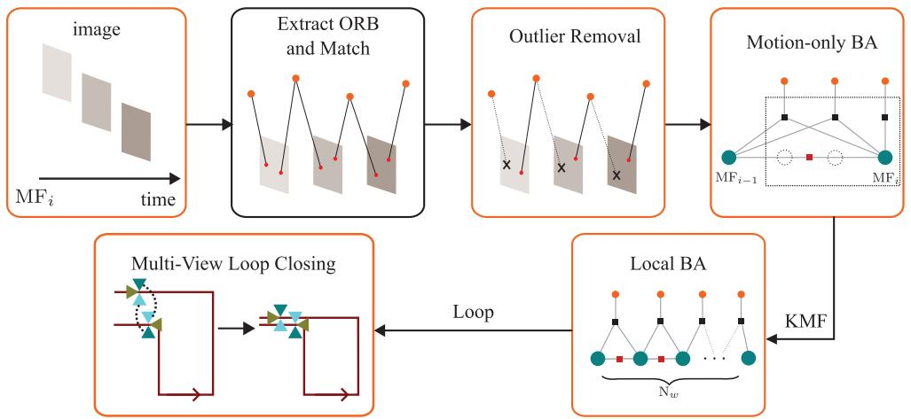  
Fig. 2. Overview of AMC-SLAM: the system first acquires images from multiple cameras, then extracts and matches ORB features to map points in parallel. Outliers are removed via MC-RANSAC, after which motion-only BA optimizes the continuous-time trajectory using inliers. In local BA, KMFs are added to a sliding-window optimization for trajectory refinement. Multiview loop closing is used to detect loops and correct drift.

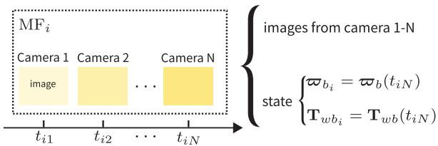  
Fig. 3. Illustration of an MF structure. $\mathrm { M F } _ { i }$ , representing the ith MF, includes images captured from time $t _ { i 1 }$ to tiN . Twb and $\pmb { \varpi } _ { b _ { i } }$ , corresponding to the latest $capture time, represent the body frame pose and velocity of $\mathrm { M F } _ { i }$ , respectively.

the right Jacobian of SE(3). Tp denotes the transformation $\mathbf { R } \mathbf { p } + \mathbf { t }$ , while Tp represents a homogeneous transformation from $\mathbb { R } ^ { 4 }$ to $\mathbb { R } ^ { 4 }$ , where $\overline { { \mathbf { p } } } \in \mathbb { R } ^ { 4 }$ is the homogeneous coordinate of $\mathbf { p } \in \mathbb { R } ^ { 3 }$ .

# B. Multiframe

AMC-SLAM utilizes an MF structure handle asynchronous image data efficiently. This design is essential due to the nature of the input, which consists of images from multiple asynchronous cameras, making it impractical to associate all data with a single temporal point. As shown in Fig. 3, the ith MF structure retains two critical pieces of information: 1) images captured by multiple cameras over a certain period, each annotated with its corresponding timestamp $t _ { i j }$ , where $t _ { i j }$ denotes the time at which the jth image was taken; and 2) the body frame pose $\mathbf { T } _ { \mathbf { w b } _ { i } }$ and body frame velocity $\pmb { \varpi } _ { b _ { i } }$ at the time of the most recent image capture.

In the proposed method, the criteria for selecting KMFs are refined using distance and angle thresholds, in addition to the criteria outlined in [3]. Specifically, to ensure trajectory continuity, the current MF is selected as a KMF when the displacement exceeds $2 \textrm { m }$ or the rotational change surpasses $5 ^ { \circ }$ . These threshold values were empirically determined to mitigate tracking loss during high-speed motion. Furthermore, the creation of KMFs is suppressed when the system is determined to be stationary based on the velocity estimation, thus preventing the accumulation of redundant KMFs.

# C. Outlier Removal

In MF processing, feature points are extracted from images and subsequently matched with the corresponding map points. Although the incorporation of multiple cameras significantly enhances the number of feature points, it also introduces more outliers. Consequently, it becomes essential to filter these matches, retaining only the inliers. While traditional SLAM systems typically rely on the RANSAC algorithm to eliminate outliers, its reliance on discrete motion models limits its efficacy in handling asynchronous observation scenarios. To handle asynchronous observations, an MC-RANSAC algorithm is implemented, based on the method proposed in [29]. This approach leverages a continuous motion model, enabling more effective outlier filtering in the context of asynchronous multicamera observations.

MC-RANSAC assumes that the body velocity, denoted by $\pmb { \varpi } _ { b _ { i } }$ , remains constant between two consecutive MFs, $\mathrm { M F } _ { i - 1 }$ $and current MF (MFi). Observations that violate this motion model are classified as outliers. The body pose at the time of the jth image within $\mathrm { M F } _ { i }$ can be modeled as follows:

$$
\mathbf {T} _ {\mathrm {w b}} \left(t _ {i j}\right) = \mathbf {T} _ {\mathrm {w b} _ {i - 1}} \operatorname {E x p} \left(\varpi_ {b _ {i}} \Delta t _ {i, j}\right) \tag {1}
$$

where $\Delta t _ { i , j } = t _ { i j } - t _ { ( i - 1 ) N }$

,Consider a matching pair $( \pmb { \mathrm { p } } _ { m } , \pmb { z } _ { m j } ^ { i } )$ in $\mathrm { M F } _ { i }$ , where $\mathbf { p } _ { m }$ ,represents the coordinates of the mth map point in the world frame, and $\mathbf { z } _ { m j } ^ { i }$ denotes the observation of $\mathbf { p } _ { m }$ in the jth image of $\mathrm { M F } _ { i }$ . The relationship between these variables is described by the following observation model:

$$
\mathbf {z} _ {m, j} ^ {i} = \pi_ {j} \left(\left(\mathbf {T} _ {\mathrm {w b}} \left(t _ {i j}\right) \mathbf {T} _ {\mathrm {b c} _ {j}}\right) ^ {- 1} \mathbf {p} _ {m}\right) + \mathbf {n} _ {m, j} \tag {2}
$$

where $\mathbf { n } _ { m , j }$ represents the observation noise, assumed to follow ,a Gaussian distribution: $\mathbf { n } _ { m , j } \sim \mathcal { N } ( 0 , \mathbf { R } _ { m , j } )$ .

, , ,By combining (1) and (2), the reprojection error function for asynchronous multicamera observations based on the continuous motion model is derived as follows:

$$
\mathbf {e} _ {\text {r a n c}} ^ {i, m, j} = \mathbf {z} _ {m, j} ^ {i} - \pi_ {j} \left(\left(\mathbf {T} _ {\mathrm {w b} _ {i - 1}} \operatorname {E x p} \left(\varpi_ {b _ {i}} \Delta t _ {i, j}\right) \mathbf {T} _ {\mathrm {b c} _ {j}}\right) ^ {- 1} \mathbf {p} _ {m}\right). \tag {3}
$$

From all observations, $N _ { \mathrm { r a n c } }$ pairs of observations are randomly selected to form the set $\mathcal { M }$ , resulting in the following cost function:

$$
J _ {\text {r a n c}} \left(\boldsymbol {\varpi} _ {b _ {i}}\right) = \frac {1}{2} \sum_ {(m, j) \in \mathcal {M}} \left(\mathbf {e} _ {\text {r a n c}} ^ {i, m, j}\right) ^ {\top} \mathbf {R} _ {m, j} \mathbf {e} _ {\text {r a n c}} ^ {i, m, j}. \tag {4}
$$

By minimizing the cost function, the optimal constant velocity is determined as follows:

$$
\boldsymbol {\varpi} _ {b _ {i}} ^ {*} = \underset {\boldsymbol {\varpi} _ {b _ {i}}} {\arg \min } J _ {\text {r a n c}} \left(\boldsymbol {\varpi} _ {b _ {i}}\right). \tag {5}
$$

The Gauss-Newton method is employed to solve this optimization problem, where the optimization variables are updated iteratively until convergence

$$
\boldsymbol {\varpi} _ {b _ {i}} = \boldsymbol {\varpi} _ {b _ {i}} + \delta \boldsymbol {\varpi} _ {b _ {i}}. \tag {6}
$$

The increment $\delta \pmb { \varpi } _ { b _ { i } }$ is computed as follows:

$$
\delta \boldsymbol {\varpi} _ {b _ {i}} = - \mathbf {H} ^ {- 1} \mathbf {g} \tag {7}
$$

where H and $\mathbf { g }$ denote the approximate Hessian matrix and the gradient of the cost function, respectively

$$
\mathbf {H} = \sum_ {(m, j) \in \mathcal {M}} \mathbf {J} _ {m, j} ^ {\top} \mathbf {R} _ {m, j} ^ {- 1} \mathbf {J} _ {m, j}
$$

$$
\mathbf {g} = \sum_ {(m, j) \in \mathcal {M}} \mathbf {J} _ {m, j} ^ {\top} \mathbf {R} _ {m, j} ^ {- 1} \mathbf {e} _ {\text {r a n c}, m, j}. \tag {8}
$$

The Jacobian matrix $\mathbf { J } _ { m , j }$ of (3) is expressed as follows:

$$
\mathbf {J} _ {m, j}
$$

$$
= \frac {\partial \pi_ {j} (\mathbf {p})}{\partial \mathbf {p}} \left(\mathbf {T} _ {\mathrm {b c} _ {j}} ^ {- 1} \left(\mathbf {T} _ {\mathrm {w b} _ {i - 1}} ^ {- 1} \overline {{\mathbf {p}}} _ {m}\right) ^ {\odot} \mathcal {J} _ {r} \left(- \varpi_ {b _ {i}} \Delta t _ {i, j}\right) \Delta t _ {i, j}\right) _ {1: 3} \tag {9}
$$

where $\mathbf { \overline { { p } } } ^ { \odot } = \left[ \epsilon \mathbf { \overline { { \eta } } } \right] ^ { \odot } = \left[ \eta \mathbf { 1 } \right. \quad \left. - [ \epsilon ] \times \right] , ( \partial \pi _ { j } ( \mathbf { p } ) / \partial \mathbf { p } )$ represents the ηJacobian of the camera projection model, and $( \cdot ) _ { 1 : 3 }$ extracts the first three rows of the matrix.

By substituting the computed optimal velocity $\varpi _ { b _ { i } } ^ { * }$ into (3), the reprojection error for each matching pair $( \pmb { \mathrm { p } } _ { m } , \pmb { z } _ { m j } ^ { i } )$ i s ,evaluated and compared against a predefined threshold $\epsilon _ { \mathrm { r a n c } }$ . Based on this comparison, each matching pair is classified as either an inlier or an outlier. This process of randomly selecting observations and estimating the velocity is iterated $N _ { \mathrm { i t e r } }$ times, with the classification yielding the highest number of inliers chosen as the final segmentation.

# D. Continuous-Time Trajectory

To fuse asynchronous observations from multiple cameras, the system state is modeled using a continuous-time trajectory. This approach is preferred over traditional discrete-time representations, which are limited to handling observations at specific time points and are thus ineffective for associating asynchronous data. Sparse GP [30] is chosen to represent the continuous-time trajectory due to its ability to explicitly capture trajectory uncertainty while preserving the sparsity of the SLAM system. The state of $\mathrm { M F } _ { i }$ is defined as follows:

$$
\mathbf {x} _ {i} = \left\{\mathbf {T} _ {\mathrm {w b} _ {i}}, \boldsymbol {\varpi} _ {b _ {i}} \right\}. \tag {10}
$$

1) Sparse GP Prior: The GP prior defines the prior distribution over continuous-time trajectories, while GP regression leverages this prior information to estimate such trajectories. The sparse GP prior proposed in [30] assumes constant velocity in the world frame. However, for ground-based mobile robots, it is more appropriate to assume constant velocity in the body frame. To account for this, the local GP prior for $\mathrm { M F } _ { i }$ is adopted, as introduced in [31]. The local WNOA motion GP prior is defined as follows:

$$
\mathbf {T} _ {\mathrm {w b}} (t) = \mathbf {T} _ {\mathrm {w b} _ {i - 1}} \operatorname {E x p} (\xi_ {i} (t))
$$

$$
\ddot {\boldsymbol {\xi}} _ {i} (t) \sim \mathcal {G P} \left(\mathbf {0}, \mathbf {Q} _ {c} \delta \left(t - t ^ {\prime}\right)\right) \tag {11}
$$

where $\mathbf { Q } _ { c } \in \mathbb { R } ^ { 6 \times 6 }$ represents the power spectral density matrix, time $t$ satisfies $t _ { ( i - 1 ) N } \leq t \leq t _ { i N }$ , and $\delta ( t - t ^ { \prime } )$ denotes the Dirac delta function.

From (11), it follows that

$$
\boldsymbol {\xi} _ {i} (t) = \operatorname {L n} \left(\mathbf {T} _ {\mathrm {w b} _ {i - 1}} ^ {- 1} \mathbf {T} _ {\mathrm {w b}} (t)\right). \tag {12}
$$

The relationship between $\dot { \pmb { \xi } } _ { i } ( t )$ and ${ \pmb { \varpi } } _ { b } ( t )$ is given by [31]

$$
\dot {\boldsymbol {\xi}} _ {i} (t) = \mathcal {J} _ {r} (\boldsymbol {\xi} _ {i} (t)) ^ {- 1} \boldsymbol {\varpi} _ {b} (t). \tag {13}
$$

The prior error formulation stems from the WNOA assumption in (11), where $\ddot { \pmb { \xi } } _ { i } ( t )$ is modeled as Gaussian white noise. ξThis implies constant velocity motion within $t _ { ( i - 1 ) N } \leq t \leq t _ { i N }$ . The prior error term is formulated as follows:

$$
\begin{array}{l} \mathbf {e} _ {\text {p r i o r}} ^ {i} = \left[ \begin{array}{c} \boldsymbol {\xi} _ {i} (t _ {i N}) \\ \dot {\boldsymbol {\xi}} _ {i} (t _ {i N}) \end{array} \right] - \boldsymbol {\Phi} (\Delta t _ {i, N}) \left[ \begin{array}{c} \boldsymbol {\xi} _ {i} (t _ {(i - 1) N}) \\ \dot {\boldsymbol {\xi}} _ {i} (t _ {(i - 1) N}) \end{array} \right] \\ = \left[ \begin{array}{l} \operatorname {L n} \left(\mathbf {T} _ {\mathrm {w b} _ {i - 1}} ^ {- 1} \mathbf {T} _ {\mathrm {w b} _ {i}}\right) - \boldsymbol {\varpi} _ {b _ {i - 1}} \Delta t _ {i, N} \\ \mathcal {J} _ {r} \left(\operatorname {L n} \left(\mathbf {T} _ {\mathrm {w b} _ {i - 1}} ^ {- 1} \mathbf {T} _ {\mathrm {w b} _ {i}}\right)\right) ^ {- 1} \boldsymbol {\varpi} _ {b _ {i}} - \boldsymbol {\varpi} _ {b _ {i - 1}} \end{array} \right] \tag {14} \\ \end{array}
$$

where the state transition matrix $\Phi ( \Delta t )$ is defined as follows:

$$
\boldsymbol {\Phi} (\Delta t) = \left[ \begin{array}{c c} \mathbf {1} & \Delta t \mathbf {1} \\ \mathbf {0} & \mathbf {1} \end{array} \right]. \tag {15}
$$

Applying the GP prior to the system through GP regression results in the following prior cost function:

$$
J _ {\text {p r i o r}} ^ {i} \left(\mathbf {x} _ {i - 1}, \mathbf {x} _ {i}\right) = \frac {1}{2} \left(\mathbf {e} _ {\text {p r i o r}} ^ {i}\right) ^ {\top} \mathbf {Q} _ {i, N} ^ {- 1} \mathbf {e} _ {\text {p r i o r}} ^ {i} \tag {16}
$$

where $\mathbf { Q } _ { i , j }$ denotes the covariance matrix [32]

$$
\mathbf {Q} _ {i, j} = \left[ \begin{array}{l l} \frac {1}{3} \Delta t _ {i, j} ^ {3} \mathbf {Q} _ {c c} & \frac {1}{2} \Delta t _ {i, j} ^ {2} \mathbf {Q} _ {c c} \\ \frac {1}{2} \Delta t _ {i, j} ^ {2} \mathbf {Q} _ {c c} & \Delta t _ {i, j} \mathbf {Q} _ {c c} \end{array} \right]. \tag {17}
$$

2) Interpolation: GP interpolation is employed to estimate the state at the measurement time within $\mathrm { M F } _ { i }$ [22]. The interpolation is computed based on the states of both $\mathrm { M F } _ { i - 1 }$ and $\mathrm { M F } _ { i }$ as reference, defined as follows [31]:

$$
\mathbf {T} _ {\mathrm {w b}} \left(t _ {i j}\right) = \mathbf {T} _ {\mathrm {w b} _ {i - 1}} \operatorname {E x p} \left(\boldsymbol {\Lambda} _ {1} \left(t _ {i j}\right) \boldsymbol {\gamma} _ {i - 1} + \boldsymbol {\Psi} _ {1} \left(t _ {i j}\right) \boldsymbol {\gamma} _ {i}\right) \tag {18}
$$

$$
\boldsymbol {\varpi} _ {b} \left(t _ {i j}\right) = \mathcal {J} _ {r} \left(\xi_ {i} \left(t _ {i j}\right)\right) ^ {- 1} \left(\Lambda_ {2} \left(t _ {i j}\right) \boldsymbol {\gamma} _ {i - 1} + \boldsymbol {\Psi} _ {2} \left(t _ {i j}\right) \boldsymbol {\gamma} _ {i}\right) \tag {19}
$$

where

$$
\begin{array}{l} \boldsymbol {\Lambda} (t _ {i j}) = \left[ \boldsymbol {\Lambda} _ {1} (t _ {i j}), \boldsymbol {\Lambda} _ {2} (t _ {i j}) \right] ^ {\top} \\ = \boldsymbol {\Phi} (\Delta t _ {i, j}) - \mathbf {Q} _ {i, j} \boldsymbol {\Phi} (\Delta t _ {i, j}) ^ {\top} \mathbf {Q} _ {i, N} ^ {- 1} \boldsymbol {\Phi} (\Delta t _ {i, N}) \\ \end{array}
$$

$$
\begin{array}{l} \boldsymbol {\Psi} (t _ {i j}) = \left[ \boldsymbol {\Psi} _ {1} (t _ {i j}), \boldsymbol {\Psi} _ {2} (t _ {i j}) \right] ^ {\top} = \mathbf {Q} _ {i, j} \boldsymbol {\Phi} (\Delta t _ {i, j}) ^ {\top} \mathbf {Q} _ {i, N} ^ {- 1} \\ \gamma_ {i - 1} = \left[ \begin{array}{c} 0 \\ \varpi_ {b _ {i - 1}} \end{array} \right], \quad \gamma_ {i} = \left[ \begin{array}{c} \xi_ {i} (t _ {i N}) \\ \mathcal {J} _ {r} (\xi_ {i} (t _ {i N})) ^ {- 1} \varpi_ {b _ {i}} \end{array} \right]. \\ \end{array}
$$

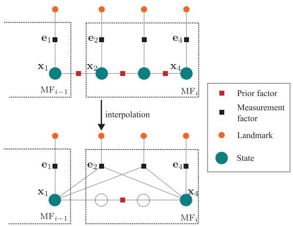  
Fig. 4. Factor graph of motion-only BA. By utilizing GP interpolation, the state estimation within $\mathrm { M F } _ { i }$ is significantly simplified, reducing the need to estimate multiple state variables for multicamera to estimating only a single state variable.

# E. Motion-Only BA

In motion-only BA, inliers obtained from MC-RANSAC are employed to estimate the state of the $\mathrm { M F } _ { i }$ . These inliers are gathered across multiple time points. To maximize the utility of asynchronous inliers, it is crucial to estimate the system state at each moment. However, this approach increases the dimensionality of the problem and weakens the intercamera data correlation, which in turn reduces system accuracy. To mitigate this issue, state estimation is restricted to the final state of $\mathrm { M F } _ { i }$ using GP interpolation. The factor graph employed for motion-only BA is shown in Fig. 4.

1) Optimization: The measurement error term is first defined as follows:

$$
\mathbf {e} _ {\text {m e a s}} ^ {i, m, j} = \mathbf {z} _ {m, j} ^ {i} - \pi_ {j} \left(\left(\mathbf {T} _ {\mathrm {w b}} \left(t _ {i j}\right) \mathbf {T} _ {\mathrm {b c} _ {j}}\right) ^ {- 1} \mathbf {p} _ {m}\right) \tag {20}
$$

where $\mathbf { T } _ { \mathrm { w b } } ( t _ { i j } )$ is computed by (18).

Next, the measurement cost function, involving a set of inliers $\mathcal { M } _ { i }$ , is given by the following equation:

$$
J _ {\text {m e a s}} ^ {i} \left(\mathbf {x} _ {i - 1}, \mathbf {x} _ {i}\right) = \frac {1}{2} \sum_ {(m, j) \in \mathcal {M} _ {i}} \left(\mathbf {e} _ {\text {m e a s}} ^ {i, m, j}\right) ^ {\top} \mathbf {R} _ {m, j} ^ {- 1} \mathbf {e} _ {\text {m e a s}} ^ {i, m, j}. \tag {21}
$$

The overall cost function for motion-only BA is then expressed as follows:

$$
J _ {\text {m o t i o n}} ^ {i} \left(\mathbf {x} _ {i - 1}, \mathbf {x} _ {i}\right) = J _ {\text {p r i o r}} ^ {i} + J _ {\text {m e a s}} ^ {i}. \tag {22}
$$

The Gauss-Newton method is employed to minimize the total cost function

$$
\left\{\mathbf {x} _ {i - 1} ^ {*}, \mathbf {x} _ {i} ^ {*} \right\} = \underset {\left\{\mathbf {x} _ {i - 1}, \mathbf {x} _ {i} \right\}} {\arg \min } J _ {\text {m o t i o n}} ^ {i} \left(\mathbf {x} _ {i - 1}, \mathbf {x} _ {i}\right) \tag {23}
$$

with the Jaocabian matrix $\mathbf { A } ^ { i }$ of (14) with respect to $\left\{ \mathbf { x } _ { i - 1 } , \mathbf { x } _ { i } \right\}$

$$
\mathbf {A} ^ {i} = \left[ \begin{array}{c c c c} \mathbf {A} _ {1 1} ^ {i} & - \Delta t _ {i, N} \mathbf {1} & \mathbf {A} _ {1 3} ^ {i} & \mathbf {0} \\ \mathbf {A} _ {2 1} ^ {i} & - \mathbf {1} & \mathbf {A} _ {2 3} ^ {i} & \mathbf {A} _ {2 4} ^ {i} \end{array} \right] \tag {24}
$$

where

$$
\mathbf {A} _ {1 1} ^ {i} = - \mathcal {J} _ {r} \left(- \boldsymbol {\xi} _ {i} (t _ {i N})\right) ^ {- 1}, \quad \mathbf {A} _ {1 3} ^ {i} = \mathbf {A} _ {2 4} ^ {i} = \mathcal {J} _ {r} \left(\boldsymbol {\xi} _ {i} (t _ {i N})\right) ^ {- 1}
$$

$$
\mathbf {A} _ {2 1} ^ {i} = - \frac {1}{2} \operatorname {a d} \left(\varpi_ {b _ {i}} ^ {\wedge}\right) \mathbf {A} _ {1 1} ^ {i}, \quad \mathbf {A} _ {2 3} ^ {i} = - \frac {1}{2} \operatorname {a d} \left(\varpi_ {b _ {i}} ^ {\wedge}\right) \mathbf {A} _ {1 3} ^ {i}
$$

and the Jacobian matrix $\mathbf { B } ^ { i , j }$ of (20) with respect to $\left\{ \mathbf { x } _ { i - 1 } , \mathbf { x } _ { i } \right\}$

$$
\mathbf {B} ^ {i, j} = - \frac {\partial \pi_ {j} (\mathbf {p})}{\partial \mathbf {p}} \frac {\partial \mathbf {p}}{\partial \mathbf {T} _ {\mathrm {w b}} (t _ {i j})} \left[ \begin{array}{l l l l} \mathbf {B} _ {1} ^ {i, j} & \mathbf {B} _ {2} ^ {i, j} & \mathbf {B} _ {3} ^ {i, j} & \mathbf {B} _ {4} ^ {i, j} \end{array} \right] \tag {25}
$$

where

$$
\frac {\partial \mathbf {p}}{\partial \mathbf {T} _ {\mathrm {w b}} (t _ {i j})} = \mathbf {R} _ {c _ {j} b} \left[ - \mathbf {1} \left[ (\mathbf {T} _ {\mathrm {w b}} (t _ {i j})) ^ {- 1} \mathbf {p} _ {m} \right] _ {\times} \right]
$$

$$
\mathbf {B} _ {1} ^ {i, j} = \operatorname {A d} \left(\operatorname {E x p} \left(- \boldsymbol {\tau} _ {i j}\right)\right) + \mathcal {J} _ {r} \left(\boldsymbol {\tau} _ {i j}\right) \boldsymbol {\Psi} _ {1} \left(t _ {i j}\right) \left[ \begin{array}{c} \mathbf {A} _ {1 1} ^ {i} \\ \mathbf {A} _ {2 1} ^ {i} \end{array} \right]
$$

$$
\mathbf {B} _ {2} ^ {i, j} = \mathcal {J} _ {r} (\boldsymbol {\tau} _ {i j}) \boldsymbol {\Lambda} _ {1} (t _ {i j}) [ \mathbf {0}, \mathbf {1} ] ^ {\intercal}
$$

$$
\mathbf {B} _ {3} ^ {i, j} = \mathcal {J} _ {r} (\boldsymbol {\tau} _ {i j}) \boldsymbol {\Psi} _ {1} (t _ {i j}) [ \mathbf {A} _ {1 3} ^ {i}, \mathbf {A} _ {2 3} ^ {i} ] ^ {\intercal}
$$

$$
\mathbf {B} _ {4} ^ {i, j} = \mathcal {J} _ {r} (\tau_ {i j}) \Psi_ {1} (t _ {i j}) [ \mathbf {0}, \mathcal {J} _ {r} (\xi_ {i} (t _ {i N})) ^ {- 1} ] ^ {\mathsf {T}}
$$

$$
\tau_ {i j} = \boldsymbol {\Lambda} _ {1} \left(t _ {i j}\right) \boldsymbol {\gamma} _ {i - 1} + \boldsymbol {\Psi} _ {1} \left(t _ {i j}\right) \boldsymbol {\gamma} _ {i}.
$$

The states are updated iteratively as follows:

$$
\mathbf {T} _ {\mathrm {w b}} \leftarrow \mathbf {T} _ {\mathrm {w b}} \operatorname {E x p} \left(\delta \boldsymbol {\xi} ^ {*}\right)
$$

$$
\boldsymbol {\varpi} _ {b} \leftarrow \boldsymbol {\varpi} _ {b} + \delta \boldsymbol {\varpi} _ {b} ^ {*}
$$

where $\{ \delta \pmb { \xi } ^ { * } , \delta \pmb { \varpi } _ { b } ^ { * } \}$ are computed using Jacobian matrices $\mathbf { A } ^ { i }$ and $\mathbf { B } ^ { i , j }$ δξ , δ$in Gauss-Newton. This process is iterated until convergence, yielding the optimal state for the current $\mathrm { M F } _ { i }$ .

2) Proof: To demonstrate that the integration of GP interpolation with BA reduces the estimated state variables, decreases estimation uncertainty, and enhances accuracy, the factor graph shown in Fig. 4 is analyzed, with the third state node omitted for simplicity. In practical applications, where measurement factors considerably outnumber prior terms and dominate the information matrix, prior factors may be neglected in theoretical analysis.

When estimating the state at each time instant, the state vector is given by $\mathbf { X } _ { 1 } ~ = ~ [ \mathbf { x } _ { 1 } ^ { \top } , \mathbf { x } _ { 2 } ^ { \top } , \mathbf { x } _ { 4 } ^ { \top } ] ^ { \top }$ with each state node , ,associated with a measurement factor $\mathbf { e } _ { j }$ . The incremental equation in the Gauss-Newton method for solving this nonlinear optimization problem becomes

$$
\mathbf {H} _ {1} \delta \mathbf {X} _ {1} = \mathbf {g} _ {1} \tag {26}
$$

where the approximate Hessian matrix is

$$
\mathbf {H} _ {1} = \operatorname {d i a g} \left(\mathbf {G} _ {1} ^ {\top} \mathbf {R} ^ {- 1} \mathbf {G} _ {1}, \mathbf {G} _ {2} ^ {\top} \mathbf {R} ^ {- 1} \mathbf {G} _ {2}, \mathbf {G} _ {4} ^ {\top} \mathbf {R} ^ {- 1} \mathbf {G} _ {4}\right). \tag {27}
$$

Here, R denotes the covariance matrix of observation factors, and $\mathbf { G } _ { j } = ( \partial \mathbf { e } _ { j } / \partial \mathbf { x } _ { j } )$ represents the Jacobian matrix of the ∂ /∂error term with respect to the state.

When expressing $\mathbf { X } _ { 2 }$ through $\mathbf { X } _ { 1 }$ and $\mathbf { X } _ { 4 }$ via (18) and (19), i.e., $\mathbf { x } _ { 2 } = \mathbf { f } ( \mathbf { x } _ { 1 } , \mathbf { x } _ { 4 } )$ , the reduced state vector becomes $\mathbf { X } _ { 2 } = [ \mathbf { x } _ { 1 } ^ { \top } \mathbf { x } _ { 4 } ^ { \top } ] ^ { \top }$ . ,The corresponding incremental equation is

$$
\mathbf {H} _ {2} \delta \mathbf {X} _ {2} = \mathbf {g} _ {2} \tag {28}
$$

with the approximate Hessian matrix

$$
\begin{array}{l} \mathbf {H} _ {2} = \left[ \begin{array}{c c} \mathbf {G} _ {1} ^ {\top} \mathbf {R} ^ {- 1} \mathbf {G} _ {1} & \mathbf {0} \\ \mathbf {0} & \mathbf {G} _ {4} ^ {\top} \mathbf {R} ^ {- 1} \mathbf {G} _ {4} \end{array} \right] \\ + \left[ \begin{array}{l l} \mathbf {G} _ {2, 1} ^ {\top} \mathbf {R} ^ {- 1} \mathbf {G} _ {2, 1} & \mathbf {G} _ {2, 1} ^ {\top} \mathbf {R} ^ {- 1} \mathbf {G} _ {2, 4} \\ \mathbf {G} _ {2, 4} ^ {\top} \mathbf {R} ^ {- 1} \mathbf {G} _ {2, 1} & \mathbf {G} _ {2, 4} ^ {\top} \mathbf {R} ^ {- 1} \mathbf {G} _ {2, 4} \end{array} \right] \tag {29} \\ \end{array}
$$

where ${ \bf G } _ { 2 , 1 } = ( \partial { \bf e } _ { 2 } / \partial { \bf x } _ { 2 } ) ( \partial { \bf f } / \partial { \bf x } _ { 1 } )$ and $\mathbf { G } _ { 2 , 4 } = ( \partial \mathbf { e } _ { 2 } / \partial \mathbf { x } _ { 2 } ) ( \partial \mathbf { f } / \partial \mathbf { x } _ { 4 } )$ , ∂ /∂ ∂ /∂denote the Jacobian matrices of $\mathbf { e } _ { 2 }$ , ∂ /∂ with respect to $\mathbf { X } _ { 1 }$ ∂ /∂and $\mathbf { X } _ { 4 }$ , respectively. The Hessian matrices exhibit the relationship

$$
\begin{array}{l} \mathbf {H} _ {2} = \mathbf {H} _ {1} ^ {\prime} + \Delta \mathbf {H} \\ = \mathbf {H} _ {1} ^ {\prime} + \left[ \begin{array}{l l} \mathbf {G} _ {2, 1} ^ {\top} \mathbf {R} ^ {- 1} \mathbf {G} _ {2, 1} & \mathbf {G} _ {2, 1} ^ {\top} \mathbf {R} ^ {- 1} \mathbf {G} _ {2, 4} \\ \mathbf {G} _ {2, 4} ^ {\top} \mathbf {R} ^ {- 1} \mathbf {G} _ {2, 1} & \mathbf {G} _ {2, 4} ^ {\top} \mathbf {R} ^ {- 1} \mathbf {G} _ {2, 4} \end{array} \right]. \tag {30} \\ \end{array}
$$

Here, $\mathbf { H } _ { 1 } ^ { \prime } = \mathrm { d i a g } ( \mathbf { G } _ { 1 } ^ { \mathsf { T } } \mathbf { R } ^ { - 1 } \mathbf { G } _ { 1 } , \mathbf { G } _ { 4 } ^ { \mathsf { T } } \mathbf { R } ^ { - 1 } \mathbf { G } _ { 4 } )$ corresponds to the submatrix of $\mathbf { H } _ { 1 }$ related to $\mathbf { X } _ { 1 }$ and $\mathbf { X } _ { 4 }$ . Since $\Delta \mathbf { H }$ is strictly positive semidefinite, it follows that

$$
\mathbf {H} _ {2} \succeq \mathbf {H} _ {1} ^ {\prime}. \tag {31}
$$

The Hessian matrix corresponds to the inverse of the covariance matrix. This fundamental relationship leads to two critical conclusions: 1) the reduced dimensionality of $\mathbf { H } _ { 2 }$ compared to $\mathbf { H } _ { 1 }$ directly decreases the parameter space dimension and 2) the positive semidefiniteness of $\Delta \mathbf { H }$ ensures that $\mathbf { H } _ { 2 } ^ { - 1 } \preceq ( \mathbf { H } _ { 1 } ^ { \prime } ) ^ { - 1 }$ , which results in tighter uncertainty bounds. These properties demonstrate that the proposed method achieves simultaneous improvement in both efficiency (through dimension reduction) and estimation quality (via uncertainty reduction).

# F. Local BA

A sliding window optimization is employed to mitigate drift accumulation caused by tracking errors in consecutive MFs. The extrinsic parameters of multicamera systems critically influence both accuracy and robustness. However, calibrating these parameters for systems with nonoverlapping fields of view remains particularly challenging, with no existing general-purpose method achieving high precision. Furthermore, mechanical deformation of multicamera rigs during prolonged operation progressively degrades system performance. To overcome these limitations, online extrinsic parameter estimation is integrated into the sliding window optimization framework, significantly enhancing the accuracy and robustness of AMC-SLAM. Within this framework, a window containing $N _ { w }$ KMFs is utilized to simultaneously optimize system states, map points, and multicamera extrinsic parameters. The cost function for local BA is formulated as follows:

$$
\begin{array}{l} J _ {\text {l o c a l}} \left(\left\{\mathbf {x} _ {i} \right\} _ {1 \leq i \leq N _ {w}}, \left\{\mathbf {p} _ {m} \right\}, \left\{\mathbf {T} _ {\mathrm {b c} _ {j}} \right\} _ {1 \leq j \leq N}\right) \\ = \sum_ {1 \leq i \leq N _ {w}} \left(J _ {\text {p r i o r}} ^ {i} + J _ {\text {m e a s}} ^ {i}\right). \tag {32} \\ \end{array}
$$

Similar to motion-only BA, the optimal states and map points are obtained by minimizing (32). The Jacobian matrix $\mathbf { C } ^ { i , j , m }$ of (20) with respect to $\mathbf { p } _ { m }$ is expressed as follows:

$$
\mathbf {C} ^ {i, j, m} = - \frac {\partial \pi_ {j} (\mathbf {p})}{\partial \mathbf {p}} \mathbf {R} _ {c _ {j} b} \mathbf {R} _ {\mathrm {b w}} (t _ {i j}). \tag {33}
$$

And the Jacobian matrix $\mathbf { D } ^ { i , j , m }$ of (20) with respect to $\mathbf { T } _ { b c _ { j } }$ is expressed as follows:

$$
\mathbf {D} ^ {i, j, m} = - \frac {\partial \pi_ {j} (\mathbf {p})}{\partial \mathbf {p}} \left[ - \mathbf {1} \left[ \left(\mathbf {T} _ {\mathrm {w b}} \left(t _ {i j}\right) \mathbf {T} _ {\mathrm {b c} _ {j}}\right) ^ {- 1} \mathbf {p} _ {m} \right] _ {\times} \right]. \tag {34}
$$

To address numerical instability in extrinsic parameter optimization caused by insufficient camera observations, the

proposed methodology enforces two critical constraints: 1) camera extrinsic parameters are introduced into the optimization only when sufficient measurement data is available, accompanied by proper initialization and 2) a phased optimization strategy is employed in local BA. Initially, extrinsic parameters are fixed while camera poses and 3-D map points are optimized. Once convergence is achieved in this primary stage, extrinsic parameters are then jointly optimized, thereby enhancing numerical stability throughout the nonlinear optimization process.

# G. Multiview Loop Closing

Single-view loop closing often suffers from reduced success rates due to a limited FOV, especially in cases where the same location is revisited from different directions or when the camera experiences occlusion. To address these limitations, the loop closing module in ORB-SLAM3 [3] has been extended by implementing a multiview approach.

In the proposed method, the feature points from the current KMF are matched with those from all cameras associated with each potential loop candidate KMF using the DBoW2 [33] algorithm. A similarity score is then computed, and candidates are filtered based on this criterion. For KMFs that surpass the similarity threshold, a geometric consistency check is performed using the RANSAC algorithm. During this stage, the camera pose for each feature point is determined based on the continuous-time trajectory and camera extrinsic parameters. A match is considered valid if the number of inliers surpasses a predetermined threshold.

Once a loop is validated, the corresponding KMF is integrated into the pose graph. During pose graph optimization, only the poses of each KMF are adjusted. Following this, a global BA is performed to refine the overall map consistency further. The optimization applies (32) to all KMFs and map points.

# IV. EXPERIMENTS ON DATASETS

The proposed algorithm was evaluated on the AMV-Bench dataset [1] and Newer College dataset (NCD) [2], with comparisons made against state-of-the-art stereo SLAM algorithms and multicamera SLAM methods. Ablation studies were conducted on MC-RANSAC to validate component effectiveness. The experimental analysis emphasizes the significance of multiview loop closure mechanisms and demonstrates AMC-SLAM’s real-time capabilities.

The evaluation employed two established metrics: mean absolute translation error (ATE) and mean relative pose error (RPE) computed over ten-frame intervals. Each algorithm execution was repeated three times per sequence, with error statistics averaged across trials. Pose estimation accuracy was quantified using the Eevo tool2 through comparison between estimated trajectories and ground truth data.

The experimental configuration utilized a stereo camera initialization with 500 ORB features extracted per image frame. The outlier removal threshold was set at $\epsilon _ { \mathrm { r a n c } } ~ = ~ 2 . 0$

$$
^ 2 \mathrm {t h p s : / / g i t h u b . c o m / M i c h a l G r u p p / e v o}
$$

TABLE II COMPARISON WITH STATE-OF-THE-ART STEREO SLAM METHODS ON THE AMV-BENCH DATASET   

<table><tr><td rowspan="2">Seq.</td><td rowspan="2">Length [m]</td><td colspan="3">AMC-SLAM</td><td colspan="3">ORB-SLAM3 [3]</td><td colspan="3">SVO Pro [4]</td></tr><tr><td>ATE [m]</td><td>RPEt [m]</td><td>RPER [°]</td><td>ATE [m]</td><td>RPEt [m]</td><td>RPER [°]</td><td>ATE [m]</td><td>RPEt [m]</td><td>RPER [°]</td></tr><tr><td>day_no_rain0</td><td>2269</td><td>5.01</td><td>0.09</td><td>0.05</td><td>-</td><td>-</td><td>-</td><td>-</td><td>-</td><td>-</td></tr><tr><td>day_no_rain1</td><td>2446</td><td>0.49</td><td>0.03</td><td>0.04</td><td>73.87</td><td>7.46</td><td>2.36</td><td>-</td><td>-</td><td>-</td></tr><tr><td>day_no_rain2</td><td>3092</td><td>2.37</td><td>0.04</td><td>0.06</td><td>8.33</td><td>5.91</td><td>1.65</td><td>56.32</td><td>0.30</td><td>0.19</td></tr><tr><td>day_no_rain3</td><td>1652</td><td>0.83</td><td>0.06</td><td>0.05</td><td>66.81</td><td>8.81</td><td>1.70</td><td>19.06</td><td>0.35</td><td>0.10</td></tr><tr><td>day_no_rain4</td><td>2636</td><td>2.91</td><td>0.08</td><td>0.06</td><td>116.59</td><td>7.08</td><td>1.40</td><td>89.76</td><td>0.38</td><td>0.30</td></tr><tr><td>day_no_rain5</td><td>2305</td><td>1.70</td><td>0.05</td><td>0.05</td><td>165.27</td><td>6.28</td><td>1.59</td><td>202.27</td><td>1.43</td><td>0.26</td></tr><tr><td>day_no_rain6</td><td>3235</td><td>0.22</td><td>0.04</td><td>0.06</td><td>3.71</td><td>5.82</td><td>2.76</td><td>-</td><td>-</td><td>-</td></tr><tr><td>day_no_rain7</td><td>564</td><td>0.16</td><td>0.02</td><td>0.06</td><td>0.77</td><td>2.99</td><td>2.00</td><td>3.82</td><td>0.15</td><td>0.09</td></tr><tr><td>day_no_rain8</td><td>2958</td><td>4.88</td><td>0.07</td><td>0.06</td><td>-</td><td>-</td><td>-</td><td>-</td><td>-</td><td>-</td></tr><tr><td>day_no_rain9</td><td>2228</td><td>5.94</td><td>0.11</td><td>0.07</td><td>-</td><td>-</td><td>-</td><td>-</td><td>-</td><td>-</td></tr><tr><td>day_no_rain10</td><td>1795</td><td>1.32</td><td>0.05</td><td>0.05</td><td>120.45</td><td>9.39</td><td>2.06</td><td>35.96</td><td>0.84</td><td>0.16</td></tr><tr><td>day_no_rain11</td><td>1692</td><td>0.63</td><td>0.07</td><td>0.08</td><td>2.45</td><td>8.94</td><td>3.52</td><td>142.21</td><td>1.79</td><td>1.23</td></tr></table>

$\mathrm { R P E } _ { \mathrm { t } }$ :Translation PartofRPE; $\mathrm { R P E _ { R } }$ :Rotation Partof RPE;'-'indicates unavailable data; Best results for each sequence are highlighted in bold.

and the number of set was set at $N _ { \mathrm { r a n c } } = 3$ . In the motiononly BA and local BA, the power spectral density matrix was configured as $\mathbf { Q } _ { c } = \mathrm { d i a g } ( 0 . 0 2 , 0 . 0 2 , 0 . 0 2 , 0 . 0 0 2 , 0 . 0 0 2 , 0 . 0 0 2 , 0 . 0 0 2 )$ . . , . , . , . , . , .All experiments were conducted on an Intel Core i7-14700KF CPU and the proposed method is implemented based on Ubuntu 22.04.

# A. Datasets

1) AMV-Bench: AMV-Bench [1] is a large-scale autonomous driving dataset recorded using seven asynchronous cameras, comprising five monocular cameras and an additional stereo pair to provide omnidirectional vision. The evaluation was conducted using the validation dataset comprising 25 sequences collected from diverse environments ranging from urban to highway scenarios under various weather conditions. The validation dataset is categorized into four distinct scenery types.

1) day no rain: sunny day in urban areas.   
2) day rain: rainy day in urban areas.   
3) hwy no rain: sunny day on the highway.   
4) hwy rain: rainy day on the highway.   
2) Newer College Dataset: The NCD [2] consists of a data acquisition system with four cameras. Two of the cameras are oriented forward to form a stereo pair, while the other two cameras are directed to the left and right, respectively. NCD includes several challenging scenes for only vision, such as low texture in certain directions, severe motion, and strong illumination changes. The dataset primarily includes four sequences.   
1) quad: a narrow corridor and a large open area where sunlight causes significant variations in illumination.   
2) stair: a narrow stair with multiple areas of low texture.   
3) mine: a dark underground environment where lighting conditions fluctuate.   
4) math: a large-scale outdoor scene subject to significant motion.

# B. Evaluation Against Sota Stereo SLAM

The evaluation employs ORB-SLAM3 [3] and SVO Pro [4] as baseline systems, representing widely used open-source stereo SLAM implementations. Experimental analysis revealed

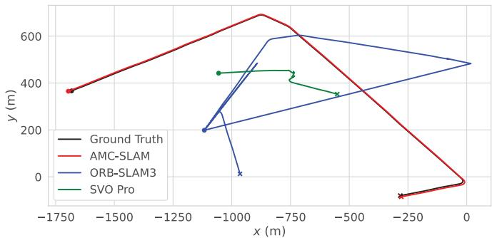

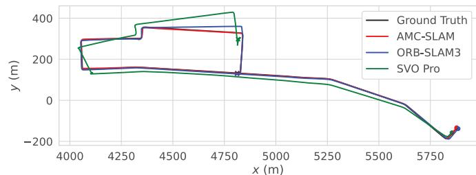  
  
（b）  
Fig. 5. Trajectory comparison in two sequences. Glare and dynamic objects cause stereo methods to produce inaccurate results. The trajectory of AMC-SLAM closely aligns with the ground truth. The dot marks the start, while the cross indicates the end. (a) Trajectories in day no rain0. (b) Trajectories in day no rain2.

limited robustness in these baseline methods under adverse weather conditions and high-speed scenarios on the AMV-Bench. Comparative evaluation was therefore concentrated on urban environments with stable meteorological conditions to ensure methodologically consistent performance assessment. Additional comparative analysis was conducted between ORB-SLAM3 and AMC-SLAM on the NCD to validate generalizability across distinct operational environments.

Experimental results in Table II demonstrate the proposed method’s consistent superiority over ORB-SLAM3 and SVO Pro across all test sequences, particularly in extended outdoor urban trajectories. The omnidirectional vision enabled by multicamera configurations exhibits enhanced robustness compared to conventional stereo setups, as evidenced by performance metrics. Notably, baseline methods fail to track

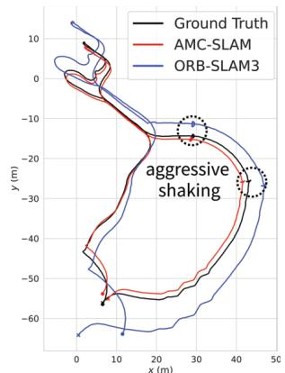  
(a)

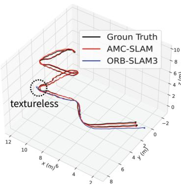  
(b)

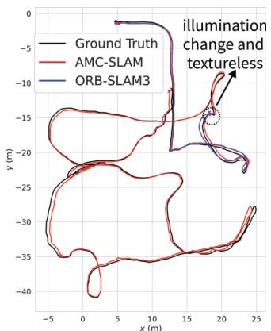  
(c)

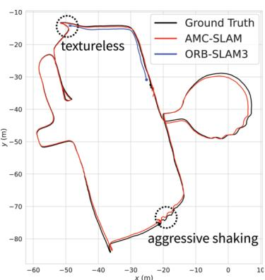  
(d)   
Fig. 6. Estimated trajectories of AMC-SLAM and ORB-SLAM3 on the NCD containing various challenging environments. AMC-SLAM demonstrates robust performance and maintains competitive accuracy across all sequences. (a) quad. (b) stair. (c) mine. (d) math.

TABLE III COMPARISON WITH STATE-OF-THE-ART STEREO SLAM METHODS ON THE NCD   

<table><tr><td>Seq.</td><td>Length [m]</td><td>AMC-SLAM</td><td>ORB-SLAM3 [3]</td></tr><tr><td></td><td></td><td>ATE [m]</td><td>ATE [m]</td></tr><tr><td>quad</td><td>235</td><td>1.33</td><td>4.45</td></tr><tr><td>stair</td><td>57</td><td>0.08</td><td>-</td></tr><tr><td>mine</td><td>236</td><td>0.35</td><td>-</td></tr><tr><td>math</td><td>320</td><td>0.60</td><td>-</td></tr></table>

the day no rain0 sequence due to monocular glare sensitivity in single stereo configurations [Fig. 5(a)], while the multicamera architecture maintains continuous tracking through sensor redundancy.

Further analysis reveals significant trajectory deviations in stereo-based estimations for the day no rain2 sequence [Fig. 5(b)], where urban traffic dynamics introduce substantial environmental perturbations. AMC-SLAM successfully mitigates these challenges through enhanced outlier rejection mechanisms and expanded FOV coverage. Quantitative comparisons with ground truth data confirm $7 1 . 5 \%$ and $9 5 . 8 \%$ reduction in mean ATE relative to conventional stereo SLAM approaches under dynamic conditions.

Comparative evaluation results on the NCD are presented in Table III. ORB-SLAM3 achieved successful operation exclusively on the quad sequence while showing tracking failures across remaining sequences. In contrast, AMC-SLAM maintained consistent tracking across all four sequences, achieving $7 0 . 1 \%$ reduction in ATE compared to ORB-SLAM3 on the quad. Environmental complexity in all test sequences (Fig. 6) includes rapid motion dynamics, illumination variations, and low-texture regions that challenge conventional stereo approaches dependent on single-camera configurations. AMC-SLAM addresses these limitations through enhanced FOV coverage, yielding improved accuracy and system robustness.

# C. Evaluation Against Multicamera SLAM

The evaluation framework uses MultiCol-SLAM [26] as the baseline for SLAM and AMV-SLAM for comparison of

asynchronous multicamera systems. Due to the incompatibility of pinhole camera configurations in the MultiCol-SLAM implementation, a sync-MC SLAM system was developed by modifying the structure of ORB-SLAM3 [3], following the architectural principles outlined in [26]. Given the unavailability of AMV-SLAM’s source code, performance results from the AMV-SLAM paper [1] were used for evaluation. To assess the impact of asynchronous multicamera, a comparative analysis was conducted on highway sequences without loop closure.

Table IV reveals AMC-SLAM’s consistent superiority over both sync-MC and AMV-SLAM implementations across $8 5 \%$ of evaluated sequences. The proposed method maintains continuous tracking stability in all test scenarios, while sync-MC fails in two sequences and AMV-SLAM fails in two complex environments, demonstrating AMC-SLAM’s enhanced robustness. Quantitative analysis shows $3 5 . 6 \%$ mean ATE reduction compared to sync-MC across seven sequences and $4 2 . 3 \%$ improvement over AMV-SLAM in five sequences. In the hwy no rain1 sequence, all three methods exhibit comparable performance due to reduced side-view texture complexity mitigating asynchronous multicamera challenges. Fig. 7 illustrates AMC-SLAM’s estimated trajectory closely aligning with ground truth, while sync-MC exhibits both tracking loss and significant drift, particularly under high-speed rotation conditions.

# D. MC-RANSAC

1) Analysis on Threshold: The parameter $\epsilon _ { \mathrm { r a n c } }$ in the MC-RANSAC algorithm is used to determine whether a feature point is an inlier. A systematic comparison was conducted within the range of $\epsilon _ { \mathrm { r a n c } } ~ \in ~ [ 0 . 5 , 4 . 0 ]$ , and the results are  . , .shown in Table V. The experimental results indicate that Sequences 0 and 5 exhibit similar performance across different parameter settings, demonstrating low sensitivity to noise. Results for Sequences 2 and 3 highlight the dilemma in threshold setting: excessively large thresholds lead to the misclassification of outliers as inliers, thereby reducing model accuracy, while overly small thresholds may erroneously exclude valid inliers, affecting system stability. In the more

TABLE IV COMPARISON WITH MULTICAMERA SLAM METHOD ON THE AMV-BENCH DATASET   

<table><tr><td rowspan="2">Seq.</td><td rowspan="2">Length [m]</td><td colspan="3">AMC-SLAM</td><td colspan="3">Sync-MC [26]</td><td>AMV-SLAM [1]</td></tr><tr><td>ATE [m]</td><td>RPEt [m]</td><td>RPER [°]</td><td>ATE [m]</td><td>RPEt [m]</td><td>RPER [°]</td><td>ATE [m]</td></tr><tr><td>hwy_no_rain0</td><td>10106</td><td>48.45</td><td>0.46</td><td>0.73</td><td>104.90</td><td>1.07</td><td>2.35</td><td>52.94</td></tr><tr><td>hwy_no_rain1</td><td>6722</td><td>27.43</td><td>0.20</td><td>0.04</td><td>23.80</td><td>0.18</td><td>0.04</td><td>22.54</td></tr><tr><td>hwy_no_rain2</td><td>7435</td><td>23.36</td><td>0.16</td><td>0.06</td><td>33.06</td><td>0.21</td><td>0.05</td><td>377.00</td></tr><tr><td>hwy_no_rain3</td><td>7015</td><td>16.02</td><td>0.10</td><td>0.05</td><td>26.43</td><td>0.12</td><td>0.05</td><td>36.58</td></tr><tr><td>hwy_rain0</td><td>7820</td><td>16.12</td><td>0.11</td><td>0.04</td><td>32.97</td><td>0.21</td><td>0.04</td><td>63.98</td></tr><tr><td>hwy_rain1</td><td>8381</td><td>13.16</td><td>0.13</td><td>0.04</td><td>14.74</td><td>0.16</td><td>0.04</td><td>-</td></tr><tr><td>hwy_rain2</td><td>10567</td><td>24.33</td><td>0.18</td><td>0.05</td><td>122.36</td><td>0.67</td><td>0.06</td><td>-</td></tr></table>

TABLE V COMPARISON OF ATE UNDER DIFFERENT THRESHOLDS OF MC-RANSAC   

<table><tr><td>Seq.</td><td>εranc = 0.5</td><td>εranc = 1.0</td><td>εranc = 1.5</td><td>εranc = 2.0</td><td>εranc = 2.5</td><td>εranc = 3.0</td><td>εranc = 4.0</td></tr><tr><td>day_rain0</td><td>2.97</td><td>2.69</td><td>3.09</td><td>2.93</td><td>2.96</td><td>2.97</td><td>2.92</td></tr><tr><td>day_rain1</td><td>4.83</td><td>4.58</td><td>4.04</td><td>3.18</td><td>120.35</td><td>3.22</td><td>3.10</td></tr><tr><td>day_rain2</td><td>3.93</td><td>5.76</td><td>44.41</td><td>5.70</td><td>43.36</td><td>13.07</td><td>7.05</td></tr><tr><td>day_rain3</td><td>9.78</td><td>10.06</td><td>10.08</td><td>9.63</td><td>9.61</td><td>9.90</td><td>10.80</td></tr><tr><td>day_rain4</td><td>22.45</td><td>13.78</td><td>20.81</td><td>7.81</td><td>5.99</td><td>5.80</td><td>1.82</td></tr><tr><td>day_rain5</td><td>0.42</td><td>0.49</td><td>0.43</td><td>0.42</td><td>0.49</td><td>0.42</td><td>0.43</td></tr></table>

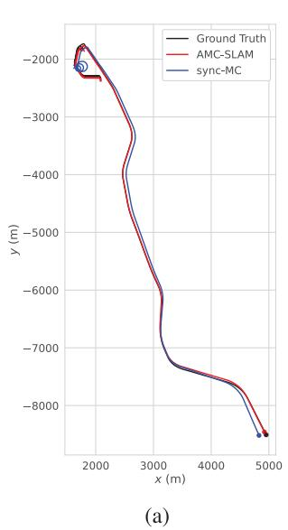

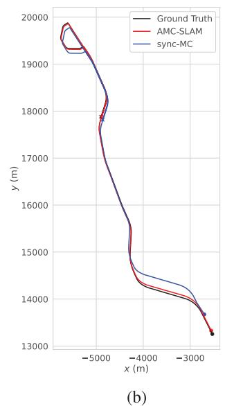  
Fig. 7. Trajectory comparison of asynchronous and synchronized methods on highway scenes. AMC-SLAM’s estimated trajectory closely aligns with ground truth, while sync-MC fails to track in (a) and exhibits drift in (b). (a) hwy no rain0. (b) hwy rain2.

complex environments of Sequences 1 and 4, the data suggest that smaller thresholds significantly reduce robustness in challenging scenarios. However, in relatively simpler environments, such as Sequence 3, smaller thresholds improve system accuracy.

Based on this comprehensive analysis, $\begin{array} { r l r } { \epsilon _ { \mathrm { r a n c } } } & { { } = } & { 2 . 0 } \end{array}$  .demonstrated superior balanced performance across all test sequences: it avoided extreme errors while maintaining minimal error fluctuations. This parameter successfully strikes a balance in two key aspects: it preserves sufficient inliers to ensure reliable model fitting (avoiding overly stringent constraints of small thresholds) and effectively excludes outlier

TABLE VI ABLATION STUDY COMPARISON ON MC-RANSAC   

<table><tr><td rowspan="2">Seq.</td><td colspan="3">AMC-SLAM w/ MC-RANSAC</td><td colspan="3">w/o MC-RANSAC</td></tr><tr><td>ATE [m]</td><td>RPEt [m]</td><td>RPR [°]</td><td>ATE [m]</td><td>RPEt [m]</td><td>RPR [°]</td></tr><tr><td>day_rain0</td><td>2.93</td><td>0.07</td><td>0.06</td><td>2.85</td><td>0.07</td><td>0.06</td></tr><tr><td>day_rain1</td><td>3.18</td><td>0.05</td><td>0.05</td><td>3.73</td><td>0.05</td><td>0.06</td></tr><tr><td>day_rain2</td><td>5.70</td><td>0.04</td><td>0.06</td><td>3.33</td><td>0.04</td><td>0.06</td></tr><tr><td>day_rain3</td><td>9.63</td><td>0.09</td><td>0.06</td><td>10.34</td><td>0.10</td><td>0.06</td></tr><tr><td>day_rain4</td><td>7.81</td><td>0.07</td><td>0.06</td><td>20.42</td><td>0.13</td><td>0.07</td></tr><tr><td>day_rain5</td><td>0.42</td><td>0.06</td><td>0.09</td><td>0.46</td><td>0.06</td><td>0.09</td></tr></table>

interference (avoiding the lenient standards of large thresholds). Thus, $\epsilon _ { \mathrm { r a n c } } = 2 . 0$ is identified as the suitable choice for AMC-SLAM.

2) Ablation Study: To emphasize the impact of outlier removal in AMC-SLAM, the performance of AMC-SLAM with and without MC-RANSAC is compared with the day rain sequences. As shown in Table VI, although MC-RANSAC slightly decreases performance on the day rain2 sequence, where frequent stops and starts disrupt the uniform motion model, it generally enhances accuracy in urban environments under rainy conditions. Notably, in Sequence 4 (day rain), characterized by dense traffic conditions, MC-RANSAC effectively removes outliers from cameras occluded by moving vehicles, preserving inliers from cameras that are not occluded.

# E. Loop Closing

Comprehensive loop closure analysis across all sequences demonstrates the efficacy of multiview loop closing. AMC-SLAM successfully identifies all loop instances within the sequences. As illustrated in Fig. 8, even when loops are revisited from different directions and lanes, the system detects these loops and incorporates the corresponding edges into the

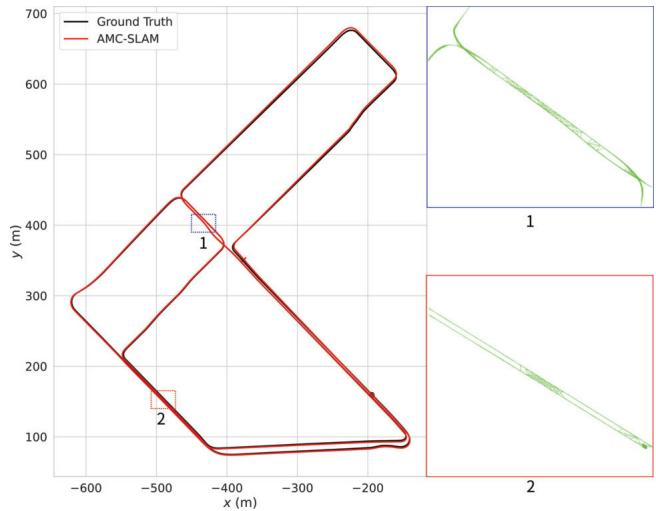  
Fig. 8. Estimated trajectory in day rain4. AMC-SLAM successfully detects loops encountered from different directions and lanes.

TABLE VII AVERAGE COMPUTATIONAL TIME   

<table><tr><td>Method</td><td>Module</td><td>Time [ms]</td></tr><tr><td rowspan="5">AMC-SLAM</td><td>Feature Extraction</td><td>37.55</td></tr><tr><td>Outlier Removal</td><td>4.47</td></tr><tr><td>Motion-only BA</td><td>20.09</td></tr><tr><td>Local BA</td><td>230.77</td></tr><tr><td>Multi-View Loop Closing</td><td>675.75</td></tr><tr><td rowspan="4">Sync-MC</td><td>Feature Extraction</td><td>37.17</td></tr><tr><td>Motion-only BA</td><td>3.62</td></tr><tr><td>Local BA</td><td>145.43</td></tr><tr><td>Multi-View Loop Closing</td><td>584.19</td></tr></table>

pose graph, thereby reducing global drift. In contrast, stereobased methods are unable to detect these loops, highlighting the superior performance of AMC-SLAM. Additionally, sync-MC fails to detect these loops due to the challenges posed by asynchronous data.

# F. Run Time

The average processing time of each component was evaluated for both the proposed method and sync-MC on the day rain4 sequence. In the proposed method, local BA and multiview loop closing are executed in two independent threads separate from the main thread, while motion-only BA is performed twice within the main thread. As presented in Table VII, the feature extraction stage requires significant computational time, attributed to the higher density of feature points generated by the multicamera configuration. Furthermore, the BA process in AMC-SLAM demands additional time due to the optimization of continuous-time trajectories, contrasting with sync-MC’s discrete-time trajectory optimization. The main thread processing time averages 82.2 ms per MF, demonstrating real-time operational capability at $1 0 \ \mathrm { H z }$ .

A comparative analysis with AMV-SLAM was precluded due to unavailable open-source implementations. However, it is noteworthy that the proposed system achieves real-time

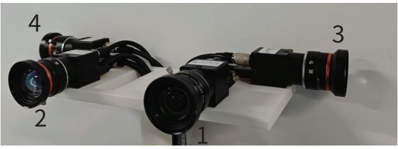  
Fig. 9. Asynchronous multicamera hardware platform used to evaluate the performance of the proposed system.

performance at $1 0 \ \mathrm { H z }$ , whereas the system described in [1] reportedly operates without real-time functionality.

# V. EXPERIMENTS ON REAL SYSTEM

An asynchronous multicamera hardware platform was developed to evaluate the operational performance of AMC-SLAM under realistic conditions. Systematic assessments were conducted across three representative scenarios: indoor environments, outdoor static environments, and outdoor dynamic environments with moving objects. The experiment included a comparison with the stereo method in dynamic environments, an ablation study on the online calibration module, and an analysis of the impact of feature point density and number of cameras on system robustness and accuracy. For accuracy comparisons in Sections V-C and V-D, the loop closing module was intentionally deactivated while maintaining other system components unchanged. The experimental configuration remained identical to that described in Section IV, with the modification that all cameras extracted a total of 3000 ORB features by default unless otherwise specified.

# A. Hardware Setup

The experimental platform incorporates four rigidly mounted MV-CU013-A0UC industrial cameras (Fig. 9) equipped with 6mm MVL-HF0628M-6MPE lenses operating at $1 2 8 0 \times 1 0 2 4$ resolution. An STM32 microcontroller implements asynchronous hardware triggering at $2 5 \ \mathrm { H z }$ to emulate real-world temporal misalignment, with Camera 3 and Camera 4 exhibiting deliberate 20 and 30 ms triggering delays relative to Camera 1, respectively, while Cameras 1 and 2 remain synchronized. Kalibr [34] calibrates intrinsic parameters for all cameras and extrinsic parameters between overlapping FOV pairs. For Cameras 3 and 4, with limited FOV overlap with other cameras, the extrinsic parameters are initially estimated through mechanical mounting measurements, followed by refinement using the online calibration module.

# B. Dynamic Environment

Experimental evaluation of AMC-SLAM in outdoor dynamic environments demonstrates superior performance compared with ORB-SLAM3 [3] through qualitative analysis. As shown in Fig. 10, ORB-SLAM3 exhibits tracking failure under complex dynamic occlusion scenarios, while AMC-SLAM successfully overcomes these challenges by utilizing two asynchronous cameras for complementary perception.

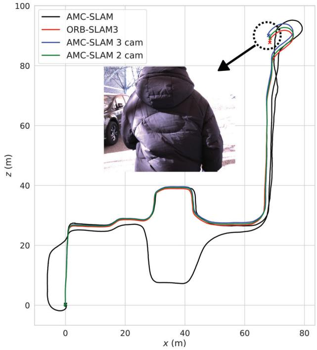  
Fig. 10. Estimated trajectories of AMC-SLAM and ORB-SLAM3 in outdoor dynamic environment.

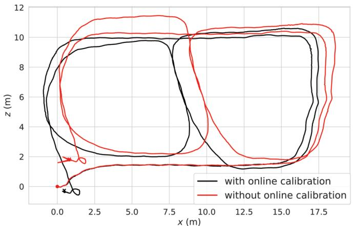  
Fig. 11. Estimated trajectories of AMC-SLAM with and without online calibration in indoor environment.

The proposed system completes a $3 8 8 – \mathrm { m }$ closed-loop trajectory with a precise return to the initial position (positioning error $< 0 . 3 ~ \mathrm { ~ m ~ }$ ), validating its significant improvements in <environmental adaptability and system stability through multicamera configuration.

Moreover, similar to ORB-SLAM3, both the two-camera and three-camera configurations of AMC-SLAM experience tracking failures when encountering dynamic objects. This shared limitation originates from insufficient extraction of static environmental features when dynamic entities dominate the FoV, ultimately compromising localization reliability.

# C. Online Calibration

The online calibration module of AMC-SLAM was experimentally evaluated in the indoor environment on an identical trajectory with and without online calibration activation (as

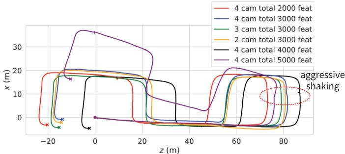  
Fig. 12. Comparison of estimated AMC-SLAM trajectories with varying ORB feature counts and camera configurations in outdoor environment.

shown in Fig. 11). Over a 121-m closed-loop trajectory, the system without online calibration exhibited an end-to-end error of $2 . 0 1 \mathrm { ~ m ~ }$ , while the system with online calibration achieved a significantly reduced error of $0 . 5 3 \mathrm { ~ m ~ }$ . These experimental results demonstrate two critical findings: 1) the online calibration module substantially improves trajectory accuracy and 2) camera extrinsic parameters significantly impact multicamera system precision.

# D. Effect of Feature Number and Camera Configurations

AMC-SLAM was experimentally evaluated in an outdoor environment using a closed-loop trajectory with a total length of $2 6 6 \mathrm { m }$ . The primary objective was to analyze the impact of camera configurations and the number of extracted features on system performance, as shown in Fig. 12. The experimental results demonstrate a generally positive correlation between the number of extracted features and tracking accuracy when the number of cameras remains constant. Specifically, with a four-camera setup and 4000 extracted features, the system achieved the lowest end-to-end localization error of $5 . 2 0 \mathrm { ~ m ~ }$ . As the number of extracted features decreased, the system’s accuracy deteriorated, resulting in increased end-to-end error. However, further increasing the number of features to 5000 led to a notable decline in performance. This counterintuitive result is attributed to the increased computational burden on the back-end sliding-window optimization module. As the number of asynchronous feature tracks grows, the back-end requires significantly more time to complete each optimization cycle. Since the front-end tracking and back-end optimization run on separate threads, this imbalance introduces latency in pose refinement. In scenarios involving rapid motion or sudden camera shake, such delays exacerbate estimation drift, ultimately reducing tracking accuracy.

Additionally, due to the relatively simple test environment, when the total number of extracted features was identical across different camera configurations, the variation in system accuracy was not significant. In contrast, in more complex environments (as shown in Fig. 10), reducing the number of cameras resulted in a restricted FOV, leading to a noticeable decline in system robustness and, in some cases, tracking failure.

Statistical analysis was conducted on the average tracking time for six different configurations, with results presented in Table VIII. The results reveal that, under a fixed number

TABLE VIII AVERAGE COMPUTATIONAL TIME FOR TRACKING WITH DIFFERENT NUM-BERS OF EXTRACTED ORB FEATURES AND CAMERAS   

<table><tr><td>Cam.</td><td>Per Cam.Feat.</td><td>TotalFeat.</td><td>Time [ms]</td></tr><tr><td rowspan="4">4</td><td>500</td><td>2000</td><td>57.83</td></tr><tr><td>750</td><td>3000</td><td>67.05</td></tr><tr><td>1000</td><td>4000</td><td>77.32</td></tr><tr><td>1250</td><td>5000</td><td>96.34</td></tr><tr><td>3</td><td>1000</td><td>3000</td><td>60.30</td></tr><tr><td>2</td><td>1500</td><td>3000</td><td>40.86</td></tr></table>

of cameras, increasing the number of extracted features leads to higher computational complexity, thereby extending the average tracking time. Conversely, when the total number of extracted features remains constant, reducing the number of cameras shortens tracking time. However, as discussed earlier, while decreasing the number of extracted features or cameras can alleviate the computational burden, it also compromises system accuracy and robustness, potentially leading to tracking failure. Moreover, computational efficiency can indirectly impact tracking accuracy—particularly in configurations where an excessive number of features causes delays in back-end optimization, as observed in the 5000-feature scenario, where local BA required an average of 419.74 ms. Such delays may introduce significant drift and reduce tracking precision, especially in situations involving aggressive camera motion. Therefore, in practical applications, an optimal system configuration should be selected by balancing computational efficiency against tracking accuracy and robustness based on environmental complexity.

Furthermore, it was observed that the majority of tracking time was consumed by the ORB feature extraction process. For instance, in a four-camera configuration with a total of 3000 ORB features, feature extraction required approximately 47.03 ms, which is directly related to the high resolution of the cameras $1 2 8 0 \times 1 0 2 4 )$ . In practical applications, selecting an appropriate camera resolution is also crucial. Future research could focus on optimizing the feature extraction algorithm and enhancing the efficiency of continuous-time trajectory optimization to improve overall computational performance.

# VI. CONCLUSION

This article presents a continuous-time AMC-SLAM framework based on GP regression. To address the increased outliers in feature points introduced by multiple cameras, MC-RANSAC is employed to filter outliers from asynchronous feature points, thus providing a foundation for accurate trajectory estimation. By integrating GP regressionbased interpolation with BA, the framework not only improves data association across multiple cameras but also reduces the number of states to be estimated, thereby enhancing computational efficiency. Moreover, online calibration of multicamera extrinsic parameters is implemented. A multiview loop closing method has also been developed to improve robustness further. The method is validated on the AMV-Bench and NCDs, as well as on a real system, demonstrating high accuracy and robustness in various challenging environments.

While the system supports near real-time operation on high-performance CPUs, it encounters limitations on lowpower devices due to the increasing number of feature points and the demands of continuous-time trajectory optimization. Future work will focus on improving computational efficiency by optimizing the feature extraction algorithm, adaptively adjusting the number of feature points for each camera, and refining the continuous-time BA. Additionally, integrating other sensors, such as LiDAR and IMU, into the framework could further enhance performance.

# REFERENCES

[1] A. J. Yang, C. Cui, I. A. Barsan, R. Urtasun, and S. Wang, ˆ “Asynchronous multi-view SLAM,” in Proc. IEEE Int. Conf. Robot. Autom. (ICRA), May 2021, pp. 5669–5676.   
[2] L. Zhang, M. Camurri, D. Wisth, and M. Fallon, “Multi-camera LiDAR inertial extension to the newer college dataset,” 2021, arXiv:2112.08854.   
[3] C. Campos, R. Elvira, J. J. G. Rodr´ıguez, J. M. M. Montiel, and J. D. Tardos, “ORB-SLAM3: An accurate open-source library for visual, ´ visual-inertial, and multimap SLAM,” IEEE Trans. Robot., vol. 37, no. 6, pp. 1874–1890, Dec. 2021.   
[4] C. Forster, Z. Zhang, M. Gassner, M. Werlberger, and D. Scaramuzza, “SVO: Semidirect visual odometry for monocular and multicamera systems,” IEEE Trans. Robot., vol. 33, no. 2, pp. 249–265, Apr. 2017.   
[5] T. Qin, P. Li, and S. Shen, “VINS-mono: A robust and versatile monocular visual-inertial state estimator,” IEEE Trans. Robot., vol. 34, no. 4, pp. 1004–1020, Aug. 2018.   
[6] Y. Zhuang et al., “Amos-SLAM: An anti-dynamics two-stage RGB-D SLAM approach,” IEEE Trans. Instrum. Meas., vol. 73, pp. 1–10, 2024.   
[7] S. Wen, S. Tao, X. Liu, A. Babiarz, and F. R. Yu, “CD-SLAM: A realtime stereo visual–inertial SLAM for complex dynamic environments with semantic and geometric information,” IEEE Trans. Instrum. Meas., vol. 73, pp. 1–8, 2024.   
[8] B. Song, X. Yuan, Z. Ying, B. Yang, Y. Song, and F. Zhou, “DGM-VINS: Visual–inertial SLAM for complex dynamic environments with joint geometry feature extraction and multiple object tracking,” IEEE Trans. Instrum. Meas., vol. 72, pp. 1–11, 2023.   
[9] J. Shi, W. Wang, M. Qi, X. Li, and Y. Yan, “Dynam-LVIO: A dynamic-object-aware LiDAR visual inertial odometry in dynamic urban environments,” IEEE Trans. Instrum. Meas., vol. 73, pp. 1–19, 2024.   
[10] L. Zhang, H. Yin, W. Ye, and J. Betz, “DP-VINS: Dynamics adaptive plane-based visual-inertial SLAM for autonomous vehicles,” IEEE Trans. Instrum. Meas., vol. 73, pp. 1–16, 2024.   
[11] L. Zhang, D. Wisth, M. Camurri, and M. Fallon, “Balancing the budget: Feature selection and tracking for multi-camera visual-inertial odometry,” IEEE Robot. Autom. Lett., vol. 7, no. 2, pp. 1182–1189, Apr. 2022.   
[12] P. Kaveti, S. N. Vaidyanathan, A. T. Chelvan, and H. Singh, “Design and evaluation of a generic visual SLAM framework for multi camera systems,” IEEE Robot. Autom. Lett., vol. 8, no. 11, pp. 7368–7375, Nov. 2023.   
[13] J. Kuo, M. Muglikar, Z. Zhang, and D. Scaramuzza, “Redesigning SLAM for arbitrary multi-camera systems,” in Proc. IEEE Int. Conf. Robot. Autom. (ICRA), May 2020, pp. 2116–2122.   
[14] K. Eckenhoff, P. Geneva, and G. Huang, “MIMC-VINS: A versatile and resilient multi-IMU multi-camera visual-inertial navigation system,” IEEE Trans. Robot., vol. 37, no. 5, pp. 1360–1380, Oct. 2021.   
[15] L. Wang, Y. Xu, and S. Shen, “VINS-multi: A robust asynchronous multi-camera-IMU state estimator,” 2024, arXiv:2405.14539.   
[16] P. Furgale, T. D. Barfoot, and G. Sibley, “Continuous-time batch estimation using temporal basis functions,” in Proc. IEEE Int. Conf. Robot. Autom., May 2012, pp. 2088–2095.   
[17] D. Hug, P. Bonninger, I. Alzugaray, and M. Chli, “Continuous-time ¨ stereo-inertial odometry,” IEEE Robot. Autom. Lett., vol. 7, no. 3, pp. 6455–6462, Jul. 2022.   
[18] X. Lang, J. Lv, J. Huang, Y. Ma, Y. Liu, and X. Zuo, “Ctrl-VIO: Continuous-time visual-inertial odometry for rolling shutter cameras,” IEEE Robot. Autom. Lett., vol. 7, no. 4, pp. 11537–11544, Oct. 2022.   
[19] X. Liu, H. Xue, X. Gao, H. Liu, B. Chen, and S. S. Ge, “Cubic B-splinebased feature tracking for visual–inertial odometry with event camera,” IEEE Trans. Instrum. Meas., vol. 72, pp. 1–15, 2023.

[20] X. Lang et al., “Coco-LIC: Continuous-time tightly-coupled LiDARinertial-camera odometry using non-uniform B-spline,” IEEE Robot. Autom. Lett., vol. 8, no. 11, pp. 7074–7081, Nov. 2023.   
[21] J. Johnson, J. Mangelson, T. Barfoot, and R. Beard, “Continuous-time trajectory estimation: A comparative study between Gaussian process and spline-based approaches,” 2024, arXiv:2402.00399.   
[22] C. H. Tong, P. Furgale, and T. D. Barfoot, “Gaussian process Gauss–Newton for non-parametric simultaneous localization and mapping,” Int. J. Robot. Res., vol. 32, no. 5, pp. 507–525, Apr. 2013.   
[23] X. Yan, V. Indelman, and B. Boots, “Incremental sparse GP regression for continuous-time trajectory estimation and mapping,” Robot. Auto. Syst., vol. 87, pp. 120–132, Jan. 2017.   
[24] T. Y. Tang, D. J. Yoon, and T. D. Barfoot, “A white-noise-on-jerk motion prior for continuous-time trajectory estimation on SE(3),” IEEE Robot. Autom. Lett., vol. 4, no. 2, pp. 594–601, Apr. 2019.   
[25] H. Zhang, C.-C. Chen, H. Vallery, and T. D. Barfoot, “GNSS/multisensor fusion using continuous-time factor graph optimization for robust localization,” IEEE Trans. Robot., vol. 40, no. 5, pp. 4003–4023, Sep. 2024.   
[26] S. Urban, S. Wursthorn, J. Leitloff, and S. Hinz, “MultiCol bundle adjustment: A generic method for pose estimation, simultaneous selfcalibration and reconstruction for arbitrary multi-camera systems,” Int. J. Comput. Vis., vol. 121, no. 2, pp. 234–252, Jan. 2017.   
[27] R. Mur-Artal, J. M. M. Montiel, and J. D. Tardos, “ORB-SLAM: ´ A versatile and accurate monocular SLAM system,” IEEE Trans. Robot., vol. 31, no. 5, pp. 1147–1163, Oct. 2015.   
[28] P. Liu, M. Geppert, L. Heng, T. Sattler, A. Geiger, and M. Pollefeys, “Towards robust visual odometry with a multi-camera system,” in Proc. IEEE/RSJ Int. Conf. Intell. Robots Syst. (IROS), Oct. 2018, pp. 1154–1161.   
[29] S. Anderson and T. D. Barfoot, “RANSAC for motion-distorted 3D visual sensors,” in Proc. IEEE/RSJ Int. Conf. Intell. Robots Syst., Nov. 2013, pp. 2093–2099.   
[30] S. Anderson and T. D. Barfoot, “Full STEAM ahead: Exactly sparse Gaussian process regression for batch continuous-time trajectory estimation on SE(3),” in Proc. IEEE/RSJ Int. Conf. Intell. Robots Syst. (IROS), Sep. 2015, pp. 157–164.   
[31] J. Dong, M. Mukadam, B. Boots, and F. Dellaert, “Sparse Gaussian processes on matrix lie groups: A unified framework for optimizing continuous-time trajectories,” in Proc. IEEE Int. Conf. Robot. Autom. (ICRA), May 2018, pp. 6497–6504.   
[32] T. Barfoot, C. H. Tong, and S. Sarkka, “Batch continuous-time trajectory estimation as exactly sparse Gaussian process regression,” in Proc. Robot., Sci. Syst. X, Jul. 2014, pp. 1–8.   
[33] D. Galvez-Lopez and J. D. Tardos, “Bags of binary words for fast place ´ recognition in image sequences,” IEEE Trans. Robot., vol. 28, no. 5, pp. 1188–1197, Oct. 2012.   
[34] P. Furgale, J. Rehder, and R. Siegwart, “Unified temporal and spatial calibration for multi-sensor systems,” in Proc. IEEE/RSJ Int. Conf. Intell. Robots Syst., Nov. 2013, pp. 1280–1286.

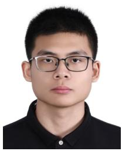

Jinjiang Li received the B.E. degree in robotics engineering from Beihang University, Beijing, China, in 2022, where he is currently pursuing the Ph.D. degree in mechatronics engineering.

His research interests include visual SLAM and robot localization.

Wei Wang was born in Yichang, Hubei, China, in July 1973. He received the B.E. degree in mechanical design and manufacturing and the M.E. degree in mechatronics engineering from Harbin Engineering University, Harbin, China, in 1994 and 1997, respectively, and the Ph.D. degree in mechatronics engineering from Beihang University, Beijing, China, in 2000.

He is currently a Professor with the School of Mechanical Engineering and Automation, Beihang University, where he also serves as the Program

Director of robotics engineering and the Director of the Mechanical Engineering Teaching and Experiment Center. His research interests include robot design and control, precision mechatronic systems, and robot navigation and localization.

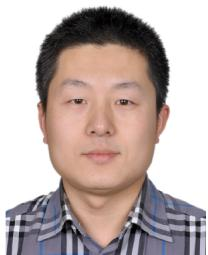

Yueri Cai received the B.E. degree in mechatronics engineering from the University of Science and Technology Beijing, Beijing, China, in 2005, and the Ph.D. degree in mechanical design and theory from Beihang University, Beijing, in 2012.

He is currently an Associate Professor with the School of Mechanical Engineering and Automation, Beihang University. His research interests include bionic robot, robot navigation and localization, and specialized robot.