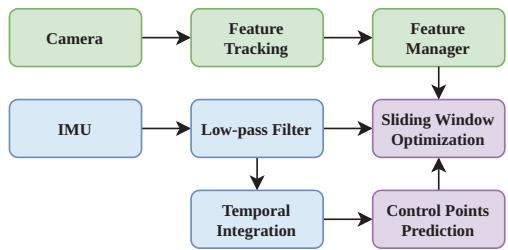
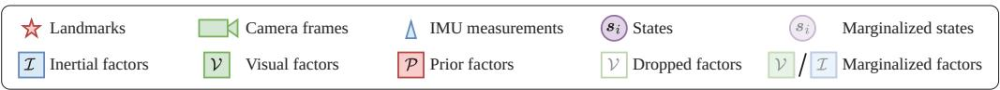
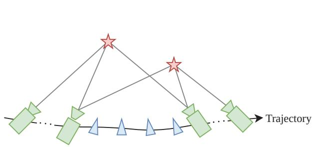
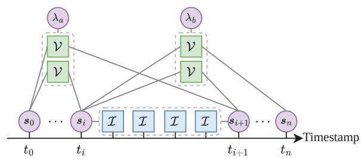
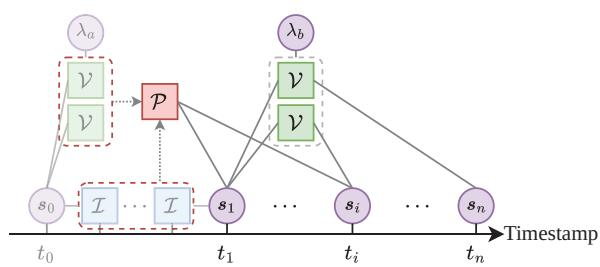
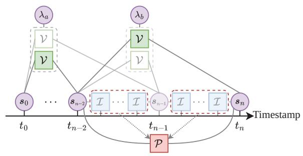
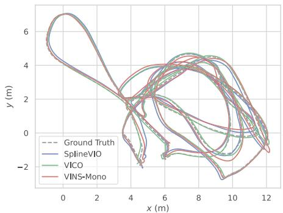
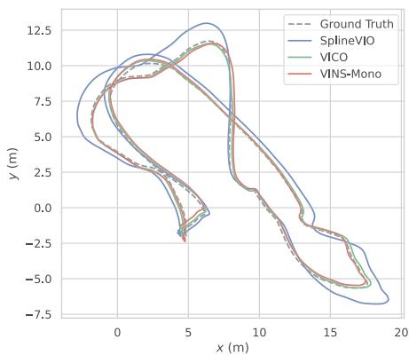

# VICO: Visual-Inertial Continuous-Time Odometry Based on Generalized Hermite Spline

1st Haoyu Qi ool of Automation Institute of Technology Beijing, China il: qiqiqihy@qq.com

2nd Zhen Li* School of Automation Beijing Institute of Technology Beijing, China email: zhenli@bit.edu.cn

3rd Haikuo Liu School of Automation Beijing Institute of Technology Beijing, China email: foreverlhk@bit.edu.cn

4th Xiangdong Liu School of Automation Beijing Institute of Technology Beijing, China email: xdliu@bit.edu.cn

$5 ^ { \mathrm { t h } }$ Fang Deng School of Automation Beijing Institute of Technology Beijing, China email: dengfang@bit.edu.cn

Abstract—Continuous-time simultaneous localization and mapping (SLAM) facilitates the seamless fusion of asynchronous and high update-rate sensors. The traditional continuous-time parameterizaiton adopts the cumulative B-splines, causing the complexity in implementation and abstraction of control points. To address these issues, this paper proposes a continuous-time visual-inertial odometry (VIO) based on generalized Hermite spline. The analytical temporal derivatives and Jacobians with respect to the control points are derived, so that the VIO is further formulated as a sliding window based optimization. To validate the efficacy of the proposed method, the extensive evaluations are conducted on the TUM VI and EuRoC dataset. The results demonstrate the state-of-the-art accuracy and realtime performance. Our implementation is fully open-source at https://github.com/FALCONS-Lab/VICO.

Index Terms—Continuous-time SLAM, visual-inertial odometry, sensor fusion.

# I. INTRODUCTION

Simultaneous localization and mapping (SLAM) facilitates autonomous navigation by providing the accurate and robust pose estimation with seamless fusion of various sensors [1]. Due to the low cost and the complementary benefits in observability and update rate, the visual-inertial odometry (VIO), which composes of camera and inertial measurement unit (IMU), becomes a commercially mainstream localization approach. SLAM is in nature considered a state estimation problem, and its feasible solutions are categorized into filtering-based and optimization-based methods. For optimization-based SLAM, 6-degree-of-freedom (6-DoF) poses at the sampling instants of sensors are conventionally taken as state variables, and the corresponding approaches employing this parameterization are referred to as discrete-time SLAM. However, such parameterization can be challenged in real-time performance, especially when SLAM system deals with high update-rate IMUs or heterogeneous sampling rates between cameras and IMUs. Various strategies have been proposed to improve the efficiency of SLAM optimization,

e.g., the adoption of sliding windows to limit the scale of optimization [2], and the utilization of IMU pre-integration to unify the rate of visual and inertial measurements [3].

Compared to discrete-time SLAM above, continuous-time SLAM (CT-SLAM) employs the continuous-time parameterization, where ego-motion is modeled as a mapping or stochastic process from time to 6-DoF poses determined by a series of discrete control points. Such parameterization has been proven to effectively reduce the state space dimensionality, and its explicit consideration on time allows the analytical extraction of higher-order kinematic quantities (e.g. linear and angular velocities, accelerations) without introducing additional state variables. Overall, the continuoustime parameterization approaches can be classified into interpolation [4], [5], spline [6]–[9], hierarchical wavelets [10], and Gaussian processes [11], [12]. Although most practical implementations used the uniform cumulative B-splines to represent the continuous-time trajectories, there are two main challenges affecting the overall performance, i.e., 1) Structural complexity: in cumulative B-spline, multiple control points on the Lie group are utilized for the computation of each pose in state estimation, and conversely, each individual control point influences the determination of multiple poses, resulting in complicated Jacobian evaluation and a more dense optimization structure [13]; 2) the abstraction of control points: the fact that B-splines curves do not pass through their control points and the absence of a clear correspondence between each control points and kinematic quantities, creates difficulties in establishing suitable initial values for these control points, which impacts the convergence behavior of iterative optimization methods sensitive to initial guess.

To deal with these problems, we utilize generalized Hermite spline as continuous-time parameterization [14]. As an interpolation spline curve, the generalized Hermite spline not only provides the enough continuity, but also renders the control points proportional to kinematic quantities, which enable the

efficient initialization of control points and effectively reduces the complexity of optimization structure. In this paper, we further propose a visual-inertial continuous-time odometry based on generalized Hermite spline, i.e., VICO. Therefore, the contibutions of this work can be summarized as follows.

1) The analytical Jacobian of generalized Hermite spline with regard to its control points is derived, and a monocular visual-inertial continuous-time odometry (VICO) is proposed with the sliding window optimization and marginalization strategies.   
2) The proposed VICO system is evaluated on real-world datasets, demonstrating its state-of-the-art accuracy and real-time performance. The implementation of our system is fully open-source.

# II. RELATED WORK

The key of CT-SLAM lies in the continuous-time parameterization to accurately model the temporal characteristics of various sensors. Sensors such as rolling shutter cameras, event cameras, or light detection and ranging (LiDAR) devices, etc., do not complete the sampling instantaneously, so that one single sampling may correspond to multiple poses at different timestamps. The continuous-time parameterization can represent these poses with as few states as possible. Lovegrove et al. modeled the rolling shutter effect in VIO using the cumulative uniform B-spline on $S E ( 3 )$ , and trivially (3)synthesized the acelerometer and gyroscope measurements [9]. Lang et al. considered the rolling shutter effect and proposed Ctrl-VIO with the line delay online calibration [15]. Mueggler et al. proposed a VIO with the event camera by integrating asynchronous events and high update-rate IMU measurements in a continuous-time framework [16]. In the proposed SLICT system [5], Nguyen et al. designed a continuous-time maximun-a-posteriori optimization that directly utilized the raw LiDAR data instead of deskewed points. General multisensor SLAM systems typically updates the measurements at different timestamps and rates of sensors. Towards this issue, the continuous-time parameterization can enable the fusion of multi-sensor data without hardware synchronization. Hug et al. proposed a continuous-time stereo VIO robust to stereo streams that the left and right images were captured at different rates [7]. Additionally, the tight coupling of asynchronous LiDAR, IMU and camera data via continuous-time parameterization was investigated in [6] and [13].

Among various continuous-time parameterization methods, cumulative B-spline won the most widespread usage, whose utilization has gradually evolved from the initial joint form on $S E ( 3 )$ to the split form on $\mathbb { R } ^ { 3 }$ and $S O ( 3 ) / S ^ { 3 }$ due to the (3) (3)latter’s improved efficiency and convergence [17]. Although the analytical Jacobian of the split form with regard to its control points was provided in [18], which significantly sped up the optimization, the aforementioned complexities and abstractness in nature still persisted. To tackle these difficulties, a marginalization method was proposed in [15] specifically for cumulative B-spline in sliding window optimization by introducing a more efficient IMU pre-integration prior instead

of the raw measurements prior. In [13], the initialization of the abstract control points was achieved through an optimization including velocity and raw measurements factors.

On the other hand, many works were dedicated to adopting new continuous-time parameterization methods. Mo and Sattar formulated VIO as a constrained nonlinear optimization problem using cubic spline with boundary conditions [8]. Johnson et al. considered the differential flatness property of dynamic systems and defined B-spline in their flat output space to avoid time-consuming Jacobian evaluation on Lie groups [19].

Motivated by the simplification on initialization and estimation of control points, we utilize the generalized Hermite spline as continuous-time parameterization and demonstrate its applicability in VIO.

# III. METHODOLOGY

We first introduce the reference frames and operations on Lie groups used in this paper. The world frame, body frame and camera frame are denoted by w, b and $c$ , respectively, where the body frame is equal to the IMU frame. The world frame is considered fixed, with the gravity vector aligned downward along its $\mathbf { Z }$ -axis. $\pmb { p } ^ { w } \in \mathbb { R } ^ { 3 }$ represents a vector in frame $w$ , and $\mathbf { \boldsymbol { q } } _ { b } ^ { w } \in S ^ { 3 }$ prepresents the rotation from frame $b$ to frame $w$ q. $q ^ { * }$ represents the conjugate quaternion of $q \in S ^ { 3 }$ q. · maps Lie algebra to Lie group, while $\operatorname { L o g } ( { \mathord { \cdot } } )$ q Exp( )is its inverse operation. $\mathbf { J } _ { l } ( \cdot )$ and $\mathbf { J } _ { r } ( \cdot )$ Log( )are the left and right Jacobian on $S ^ { 3 }$ ( ) ( )defined in [20], respectively.

# A. Spline Parameterization

The generalized Hermite spline used in this paper consists of a position Hermite spline in $\mathbb { R } ^ { 3 }$ and a cumulative orientation Hermite spline on $S ^ { 3 }$ . To guarantee the continuity of the synthesized acceleration, the position Hermite spline $\pmb { p } ( u ) : [ 0 , 1 )  \mathbb { R } ^ { 3 }$ is formulated as a quintic polynomial p( ) : [0 1)defined by two end positions $p _ { a }$ , ${ \mathbf { } } p _ { b }$ , two end velocities ${ \pmb v } _ { a }$ , ${ \pmb v } _ { b }$ and two end accelerations $\mathbf { \delta } _ { a }$ p, $\mathbf { \delta } _ { a _ { b } }$ v v. Note that a Hermite spline a acan be represented by a Besier spline, so that the specific form ´ of $\pmb { p } ( u )$ is given by

$$
\boldsymbol {p} (u) = \sum_ {k = 0} ^ {5} B _ {k, 5} (u) \boldsymbol {P} _ {k}, \tag {1}
$$

where $B _ { k , l } ( u )$ denotes the Besier basis function defined as ´ $B _ { k , l } ( u ) = { \binom { l } { k } } u ^ { k } ( 1 - u ) ^ { l - k }$ , and $P _ { k }$ is given by

$$
\left\{ \begin{array}{l} \boldsymbol {P} _ {0} = \boldsymbol {p} _ {a}, \\ \boldsymbol {P} _ {1} = \boldsymbol {p} _ {a} + 0. 2 \boldsymbol {v} _ {a}, \\ \boldsymbol {P} _ {2} = \boldsymbol {p} _ {a} + 0. 4 \boldsymbol {v} _ {a} + 0. 0 5 \boldsymbol {a} _ {a}, \\ \boldsymbol {P} _ {3} = \boldsymbol {p} _ {b} - 0. 4 \boldsymbol {v} _ {b} + 0. 0 5 \boldsymbol {a} _ {b}, \\ \boldsymbol {P} _ {4} = \boldsymbol {p} _ {b} - 0. 2 \boldsymbol {v} _ {b}, \\ \boldsymbol {P} _ {5} = \boldsymbol {p} _ {b}. \end{array} \right. \tag {2}
$$

By this specific assignment, the above-defined position Hermite spline satisfies the following boundary properties,

$$
\left\{ \begin{array}{l} \boldsymbol {p} (0) = \boldsymbol {p} _ {a}, \quad \boldsymbol {p} (1) = \boldsymbol {p} _ {b}, \\ \dot {\boldsymbol {p}} (0) = \boldsymbol {v} _ {a}, \quad \dot {\boldsymbol {p}} (1) = \boldsymbol {v} _ {b}, \\ \ddot {\boldsymbol {p}} (0) = \boldsymbol {a} _ {a}, \quad \ddot {\boldsymbol {p}} (1) = \boldsymbol {a} _ {b}. \end{array} \right. \tag {3}
$$

On the other hand, to similarly guarantee the continuity of the synthesized angular velocity, the cumulative orientation Hermite spline $\mathbf { { q } } ( u ) ~ : ~ [ 0 , 1 ) ~  ~ S ^ { 3 }$ is formulated as the q( ) : [0 1)cubic cumulative Hermite spline defined in [14]. This spline is defined by two end unit quaternions $\mathbf { \nabla } q _ { a }$ , $\mathbf { \nabla } q _ { b }$ and two end angular velocities $\omega _ { a }$ , $\omega _ { b }$ q q. The specific form of $\pmb q ( u )$ is given by

$$
\boldsymbol {q} (u) = \boldsymbol {q} _ {0} \prod_ {k = 1} ^ {3} \operatorname {E x p} \left[ \tilde {B} _ {k, 3} (u) \omega_ {k} \right], \tag {4}
$$

where $\tilde { B } _ { k , l } ( u )$ denotes the cumulative Besier basis function. ´ $\begin{array} { r } { \tilde { B } _ { k , l } = \sum _ { i = k } ^ { l } B _ { i , l } ( u ) } \end{array}$ , and $\omega _ { k } = \mathrm { L o g } ( \pmb q _ { k - 1 } ^ { * } \pmb q _ { k } )$ with

$$
\left\{ \begin{array}{l} \boldsymbol {q} _ {0} = \boldsymbol {q} _ {a}, \\ \boldsymbol {q} _ {1} = \boldsymbol {q} _ {a} \operatorname {E x p} \left(\omega_ {a} / 3\right), \\ \boldsymbol {q} _ {2} = \boldsymbol {q} _ {b} \operatorname {E x p} \left(- \omega_ {b} / 3\right), \\ \boldsymbol {q} _ {3} = \boldsymbol {q} _ {b}. \end{array} \right. \tag {5}
$$

As shown in (4), the cumulative Hermite spline shares a similar generalization with the cumulative B-spline commonly used in CT-SLAM, so that the analytical form of its angular velocity $\omega ( u )$ can be obtained by the same iterative scheme ω( )as in [18]. Besides, the cumulative orientation Hermite spline defined above satisfies the following boundary properties,

$$
\left\{ \begin{array}{l} \boldsymbol {q} (0) = \boldsymbol {q} _ {a}, \quad \boldsymbol {q} (1) = \boldsymbol {q} _ {b}, \\ \omega (0) = \omega_ {a}, \quad \omega (1) = \omega_ {b}. \end{array} \right. \tag {6}
$$

In order to further obtain the complete Jacobian of the residuals via the chain rule, we first derive the Jacobian of $\omega _ { k }$ $( k = 1 , 2 , 3$ ) with regard to $\mathbf { \nabla } q _ { a }$ , $\mathbf { \nabla } q _ { b }$ , $\omega _ { a }$ and $\omega _ { b }$ as follows.

$$
\mathbf {J} _ {\boldsymbol {q} _ {a}} ^ {\omega_ {1}} = \mathbf {J} _ {\boldsymbol {q} _ {b}} ^ {\omega_ {1}} = \mathbf {J} _ {\omega_ {b}} ^ {\omega_ {1}} = \mathbf {0} _ {3 \times 3}, \quad \mathbf {J} _ {\omega_ {a}} ^ {\omega_ {1}} = \mathbf {I} _ {3 \times 3}, \tag {7}
$$

$$
\mathbf {J} _ {\boldsymbol {q} _ {a}} ^ {\boldsymbol {\omega} _ {2}} = - \mathbf {J} _ {l} ^ {- 1} (\boldsymbol {\omega} _ {2}) \mathbf {R} [ \operatorname {E x p} (- \boldsymbol {\omega} _ {1}) ],
$$

$$
\mathbf {J} _ {\boldsymbol {q} _ {b}} ^ {\omega_ {2}} = \mathbf {J} _ {r} ^ {- 1} (\omega_ {2}) \mathbf {R} [ \operatorname {E x p} (\omega_ {3}) ],
$$

$$
\mathbf {J} _ {\omega_ {a}} ^ {\omega_ {2}} = - \frac {1}{3} \mathbf {J} _ {l} ^ {- 1} (\omega_ {2}) \mathbf {J} _ {r} (\omega_ {1}), \tag {8}
$$

$$
\mathbf {J} _ {\omega_ {b}} ^ {\omega_ {2}} = - \frac {1}{3} \mathbf {J} _ {r} ^ {- 1} (\omega_ {2}) \mathbf {J} _ {l} (\omega_ {3}),
$$

$$
\mathbf {J} _ {q _ {a}} ^ {\omega_ {3}} = \mathbf {J} _ {q _ {b}} ^ {\omega_ {3}} = \mathbf {J} _ {\omega_ {a}} ^ {\omega_ {3}} = \mathbf {0} _ {3 \times 3}, \quad \mathbf {J} _ {\omega_ {b}} ^ {\omega_ {3}} = \mathbf {I} _ {3 \times 3}, \tag {9}
$$

where $\mathbf { J } _ { b } ^ { a }$ represents the Jacobian of $a$ with regard to $b$ , and $\mathbf { R } ( q ) \in S O ( 3 )$ represents the same rotation as $\pmb q \in S ^ { 3 }$ .

(q) (3) qIn brief, the generalized Hermite spline used in this paper is an interpolation spline, whose control points are the positions, velocities, accelerations, orientations and angular velocities of its endpoints.

Given a set of uniformly distributed temproal knots $t _ { 0 } , t _ { 1 }$ , $t _ { 2 } , \cdot \cdot \cdot$ 0 1, our continuous-time parameterization can be obtained 2by constructing the generalized Hermtie spline between the adjacent knots as

$$
\boldsymbol {p} _ {i} (u) = \boldsymbol {p} _ {i} [ u (t) ], \quad \boldsymbol {q} _ {i} (u) = \boldsymbol {q} _ {i} [ u (t) ], \tag {10}
$$

$$
u (t) = \frac {t - t _ {i}}{\Delta t}, t _ {i} \leq t <   t _ {i + 1}, \tag {11}
$$

  
Fig. 1. Pipeline of VICO.

where $\Delta t = t _ { i + 1 } - t _ { i }$ is the constant time interval. Note that the Δ = +1boundary properties guarantee the continuity of acceleration and angular velocity throughout the entire time domain so as to smoothly synthesize the IMU measurements, which will be used to construct the inertial residual in Section III-D.

# B. System Overview

Fig. 1 shows the pipeline structure of VICO. The images captured by the camera are transmitted to a visual front-end refer to [2], which tracks the features between adjacent images to establish the data association. In a new coming image, the features from the previous image are firstly tracked via the KLT optical flow [21], followed by the extraction of new Shi-Tomasi corners [22] to ensure enough features in each image. The associated features are lifted onto the normalized plane and added to the feature manager as landmarks. The keyframes are also selected in the front-end according to the similar criteria as in [2]. Meanwhile, the raw IMU measurements are first processed through a low-pass filter to mitigate the impact of outliers, after which the filtered measurements are integrated to predict the initial values for control points.

The sliding window optimization estimates the state vector by fully utilizing the landmark observations and filtered IMU measurements within the window, alongside the prior information from marginalization. The state vector in the sliding window is defined as

$$
\chi = \left[ s _ {0}, s _ {1}, \dots , s _ {n}, \lambda_ {0}, \lambda_ {1} \dots \lambda_ {m} \right], \tag {12}
$$

$$
\boldsymbol {s} _ {i} = \left[ \boldsymbol {p} _ {b _ {i}} ^ {w}, \boldsymbol {v} _ {b _ {i}} ^ {w}, \boldsymbol {a} _ {b _ {i}} ^ {w}, \boldsymbol {q} _ {b _ {i}} ^ {w}, \omega_ {b _ {i}} ^ {w}, \boldsymbol {b} _ {i} ^ {\mathrm {a c c}}, \boldsymbol {b} _ {i} ^ {\mathrm {g y r}} \right],
$$

where $n$ is the size of the sliding window, and $s _ { i }$ is the state at time instance $t _ { i }$ s, composed of control points and acceleration/gyroscope biases $b _ { i } ^ { \mathrm { a c c } } / b _ { i } ^ { \mathrm { g y r } }$ . $m$ is the number of blandmarks within the window, and $\lambda _ { j }$ is the inverse depth of each landmark’s first observation in camera frame.

# C. Visual Factor

The continuous-time parameterization based on generalized Hermite spline enables the use of simpler discrete-time visual factor. Given the temporal homogeneity of the image stream, we align the control points with the image timestamps, which allows for the direct querying of the positions and orientations corresponding to each image. Therefore, the computation of the analytical Jacobian significantly benefits from this specific alignment. Considering the $k$ -th landmark observed in both the $i$ -th and $j$ -th frames within the window, in which their

normalized coordinates in these frames are denoted as ${ n } _ { i } ^ { k }$ and ${ n } _ { j } ^ { k }$ , respectively, the visual factor $r _ { V } ( \chi , n _ { i } ^ { k } , n _ { j } ^ { k } )$ n is given by

$$
\boldsymbol {r} _ {V} \left(\chi , \boldsymbol {n} _ {i} ^ {k}, \boldsymbol {n} _ {j} ^ {k}\right) = \left[ \begin{array}{l} \mathbf {e} _ {1} ^ {\top} \\ \mathbf {e} _ {2} ^ {\top} \end{array} \right] \frac {\boldsymbol {L} ^ {c _ {j}}}{\mathbf {e} _ {3} ^ {\top} \boldsymbol {L} ^ {c _ {j}}} - \boldsymbol {n} _ {j} ^ {k}, \tag {13}
$$

$$
\boldsymbol {L} ^ {c _ {j}} = \boldsymbol {q} _ {c _ {i}} ^ {c _ {j}} \frac {1}{\lambda_ {k}} \left[ \begin{array}{c} \boldsymbol {n} _ {\boldsymbol {i}} ^ {\boldsymbol {k}} \\ 1 \end{array} \right] + \boldsymbol {p} _ {c _ {i}} ^ {c _ {j}},
$$

$$
\boldsymbol {q} _ {c _ {i}} ^ {c _ {j}} = \boldsymbol {q} _ {b} ^ {c} \boldsymbol {q} _ {w} ^ {b _ {j}} \boldsymbol {q} _ {b _ {i}} ^ {w} \boldsymbol {q} _ {c} ^ {b}, \tag {14}
$$

$$
\boldsymbol {p} _ {c _ {i}} ^ {c _ {j}} = \boldsymbol {q} _ {b} ^ {c} \left[ \boldsymbol {q} _ {w} ^ {b _ {j}} \left(\boldsymbol {q} _ {b _ {i}} ^ {w} \boldsymbol {p} _ {c} ^ {b} + \boldsymbol {p} _ {b _ {j}} ^ {w} - \boldsymbol {p} _ {b _ {j}} ^ {w}\right) - \boldsymbol {p} _ {c} ^ {b} \right],
$$

where the constants $\pmb q _ { c } ^ { b }$ and $ { p _ { c } ^ { b } }$ denote the pre-calibrated extrinsic parameters. $\mathbf { e } _ { i }$ q pdenotes the $i$ -th column of the identity matrix I R × . $\bar { \mathbf { I } } \in \mathbb { R } ^ { 3 \times 3 }$

The analytical Jacobian of $r _ { V } ( \chi , n _ { i } ^ { k } , n _ { j } ^ { k } )$ with regard to $x$ is trivial via the chain rule as

$$
\mathbf {J} _ {\chi} ^ {r _ {V} \left(\chi , \boldsymbol {n} _ {i} ^ {k}, \boldsymbol {n} _ {j} ^ {k}\right)} = \mathbf {J} _ {L ^ {c _ {j}}} ^ {r _ {V} \left(\chi , \boldsymbol {n} _ {i} ^ {k}, \boldsymbol {n} _ {j} ^ {k}\right)} \mathbf {J} _ {\chi} ^ {L ^ {c _ {j}}}. \tag {15}
$$

# D. Inertial Factor

Considering the filtered IMU measurements, i.e., acceleration $\hat { \pmb { a } } ^ { b }$ and angular velocity $\hat { \omega } ^ { b }$ , at timestamp $t \in [ t _ { i } , t _ { i + 1 } )$ aˆbetween the $i$ -th and $( i + 1 )$ ωˆ [ +1)-th frames within the window, the inertial factor ${ r } _ { I } ( \chi , \hat { \pmb a } ^ { b } , \hat { \pmb \omega } ^ { b } )$ is given by

$$
\boldsymbol {r} _ {I} \left(\chi , \hat {\boldsymbol {a}} ^ {b}, \hat {\boldsymbol {\omega}} ^ {b}\right) = \left[ \begin{array}{l} \boldsymbol {r} _ {\omega} \left(\chi , \hat {\boldsymbol {\omega}} ^ {b}\right) \\ \boldsymbol {r} _ {\boldsymbol {a}} \left(\chi , \hat {\boldsymbol {a}} ^ {b}\right) \\ \boldsymbol {b} _ {i + 1} ^ {\mathrm {g y r}} - \boldsymbol {b} _ {i} ^ {\mathrm {g y r}} \\ \boldsymbol {b} _ {i + 1} ^ {\mathrm {a c c}} - \boldsymbol {b} _ {i} ^ {\mathrm {a c c}} \end{array} \right], \tag {16}
$$

$$
\boldsymbol {r} _ {\omega} \left(\chi , \hat {\omega} ^ {b}\right) = \omega_ {i} (u) - \hat {\omega} ^ {b} + \boldsymbol {b} _ {i} ^ {\mathrm {g y r}},
$$

$$
\boldsymbol {r} _ {\boldsymbol {a}} \left(\boldsymbol {\chi}, \hat {\boldsymbol {a}} ^ {b}\right) = \boldsymbol {q} _ {i} ^ {*} (u) \left(\boldsymbol {a} _ {i} (u) + \boldsymbol {g} ^ {w}\right) - \hat {\boldsymbol {a}} ^ {b} + \boldsymbol {b} _ {i} ^ {\text {a c c}},
$$

where $\omega _ { i } ( u )$ and $\mathbf { } a _ { i } ( u )$ denote the angular velocity and ω ( ) a ( )acceleration synthesized via our continuous-time parameterization, respectively. $g ^ { w }$ is the gravity vector in frame $w$ . The timestamp $t$ gis converted to $u \in [ 0 , 1 )$ by (11).

The analytical Jacobian of $r _ { \omega } ( \chi , \hat { \omega } ^ { b } )$ and $\boldsymbol { r } _ { a } ( \boldsymbol { \chi } , \hat { \boldsymbol { a } } ^ { b } )$ with regard to $x$ is given by

$$
\mathbf {J} _ {\boldsymbol {\chi}} ^ {\boldsymbol {r} _ {\boldsymbol {\omega}} (\boldsymbol {\chi}, \hat {\boldsymbol {\omega}} ^ {b})} = \mathbf {J} _ {\boldsymbol {\omega} _ {i} (u)} ^ {\boldsymbol {r} _ {\boldsymbol {\omega}} (\boldsymbol {\chi}, \hat {\boldsymbol {\omega}} ^ {b})} \mathbf {J} _ {\boldsymbol {\chi}} ^ {\boldsymbol {\omega} _ {i} (u)},
$$

$$
\mathbf {J} _ {\chi} ^ {\omega_ {i} (u)} = \sum_ {k = 1} ^ {3} \mathbf {J} _ {\omega_ {k}} ^ {\omega_ {i} (u)} \underset {\sim \sim} {\mathbf {J}} _ {\chi} ^ {\omega_ {k}}, \tag {17}
$$

$$
\mathbf {J} _ {\boldsymbol {\chi}} ^ {\boldsymbol {r} _ {\boldsymbol {a}} (\boldsymbol {\chi}, \hat {\boldsymbol {a}} ^ {b})} = \mathbf {J} _ {\boldsymbol {q} _ {i} (u)} ^ {\boldsymbol {r} _ {\boldsymbol {a}} (\boldsymbol {\chi}, \hat {\boldsymbol {a}} ^ {b})} \mathbf {J} _ {\boldsymbol {\chi}} ^ {\boldsymbol {q} _ {i} (u)} + \mathbf {J} _ {\boldsymbol {a} _ {i} (u)} ^ {\boldsymbol {r} _ {\boldsymbol {a}} (\boldsymbol {\chi}, \hat {\boldsymbol {a}} ^ {b})} \mathbf {J} _ {\boldsymbol {\chi}} ^ {\boldsymbol {a} _ {i} (u)},
$$

$$
\mathbf {J} _ {\chi} ^ {q _ {i} (u)} = \mathbf {J} _ {q _ {0}} ^ {q _ {i} (u)} \mathbf {J} _ {\chi} ^ {q _ {0}} + \sum_ {k = 1} ^ {3} \mathbf {J} _ {\omega_ {k}} ^ {q _ {i} (u)} \underset {\sim \sim \sim} {\mathbf {J}} _ {\chi} ^ {\omega_ {k}}, \tag {18}
$$

where the part marked with wavy underline is obtained from (7)–(9), while the rest part is consistent with the derivation in [18].

E. Sliding Window Optimization with Marginalization

The architecture of sliding window optimization and corresponding factor graph are shown in Fig. 2(a) and Fig. 2(b), respectively. Given the state vector in (12), the sliding window optimization can be formulated as

$$
\begin{array}{l} \min  _ {\boldsymbol {\chi}} \left\{\| \boldsymbol {r} _ {P} (\boldsymbol {\chi}) \| ^ {2} + \sum_ {(i, j) \in \mathcal {L} _ {k}} \rho \left(\left\| \boldsymbol {r} _ {V} \left(\boldsymbol {\chi}, \boldsymbol {n} _ {i} ^ {k}, \boldsymbol {n} _ {j} ^ {k}\right) \right\| _ {\Sigma_ {C}} ^ {2}\right) \right. \tag {19} \\ \left. + \sum_ {l \in \mathcal {B}} \left\| \boldsymbol {r} _ {I} \left(\chi , \hat {\boldsymbol {a}} ^ {b _ {l}}, \hat {\boldsymbol {\omega}} ^ {b _ {l}}\right) \right\| _ {\Sigma_ {I}} ^ {2} \right\}, \\ \end{array}
$$

where $\lVert \cdot \rVert$ denote the Euclidean distance, and $\lVert \cdot \rVert _ { \Sigma }$ denotes the ΣMahalanobis distance defined by convariance matrix $\Sigma$ . $r _ { P } ( \chi )$ Σ ris the prior factor obtained from the previous optimization. $\mathcal { L } _ { k }$ is a set of observation of landmark $k$ , where each element $( i , j )$ (represents the first and any other observations of landmark $k$ ). $\boldsymbol { B }$ is the set of all IMU measurements between consecutive frames within the window. $\rho \left( \cdot \right)$ denotes the Huber loss. Due to ( )the analytical Jacobian of all factors derived, the optimization problem (19) can be efficiently solved by Ceres Solver [23].

To launch the optimization, a discrete-time initialization similar to [2] is adopted, which aligns the visual observations with the IMU pre-integration to solve for the initial coordinate frame, scale and gyroscope bias. Subsequently, all IMU pre-integration information is marginalized for the seamless switching to our continuous-time optimization.

Based on the distribution of keyframes within the sliding window, two marginalization strategies are developed specifically. First, when the second new frame is a keyframe, we marginalize the oldest frame as depicted in Fig. 2(c). All its related factors are then turned into a prior factor via the Schur complement, and the inverse depth of all its observed landmarks are transferred to the second old frame. On the contrary, when the second new frame is not a keyframe, we marginalize it as depicted in Fig. 2(d). Only its related inertial and prior factors are turned into a new prior factor, while all its visual observations are directly dropped, by means of which avoids introducing a large number of inverse depth states into prior factor.

# IV. EXPERIMENTS

The proposed VICO system is evaluated on two real-world datasets, i.e., TUM VI [24] and EuRoC [25]. The system is further compared against a monocular continuous-time VIO referred to as SplineVIO [8], which also adopted continuoustime parameterization as an alternative to IMU pre-integration. However, SplineVIO simply used the conventional spline as continuous-time parameterization and formulated VIO as a contrained nonlinear optimization problem. Given that the front-end in our system is based on VINS-Mono [2], we also evaluate it as a reference to demonsrate the comparison between discrete-time and continuous-time VIO methods.

In our experiments, the extrinsic parameters between camera and IMU are considered pre-calibrated, and both the relocalization and pose graph optimization are disabled in VINS-Mono to guarantee a pure VIO evaluation. We take the root

  
(a)

  
(b)

  
(c)

  
(d)   
Fig. 2. Illustration of the sliding window optimization. (a) The asynchronous visual and inertial measurements within the window. (b) A factor graph corresponding to (a). (c) The marginalization strategy when the second new frame is a keyframe. The oldest frame is marginalized, all its related factos are turned into a prior factor. (d) The marginalization strategy when the second new frame is not a keyframe. The frame itself is marginalized, its visual factors are directly dropped, while other factors are turned into a prior factor.

mean square error (RMSE) of absoluate pose error (APE) as the metric for the accuracy evaluation, which can be computed by toolbox [26]. The estimated trajectory is aligned with the ground truth via $S E ( 3 )$ transformation. Each VIO method is (3)executed for three times on each datasets so a s to take the average.

# A. TUM VI Dataset

The TUM VI dataset is a visual-inertial dataset collected by handheld devices, which provides the image in $2 0 \mathrm { H z }$ from stereo fisheye cameras alongside 200Hz IMU measurements. All sensors are handware-synchronized and calibrated. The “room” sequences within this dataset are selected for evaluation as there has the ground truth captured by a motion capture system available for the entire trajectory. We use the images from the left camera as visual input.

The RMSE of APE is shown in TABLE I for the proposed VICO, SplineVIO and VINS-Mono. Compare to SplineVIO, our VICO method achieves lower RMSE on most sequences. Specifically, SplineVIO suffers from visual tracking loss at 103s within the last 10s of the “room4” sequence and at 76s of the “room5” sequence, which prevents it from completing

the entire localization. However, there has no tracking loss occurred in our VICO method, indicating its superior robustness. Compared with VINS-Mono representing for discrete-time approach, the continuous-time approaches show less advantage on accuracy in confined scenarios because the trajectories in these scenarios often present significant maneuvering, especially for handheld devices, which cause the high volatility in IMU measurements. As a result, the spline-based continuoustime parameterizations cannot sustain the efficacious state estimation in such scenarios, struggling to accurately reflect the true dynamic behavior. On the contrary, the use of preintegration can effectively mitigate these volatility through integration.

# B. EuRoC Dataset

The EuRoC dataset is collected by a hex-rotor helicopter equipped with a visual-inertial sensor unit, which provides the images in $2 0 \mathrm { H z }$ from stereo camera in front-down looking position alongside $2 0 0 \mathrm { H z }$ IMU measurements. All sensors are also handware-synchronized and calibrated. The dataset contains two different scenarios, i.e., “Machine Hall” (MH) and “Vicon Room” (V), each of which is accompanied with

TABLE ITHE RMSE(m) OF APE IN TUM VI DATASET. THE BEST RESULTS ARE INBOLD AND THE SECOND BEST RESULTS ARE UNDERLINED.  

<table><tr><td>Sequence</td><td>room1</td><td>room2</td><td>room3</td><td>room4</td><td>room5</td><td>room6</td></tr><tr><td>SplineVIO</td><td>0.142</td><td>0.235</td><td>0.191</td><td>0.215</td><td>×</td><td>0.128</td></tr><tr><td>VICO</td><td>0.136</td><td>0.183</td><td>0.226</td><td>0.180</td><td>0.176</td><td>0.166</td></tr><tr><td>VINS-Mono</td><td>0.085</td><td>0.109</td><td>0.394</td><td>0.044</td><td>0.204</td><td>0.115</td></tr></table>

TABLE IITHE RMSE(m) OF APE IN EUROC-MH DATASET. THE BEST RESULTSARE IN BOLD AND THE SECOND BEST RESULTS ARE UNDERLINED.  

<table><tr><td>Sequence</td><td>MH01</td><td>MH02</td><td>MH03</td><td>MH04</td><td>MH05</td></tr><tr><td>SplineVIO</td><td>0.140</td><td>0.113</td><td>0.256</td><td>1.653</td><td>0.194</td></tr><tr><td>VICO</td><td>0.357</td><td>0.135</td><td>0.122</td><td>0.303</td><td>0.430</td></tr><tr><td>VINS-Mono</td><td>0.192</td><td>0.167</td><td>0.234</td><td>0.347</td><td>0.319</td></tr></table>

TABLE IIITHE RMSE(M) OF APE IN EUROC-V DATASET. THE BEST RESULTS AREIN BOLD AND THE SECOND BEST RESULTS ARE UNDERLINED.  

<table><tr><td>Sequence</td><td>V101</td><td>V102</td><td>V103</td><td>V201</td><td>V202</td><td>V203</td></tr><tr><td>SplineVIO</td><td>0.154</td><td>0.439</td><td>×</td><td>0.094</td><td>0.222</td><td>×</td></tr><tr><td>VICO</td><td>0.125</td><td>×</td><td>×</td><td>0.087</td><td>0.148</td><td>×</td></tr><tr><td>VINS-Mono</td><td>0.079</td><td>0.098</td><td>0.147</td><td>0.088</td><td>0.123</td><td>0.304</td></tr></table>

full ground truth obtained via a laser tracker and a Vicon motion capture system, respectively. Similar to the evaluation on TUM VI dataset, we use the images from the left camera as visual input.

The RMSE of APE is shown in TABLE II and III. In the EuRoC dataset, the performance of the proposed VICO system is comparable to that of SplineVIO. In the “Machine Hall” sequences, our method performs best on ‘MH03’ and ‘MH04’ sequences, as shown in detailed in Fig. 3, and performs moderately on the remaining sequences. In the “Vicon Room” sequences, both our method and SplineVIO face challenges to accomplish the localization under conditions of fast motion and motion blur. However, in the sequences, where both work, our method still outperforms SplineVIO in accuracy. Compared to the discrete-time counterpart, the continuoustime method achieves better results in spacious scenarios, but performs worse in confined scenarios, which is consistent with the conclusion on the TUM VI dataset. We hold the opinion that the main reason for this case is the insufficient flexibility of continuous-time parameterization to represent ego-motion, making it difficult to adaptively deform based on the motion reflected by sensors, such as varying the frequency of control point insertion in response to the intensity of ego-motion. In the future research, we will consider the non-uniform splines to address this limitation and enhance adaptability.

# C. Efficiency Analysis

Considering the similarity in structure between the proposed VICO and VINS-Mono, we compare the runtime between

  
(a) MH03

  
(b) MH04   
Fig. 3. Estimated trajectory comparison of SplineVIO, VICO and VINS-Mono in EuRoC dataset.

TABLE IV THE RUNTIME STATISTICS ON MH03 IN EUROC DATASET. DATA FORMAT: MEAN(STANDARD DEVIATION).   

<table><tr><td></td><td>VICO</td><td>VINS-Mono</td><td>SplineVIO</td></tr><tr><td>Frontend (ms)</td><td>11.81(3.47)</td><td>6.56(6.03)</td><td>-</td></tr><tr><td>Optimization (ms)</td><td>13.97(4.35)</td><td>12.45(2.12)</td><td>30.66(6.18)</td></tr><tr><td>Marginalization (ms)</td><td>3.68(1.81)</td><td>3.11(1.83)</td><td>9.15(1.66)</td></tr></table>

these two methods on “MH03” sequence in EuRoC dataset, whose results are shown in TABLE IV. Although SplineVIO is an implementation based on DSO [27], employing a direct method for visual data association that differs from VICO and VINS-Mono, we also record its runtime as a reference for continuous-time methods. The experiment runs with an Intel i7-12700H CPU at 2.7GHz and 16GB RAM.

The front-ends of both VICO and VINS-Mono run on dedicated threads. Our front-end has similar process to VINS-Mono, and the discrepancies in runtime is due to VINS-Mono’s frequency control for the publication of front-end results. Not every incoming frame undergoes a complete feature detection process, which accounts for its lower mean runtime and the higher standard deviation. For SplineVIO, the use of direct method allows it to directly construct photometric

errors in the back-end from the original image instead of reprojection errors, so that eliminate the necessity for a distinct thread dedicated to feature extraction and matching.

Owing to the complexity of continuous-time parameterization, our method needs to calculate more residual terms in optimization and marginalization because each individual IMU measurement in our method is transformed into a residual term. However, for VINS-Mono, all IMU measurements between two keyframes are pre-integrated together into a joint residual term. Both being continuous-time parameterizaitons, our method outperforms SplineVIO in both optimization and marginalization runtime, mainly due to two reasons: firstly, the use of generalized Hermite spline introduce no additional constrains into the optimization, simplifying the structure complexity of the optimization problem; secondly, under the same IMU residuals, our visual reprojection resiudals entail lower computational loads compared to the photometric residuals utilized by SplineVIO. In conclusion, although the complexity of continuous-time parameterization leads to longer runtime for optimization and marginalization, our method still can sustain the real-time performance and the mean optimization time can be further reduced to around 12.2ms by setting the Ceres Solver to evaluate the Jacobians with 4 threads.

# V. CONCLUSION AND FUTURE WORK

In this paper, we propose a continuous-time VIO based on generalized Hermite splines, i.e., VICO. Specifically, we employ quintic Hermite spline in $\mathbb { R } ^ { 3 }$ for position and generalized cubic Hermite spline on $S ^ { 3 }$ for orientation to represent ego-motion, while the IMU acceleration and angular velocity measurements are synthesized according to this continuoustime parameterization scheme. VICO is further formulated as a sliding window based nonlinear optimization and the analytical form of the Jacobians is given with respect to the states. Experiments on TUM VI and EuRoC datasets shown that our system achieves state-of-the-art accuracy and real-time performance. For the future research, we intend to extend the system’s capabilities to include online calibration and the integration of additional sensors. Moreover, we will also consider non-uniform splines to pursue a more adaptive continuous-time parameterization strategy.

# REFERENCES

[1] C. Cadena et al., “Past, present, and future of simultaneous localization and mapping: Toward the robust-perception age,” IEEE Trans. Robot., vol. 32, pp. 1309–1332, 2016.   
[2] T. Qin, P. Li, and S. Shen, “VINS-Mono: A robust and versatile monocular visual-inertial state estimator,” IEEE Trans. Robot., vol. 34, pp. 1004–1020, 2017.   
[3] C. Forster, L. Carlone, F. Dellaert, and D. Scaramuzza, “On-manifold preintegration for real-time visual–inertial odometry,” IEEE Trans. Robot., vol. 33, pp. 1–21, 2015.   
[4] A. Haarbach, T. Birdal, and S. Ilic, “Survey of higher order rigid body motion interpolation methods for keyframe animation and continuoustime trajectory estimation,” in Proc. IEEE Int. Conf. 3D Vis., 2018, pp. 381–389.   
[5] T.-M. Nguyen, D. Duberg, P. Jensfelt, S. Yuan, and L. Xie, “SLICT: Multi-input multi-scale surfel-based lidar-inertial continuous-time odometry and mapping,” IEEE Robot. Autom. Lett., vol. 8, pp. 2102–2109, 2022.

[6] X. Lang et al., “Coco-LIC: Continuous-time tightly-coupled lidarinertial-camera odometry using non-uniform B-spline,” IEEE Robot. Autom. Lett., vol. 8, pp. 7074–7081, 2023.   
[7] D. Hug, P. Banninger, I. Alzugaray, and M. Chli, “Continuous-time ¨ stereo-inertial odometry,” IEEE Robot. Autom. Lett., vol. 7, pp. 6455– 6462, 2022.   
[8] J. Mo and J. Sattar, “Continuous-time spline visual-inertial odometry,” in Proc. IEEE Int. Conf. Robot. Autom., 2022, pp. 9492–9498.   
[9] S. Lovegrove, A. Patron-Perez, and G. Sibley, “Spline fusion: A continuous-time representation for visual-inertial fusion with application to rolling shutter cameras,” in Proc. Brit. Mach. Vis. Conf., 2013.   
[10] S. R. Anderson, F. Dellaert, and T. D. Barfoot, “A hierarchical wavelet decomposition for continuous-time slam,” in Proc. IEEE Int. Conf. Robot. Autom., 2014, pp. 373–380.   
[11] F. Dumbgen, C. T. Holmes, and T. D. Barfoot, “Safe and smooth: ¨ Certified continuous-time range-only localization,” IEEE Robot. Autom. Lett., vol. 8, pp. 1117–1124, 2022.   
[12] T. Y. Tang, D. J. Yoon, and T. D. Barfoot, “A white-noise-on-jerk motion prior for continuous-time trajectory estimation on $S E ( 3 )$ ,” IEEE Robot. Autom. Lett., vol. 4, pp. 594–601, 2018.   
[13] J. Lv, X. Lang, J. Xu, M. Wang, Y. Liu, and X. Zuo, “Continuoustime fixed-lag smoothing for lidar-inertial-camera SLAM,” IEEE/ASME Trans. Mechatronics, vol. 28, pp. 2259–2270, 2023.   
[14] M.-J. Kim, M.-S. Kim, and S. Y. Shin, “A general construction scheme for unit quaternion curves with simple high order derivatives,” in Proc. ACM SIGGRAPH Conf. Comput. Graph, 1995, pp. 369–376.   
[15] X. Lang, J. Lv, J. Huang, Y. Ma, Y. Liu, and X. Zuo, “Ctrl-VIO: Continuous-time visual-inertial odometry for rolling shutter cameras,” IEEE Robot. Autom. Lett., vol. 7, pp. 11 537–11 544, 2022.   
[16] E. Mueggler, G. Gallego, H. Rebecq, and D. Scaramuzza, “Continuoustime visual-inertial odometry for event cameras,” IEEE Trans. Robot., vol. 34, pp. 1425–1440, 2017.   
[17] H. Ovren and P.-E. Forss´ en, “Trajectory representation and landmark´ projection for continuous-time structure from motion,” Int. J. Robot. Res., vol. 38, pp. 686–701, 2019.   
[18] C. Sommer, V. C. Usenko, D. Schubert, N. Demmel, and D. Cremers, “Efficient derivative computation for cumulative B-splines on Lie groups,” in Proc. IEEE/CVF Conf. Comput. Vis. Pattern Recognit., 2019, pp. 11 145–11 153.   
[19] J. C. Johnson, J. G. Mangelson, and R. W. Beard, “Continuous-time trajectory estimation for differentially flat systems,” IEEE Robot. Autom. Lett., vol. 8, pp. 145–151, 2023.   
[20] G. S. Chirikjian, Stochastic Models, Information Theory, and Lie Groups, Volume 2: Analytic Methods and Modern Applications, ser. Applied and Numerical Harmonic Analysis. Boston, USA: Birkhauser¨ Boston, 2012, p. 40.   
[21] B. D. Lucas and T. Kanade, “An iterative image registration technique with an application to stereo vision,” in Proc. Int. Joint Conf. Artif. Intell., 1981.   
[22] J. Shi and C. Tomasi, “Good features to track,” in Proc. IEEE/CVF Conf. Comput. Vis. Pattern Recognit., 1994, pp. 593–600.   
[23] S. Agarwal et al., Ceres Solver. [Online]. Available: https://github.com/ ceres-solver/ceres-solver   
[24] D. Schubert, T. Goll, N. Demmel, V. C. Usenko, J. Stuckler, and ¨ D. Cremers, “The TUM VI benchmark for evaluating visual-inertial odometry,” in Proc. IEEE/RSJ Int. Conf. Intell. Robot. Syst., 2018, pp. 1680–1687.   
[25] M. Burri et al., “The EuRoC micro aerial vehicle datasets,” Int. J. Robot. Res., vol. 35, pp. 1157–1163, 2016.   
[26] M. Group, evo: Python package for the evaluation of odometry and SLAM., 2017. [Online]. Available: https://github.com/MichaelGrupp/evo   
[27] J. J. Engel, V. Koltun, and D. Cremers, “Direct sparse odometry,” IEEE Trans. Pattern Anal. Mach. Intell., vol. 40, pp. 611–625, 2016.