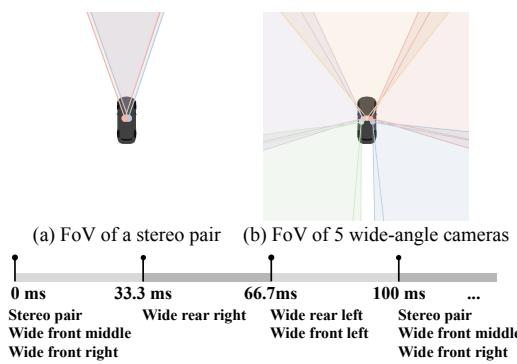
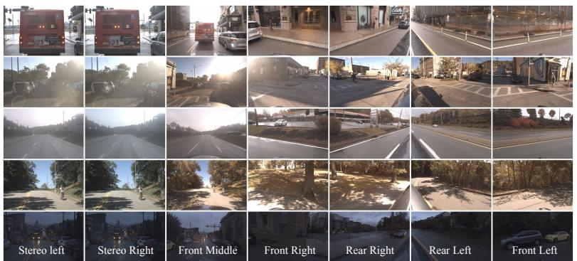
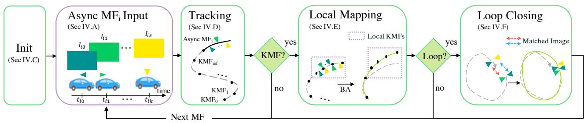
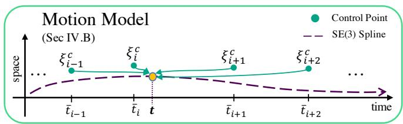

# Asynchronous Multi-View SLAM

Anqi Joyce Yang $^{1,2}$ , Can Cui $^{1,3}$ , Ioan Andrei Bârsan $^{1,2}$ , Raquel Urtasun $^{1,2}$ , Shenlong Wang $^{1,2}$

Abstract- Existing multi-camera SLAM systems assume synchronized shutters for all cameras, which is often not the case in practice. In this work, we propose a generalized multicamera SLAM formulation which accounts for asynchronous sensor observations. Our framework integrates a continuous-time motion model to relate information across asynchronous multi-frames during tracking, local mapping, and loop closing. For evaluation, we collected AMV-Bench, a challenging new SLAM dataset covering $482\mathrm{km}$ of driving recorded using our asynchronous multi-camera robotic platform. AMV-Bench is over an order of magnitude larger than previous multi-view HD outdoor SLAM datasets, and covers diverse and challenging motions and environments. Our experiments emphasize the necessity of asynchronous sensor modeling, and show that the use of multiple cameras is critical towards robust and accurate SLAM in challenging outdoor scenes. The supplementary material is located at: https://www.cs.toronto.edu/~ajyang/amv-slam

# I. INTRODUCTION

Simultaneous Localization and Mapping (SLAM) is the task of localizing an autonomous agent in unseen environments by building a map at the same time. SLAM is a fundamental part of many technologies ranging from augmented reality to photogrammetry and robotics. Due to the availability of camera sensors and the rich information they provide, camera-based SLAM, or visual SLAM, has been widely studied and applied in robot navigation.

Existing visual SLAM methods [1]–[5] and benchmarks [6]–[8] mainly focus on either monocular or stereo camera settings. Although lightweight, such configurations are prone to tracking failures caused by occlusion, dynamic objects, lighting changes and textureless scenes, all of which are common in the real world. Many of these challenges can be attributed to the narrow field of view typically used (Fig. 1a). Due to their larger field of view (Fig. 1b), wide-angle or fisheye lenses [9], [10] or multi-camera rigs [11]–[16] can significantly increase the robustness of visual SLAM systems [15].

Nevertheless, using multiple cameras comes with its own set of challenges. Existing stereo [5] or multi-camera [11]-[15] SLAM literature assumes synchronized shutters for all cameras and adopts discrete-time trajectory modeling based on this assumption. However, in practice different cameras are not always triggered at the same time, either due to technical limitations, or by design. For instance, the camera shutters could be synchronized to another sensor, such as a

spinning LiDAR (e.g., Fig. 1c), which is a common set-up in self-driving [17]–[20]. Moreover, failure to account for the robot motion in between the firing of the cameras could lead to localization failures. Consider a car driving along a highway at $30\mathrm{m / s}$ $(108\mathrm{km / h})$ . Then in a short 33ms camera firing interval, the vehicle would travel one meter, which is significant when centimeter-accurate pose estimation is required. As a result, a need arises for a generalization of multi-view visual SLAM to be agnostic to camera timing, while being scalable and robust to real-world conditions.

In this paper we formalize the asynchronous multi-view SLAM (AMV-SLAM) problem. Our first contribution is a general framework for AMV-SLAM, which, to the best of our knowledge, is the first full asynchronous continuous-time multi-camera visual SLAM system for large-scale outdoor environments. Key to this formulation is (1) the concept of asynchronous multi-frames, which group input images from multiple asynchronous cameras, and (2) the integration of a continuous-time motion model, which relates spatiotemporal information from asynchronous multi-frames for joint continuous-time trajectory estimation.

Since there is no public asynchronous multi-camera SLAM dataset, our second contribution is AMV-Bench, a novel large-scale dataset with high-quality ground-truth. AMV-Bench was collected during a full year in Pittsburgh, PA, and includes challenging conditions such as low-light scenes, occlusions, fast driving (Fig. 1d), and complex maneuvers like three-point turns and reverse parking. Our experiments show that multi-camera configurations are critical in overcoming adverse conditions in large-scale outdoor scenes. In addition, we show that asynchronous sensor modeling is crucial, as treating the cameras as synchronous leads to $30\%$ higher failure rate and $4\times$ the local pose errors compared to asynchronous modeling.

# II. RELATED WORK

1) Visual SLAM / Visual Odometry: SLAM has been a core area of research in robotics since 1980s [21]–[25]. The comprehensive survey by Cadena et al. [26] provides a detailed overview of SLAM. Modern visual SLAM approaches can be divided into direct and indirect methods. Direct methods like DTAM [27], LSD-SLAM [1], and DSO [3] estimate motion and map parameters by directly optimizing over pixel intensities (photometric error) [28], [29]. Alternatively, indirect methods, which are the focus of this work, minimize the re-projection energy (geometric error) [30] over an intermediate representation obtained from raw images. A common subset of these are feature-based methods like PTAM [31] and ORB-SLAM [4] which represent raw observations as sets of keypoints.

  
(c) Asynchronous camera firing timeline in our dataset

  
(d) Examples of camera data captured by our platform, in the order of camera firing time.   
Fig. 1: The asynchronous multi-camera rig in AMV-Bench, containing a stereo pair and five wide-angle cameras. The cameras are syncsed to a LiDAR, with the asynchronous firing schedule shown in (c). The sample images highlight challenging scenarios like occlusions, sunlight glare, low-textured highways, shadows on the road, and low-light rainy environments.

2) Multi-View SLAM: Monocular [1], [3], [4], [31] and stereo [2], [5], [32] are the most common visual SLAM configurations. However, many applications could benefit from a much wider field of view for better perception and situation awareness during navigation. Several multi-view SLAM approaches have been proposed [12]-[15], [33]-[38]. Early filtering-based approaches [33] treat multiple cameras as independent sensors, and fuse their observations using a central Extended Kalman Filter. Recent optimization-based multi-camera SLAM systems [12]-[15] extend monocular PTAM [31], ORB-SLAM [4] and DSO [3] respectively to synchronized multi-camera rigs to jointly estimate ego-poses at discrete timestamps. Multi-view visual-inertial systems such as VINS-MKF [36] and ROVINS [38] also assume synchronous camera timings.

3) Continuous-time Motion Models: Continuous-time motion models help relate sensors triggered at arbitrary times while moving, with applications such as calibration [39], [40], target tracking [41], [42] and motion planning [43], [44]. Continuous-time SLAM typically focuses on visual-inertial fusion [45], [46], rolling-shutter cameras [46]–[51] or LiDARs [52]–[55]. Klingner et al. [56] propose a continuous-time Structure-from-Motion framework for multiple synchronous rolling-shutter cameras. The key component for continuous-time trajectory modeling is choosing a family of functions that is both flexible and reflective of the kinematics. A common approach is fitting parametric functions over the states, e.g., piecewise linear functions [50], [56], spirals [57], wavelets [58], or B-splines [45], [59], [60]. Other approaches represent trajectories through non-parametric methods such as Gaussian Processes [39], [40], [55], [61]–[63].

# III. NOTATION

1) Coordinate Frame: We denote a coordinate frame $x$ with $\mathcal{F}_x$ . $\mathbf{T}_{yx}$ is the rigid transformation that maps homogeneous points from $\mathcal{F}_x$ to $\mathcal{F}_y$ . In this work we use three coordinate frames: the world frame $\mathcal{F}_w$ , the moving robot's body frame $\mathcal{F}_b$ , and the camera frame $\mathcal{F}_k$ associated with each camera $\mathcal{C}_k$ .

2) Pose and Motion: The pose of a 3D rigid body can be represented as a rigid transform from $\mathcal{F}_b$ to $\mathcal{F}_w$ as follows:

$$
\mathbf {T} _ {w b} = \left[ \begin{array}{c c} \mathbf {R} _ {w b} & \mathbf {t} _ {w} \\ \mathbf {0} ^ {T} & 1 \end{array} \right] \in \mathbb {S E} (3) \text {w i t h} \mathbf {R} _ {w b} \in \mathbb {S O} (3), \mathbf {t} _ {w} \in \mathbb {R} ^ {3}
$$

where $\mathbf{R}_{wb}$ is the $3\times 3$ rotation matrix, $\mathbf{t}_w$ is the translation vector, and $\mathbb{SE}(3)$ and $\mathbb{SO}(3)$ are the Special Euclidean and Special Orthogonal Matrix Lie Groups respectively. We define the trajectory of a 3D rigid body as a function $\mathbf{T}_{wb}(t):\mathbb{R}\to$ $\mathbb{SE}(3)$ over the time domain $t\in \mathbb{R}$

3) Lie Algebra Representation: For optimization purposes, a 6-DoF minimal pose representation associated with the Lie Algebra $\mathfrak{se}(3)$ of the matrix group $\mathbb{SE}(3)$ is widely adopted. It is a vector $\pmb{\xi} = [\pmb{v}^T\pmb{\omega}^T]^T \in \mathbb{R}^6$ , where $\pmb{v} \in \mathbb{R}^3$ and $\pmb{\omega} \in \mathbb{R}^3$ encode the translation and rotation components respectively. We use the uppercase Exp (and, conversely, Log) to convert $\pmb{\xi} \in \mathbb{R}^6$ to $\mathbf{T} \in \mathbb{SE}(3)$ : $\mathrm{Exp}(\pmb{\xi}) = \exp (\pmb{\xi}^{\wedge}) = \mathbf{T}$ , where exp is the matrix exponential, and $\pmb{\xi}^{\wedge} = \begin{bmatrix} \pmb{\omega}_{\times} & \pmb{v} \\ \pmb{0}^{T} & 0 \end{bmatrix} \in \mathfrak{se}(3)$ with $\pmb{\omega}_{\times}$ being the $3 \times 3$ skew-symmetric matrix of $\pmb{\omega}$ .

4) Motion Model: We use superscripts to denote the type of motion models. $c$ and $\ell$ represent the cubic B-spline motion model $\mathbf{T}^c (t)$ and the linear motion model $\mathbf{T}^\ell (t)$ respectively.

# IV. ASYNCHRONOUS MULTI-VIEW SLAM

We consider the asynchronous multi-view SLAM problem where the observations are captured by multiple cameras triggered at arbitrary times with respect to each other. Each camera $\mathcal{C}_k$ is assumed to be a calibrated pinhole camera with intrinsic matrix $\mathbf{K}_k$ , and extrinsics encoded by the mapping $\mathbf{T}_{kb}$ from the body frame $\mathcal{F}_b$ to camera frame $\mathcal{F}_k$ . The input to the problem is a sequence of image and capture timestamp pairs $\{(I_{ik}, t_{ik})\}_{\forall i}$ , associated with each camera $\mathcal{C}_k$ . The goal is then to estimate the robot trajectory $\mathbf{T}_{wb}(t)$ in the world frame. As a byproduct we also estimate a map $\mathcal{M}$ of the 3D structure of the environment as a set of points.

Our system follows the standard visual SLAM structure of initialization coupled with the three-threaded tracking, local mapping, and loop closing, with the key difference that we generalize to multiple cameras with asynchronous timing via asynchronous multi-frames (Sec. IV-A) and a

  
Fig. 2: Overview. Initialization is followed by tracking, local mapping and loop closing. MF=Multi-Frame; KMF=Key MF.

  
Fig. 3: Illustration of the cubic B-spline model. The pose $\mathbf{T}_{wb}^{c}(t)$ at time $t\in [\bar{t}_i,\bar{t}_{i + 1}]$ is defined by four control poses associated with key multi-frames indexed at $i - 1,i,i + 1,i + 2$

continuous-time motion model (Sec. IV-B). In particular, after initialization (Sec. IV-C), tracking (Sec. IV-D) takes each incoming multi-frame as input, infers its motion parameters, and decides whether to promote it as a key multi-frame (KMF). For efficiency, only KMFs are used during local mapping (Sec. IV-E) and loop closing (Sec. IV-F). When a new KMF is selected, the local mapping module refines poses and map points over a recent window of KMFs to ensure local consistency, while the loop closing module detects when a previously-mapped area is being revisited and corrects the drift to enhance global consistency. See Fig. 2 for an overview.

# A. Asynchronous Multi-Frames

Existing synchronous multi-view systems [14] group multiview images captured at the same time into a multi-frame as input. However, this cannot be directly applied when the firing time of each sensor varies. To generalize to asynchronous camera timings, we introduce the concept of asynchronous multi-frame, which groups images that are captured closely (e.g., within 100ms) in time. In Fig. 1 each asynchronous multi-frame contains the images taken during a single spinning LiDAR sweep at $10\mathrm{Hz}$ . Contrasting to synchronous multi-frames [14] that store images and a discrete pose estimated at a single timestamp, each asynchronous multi-frame $\mathrm{MF}_i$ stores: (1) a set of image and capture time pairs $\{(I_{ik},t_{ik})\}$ indexed by associated camera $\mathcal{C}_k$ , and (2) continuous-time motion model parameters to recover the estimated trajectory.

# B. Continuous-Time Trajectory Representation

To associate the robot pose with observations that could be made at arbitrary times, we formulate the overall robot trajectory as a continuous-time function $\mathbf{T}_{wb}(t):\mathbb{R}\to \mathbb{SE}(3)$ rather than discrete poses. We exploit a cumulative cubic B-spline function [45] as the first and second derivatives of this parameterization are smooth and computationally efficient to evaluate [59]. The cumulative structure is necessary

for accurate on-manifold interpolation in $\mathbb{SE}(3)$ [45], [64]. Following [45], given a knot vector $\mathbf{b} = [t_0, t_1, \dots, t_7] \in \mathbb{R}^8$ , a cumulative cubic B-spline trajectory $\mathbf{T}_{wb}^c(t)$ over $t \in [t_3, t_4)$ is defined by four control poses $\pmb{\xi}_0^c: \pmb{\xi}_3^c \in \mathbb{R}^6$ [45]. In our framework, we associate each key multi-frame $\mathrm{KMF}_i$ with a control pose. In addition, since the KMFs do not necessarily distribute evenly in time, we use a non-uniform knot vector. For each $\mathrm{KMF}_i$ , we define the representative time $\bar{t}_i$ as the median of all image capture times $t_{ik}$ , and define the knot vector as $\mathbf{b}_i = [\bar{t}_{i-3}, \bar{t}_{i-2}, \dots, \bar{t}_{i+4}] \in \mathbb{R}^8$ . Then, the spline trajectory over the interval $t \in [\bar{t}_i, \bar{t}_{i+1})$ can be expressed as a function of four control poses $\pmb{\xi}_{i-1}^c, \pmb{\xi}_i^c, \pmb{\xi}_{i+1}^c, \pmb{\xi}_{i+2}^c$ :

$$
\mathbf {T} _ {w b} ^ {c} (t) = \operatorname {E x p} \left(\boldsymbol {\xi} _ {i - 1} ^ {c}\right) \prod_ {j = 1} ^ {3} \operatorname {E x p} \left(\widetilde {B} _ {j, 4} (t) \boldsymbol {\Omega} _ {i - 1 + j}\right), \tag {1}
$$

where $\Omega_{i - 1 + j} = \mathrm{Log}(\mathrm{Exp}(\pmb{\xi}_{i - 2 + j}^{c})^{-1}\mathrm{Exp}(\pmb{\xi}_{i - 1 + j}^{c}))$ is the relative pose between control poses, and $B_{j,4}(t) = \sum_{l = j}^{3}B_{l,4}(t)\in \mathbb{R}$ is the cumulative basis function, where the basis function $B_{l,4}(t)$ is computed with the knot vector $\mathbf{b}_i$ using the de Boor-Cox formula [65], [66]. See Fig. 3 for an illustration, and the supplementary material for more details.

# C. Initialization

The system initialization assumes that there exists a pair of cameras that share a reasonable overlapping field of view and fire very closely in time (e.g., a synchronous stereo pair, present in most autonomous vehicle setups [19], [67], [68]). At the system startup, we create the first MF with the associated camera images and capture times, select it as the first KMF, set the representative time $\bar{t}_0$ to the camera pair firing time, the control pose $\pmb{\xi}_0^c$ to the origin of the world frame, and initialize the map with points triangulated from the camera pair. Map points from other camera images are created during mapping after the second KMF is inserted.

# D. Tracking

During tracking, we estimate the continuous pose of an incoming multi-frame $\mathrm{MF}_i$ by matching it with the most recent KMF. We then decide whether $\mathrm{MF}_i$ should be selected as a KMF for map refinement and future tracking. Following [4], we formulate pose estimation and map refinement as an indirect geometric energy minimization problem based on sparse image features.

1) Feature Matching: For each image in the new MF, we identify its reference images in the reference KMF as images captured by the same camera or any camera sharing a reasonable overlapping field of view. We extract sparse 2D keypoints and associated descriptors from the new images and match them against the reference image keypoints to establish associations with existing 3D map points. We denote the set of matches as $\{(\mathbf{u}_{i,k,j},\mathbf{X}_j)\}_{\forall (k,j)}$ where $\mathbf{u}_{i,k,j}\in \mathbb{R}^2$ is the 2D keypoint extracted from image $I_{ik}$ in $\mathrm{MF}_i$ ,and $\mathbf{X}_j\in \mathbb{R}^3$ is the matched 3D map point in the world frame.

2) Pose Estimation: Cubic B-splines are effective for modeling the overall trajectory, but directly using them in tracking entails estimating four 6-DoF control poses that define motion not only in the new MF, but also in the existing trajectory. Therefore, more information is needed for a stable estimation. For computational efficiency, we instead use a simpler and less expressive continuous-time linear motion model $\mathbf{T}_{wb}^{\ell}(t)$ during tracking, whose parameters are later used to initialize the cubic B-spline model in Sec. IV-E. Specifically, we estimate $\mathrm{MF}_i$ pose $\xi_i^\ell \in \mathbb{R}^6$ at the representative timestamp $\bar{t}_i$ , and evaluate the continuous pose with linear interpolation and extrapolation: $\mathbf{T}_{wb}^{\ell}(t) = \mathrm{Exp}(\pmb{\xi}_i^\ell)\left(\mathrm{Exp}(\pmb{\xi}_i^\ell)^{-1}\mathbf{T}_{wb}^c (\bar{t}_{\mathrm{ref}})\right)^\alpha$ , where $\alpha = \frac{\bar{t}_i - t}{t_i - t_{\mathrm{ref}}}$ and $\bar{t}_{\mathrm{ref}}$ is the representative timestamp of the reference KMF.

Coupled with the obtained multi-view correspondences, we formulate pose estimation for $\xi_i^\ell$ as a constrained, asynchronous, multi-view case of the perspective-n-points (PnP) problem, in which a geometric energy is minimized:

$$
E _ {g e o} \left(\boldsymbol {\xi} _ {i} ^ {\ell}\right) = \sum_ {(k, j)} \rho \left(\left\| \mathbf {e} _ {i, k, j} \left(\boldsymbol {\xi} _ {i} ^ {\ell}\right) \right\| _ {\boldsymbol {\Sigma} _ {i, k, j} ^ {- 1}} ^ {2}\right), \tag {2}
$$

where $\mathbf{e}_{i,k,j}(\pmb{\xi}_i^\ell) \in \mathbb{R}^2$ is the reprojection error of the matched correspondence pair $(\mathbf{u}_{i,k,j}, \mathbf{X}_j)$ , and $\pmb{\Sigma}_{i,k,j} \in \mathbb{R}^{2 \times 2}$ is a diagonal covariance matrix denoting the uncertainty of the match. $\rho$ denotes a robust norm, with Huber loss used in practice. The reprojection error for the pair is defined as:

$$
\mathbf {e} _ {i, k, j} \left(\boldsymbol {\xi} _ {i} ^ {\ell}\right) = \mathbf {u} _ {i, k, j} - \pi_ {k} \left(\mathbf {X} _ {j}, \mathbf {T} _ {w b} ^ {\ell} \left(t _ {i k}\right) \mathbf {T} _ {k b} ^ {- 1}\right), \tag {3}
$$

where $\pi_k(\cdot, \cdot): \mathbb{R}^3 \times \mathbb{SE}(3) \to \mathbb{R}^2$ is the perspective projection function of camera $C_k$ , $\mathbf{T}_{kb}$ is the respective camera extrinsic matrix, and $\mathbf{T}_{wb}^\ell(t)$ is the linear model used only during tracking to initialize the cubic B-spline model later.

We initialize $\xi_{i}^{\ell}$ by linearly extrapolating poses from the previous two multi-frames $\mathrm{MF}_{i - 2}$ and $\mathrm{MF}_{i - 1}$ based on a constant-velocity model. To achieve robustness against outlier map point associations, we wrap the above optimization in a RANSAC loop, where only a minimal number of $(\mathbf{u}_{i,k,j},\mathbf{X}_j)$ are sampled to obtain each hypothesis. We solve the optimization with the Levenberg-Marquardt (LM) algorithm within each RANSAC iteration. Given our initialization, the problem converges in a few steps in each RANSAC iteration.

3) Key Multi-Frame Selection: We use a hybrid key frame selection scheme based on estimated motion [31] and map point reobservability [4]. Namely, the current MF is registered as a KMF if the tracked pose has a local translational or rotational change above a certain threshold, or if the ratio of

map points reobserved in a number of cameras is below a certain threshold. In addition, to better condition the shape of cubic B-splines, a new KMF is regularly inserted during long periods of little change in motion and scenery (e.g., when the robot stops). Empirically we find reobservability-only heuristics insufficient during very fast motions in low-textured areas (e.g., fast highway driving), but show their combination with the motion-based heuristic to be robust to such scenarios.

# E. Local Mapping

When a new KMF is selected, we run local bundle adjustment to refine the 3D map structure and minimize drift accumulated from tracking errors in recent frames. Map points are then created and culled to reflect the latest changes.

1) Bundle Adjustment: We use windowed bundle adjustment to refine poses and map points in a set of recent KMFs. Its formulation is similar to the pose estimation problem, except extended to a window of $N$ key frames $\{\pmb{\xi}_i^c\}_{1\leq i\leq N}$ to jointly estimate a set of control poses and map points:

$$
E _ {g e o} \left(\left\{\boldsymbol {\xi} _ {i} ^ {c} \right\}, \left\{\mathbf {X} _ {j} \right\}\right) = \sum_ {(i, k, j)} \rho \left(\left\| \mathbf {e} _ {i, k, j} \left(\left\{\boldsymbol {\xi} _ {i} ^ {c} \right\}, \mathbf {X} _ {j}\right) \right\| _ {\boldsymbol {\Sigma} _ {i, k, j} ^ {- 1}} ^ {2}\right). \tag {4}
$$

Note that unlike tracking, we now refine the estimated local trajectory with the cubic B-spline model $\mathbf{T}_{wb}^{c}(t)$ parameterized by control poses $\{\pmb{\xi}_i^c\}$ . We initialize the control pose $\pmb{\xi}_N^c$ of the newly-inserted key multi-frame with $\pmb{\xi}_N^\ell$ estimated in tracking. For observations made after $\bar{t}_{N - 1}$ , their pose evaluation would involve control poses $\pmb{\xi}_{N + 1}^{c}$ and $\pmb{\xi}_{N + 2}^{c}$ and knot vector values $\bar{t}_{N + 1\leq p\leq N + 4}$ which do not yet exist. To handle such boundary cases, we represent these future control poses and timestamps as a linear extrapolation function of existing control poses and timestamps. We again minimize Eq. (4) with the LM algorithm.

2) Map Point Creation and Culling: With a newly-inserted KMF, we triangulate new map points with the refined poses and keypoint matches from overlapping image pairs both within the same KMF and across neighboring KMFs. To increase robustness against dynamic objects and outliers, we cull map points that are behind the cameras or have a reprojection errors above a certain threshold.

# F. Loop Closing

The loop closing module detects when the robot revisits an area, and corrects the accumulated drift to achieve global consistency in mapping and trajectory estimation. With a wider field of view, multi-view SLAM systems can detect loops that are encountered at arbitrary angles.

We extend the previous DBoW3 [69]-based loop detection algorithm [4] with a multi-view similarity check and a multiview geometric verification. To perform loop closure, we integrate the cubic B-spline motion model to formulate an asynchronous, multi-view case of the pose graph optimization problem. Please see the supplementary material for details.

# V. DATASET

Much of the recent progress in computer vision and robotics has been driven by the existence of large-scale high-quality datasets [6], [70], [72], [73]. However, in the field

TABLE I: An overview of major SLAM datasets. Legend: W = diverse weather, G = large geographic diversity, MV = multi-view, HD = vertical resolution ≥ 1080. *total travel distance not explicitly released at the time of writing.   

<table><tr><td>Name</td><td>Total km</td><td>Async</td><td>W</td><td>G</td><td>MV</td><td>HD</td></tr><tr><td>KITTI-360 [10]</td><td>74</td><td></td><td></td><td></td><td>✓</td><td>✓</td></tr><tr><td>RobotCar [70]</td><td>1000</td><td></td><td>✓</td><td></td><td>✓</td><td></td></tr><tr><td>Ford Multi-AV [67]</td><td>n/A*</td><td></td><td>✓</td><td></td><td>✓</td><td>✓</td></tr><tr><td>A2D2 [68]</td><td>≈100*</td><td></td><td>✓</td><td>✓</td><td>✓</td><td>✓</td></tr><tr><td>4Seasons [32]</td><td>350</td><td></td><td>✓</td><td>✓</td><td></td><td></td></tr><tr><td>EU Long-Term [71]</td><td>1000</td><td></td><td>✓</td><td></td><td>✓</td><td>✓</td></tr><tr><td>Ours</td><td>482</td><td>✓</td><td>✓</td><td>✓</td><td>✓</td><td>✓</td></tr></table>

of SLAM, in spite of their large number, previous datasets have been insufficient for evaluating asynchronous multiview SLAM systems due to either scale, diversity, or sensor configuration limitations. Such datasets either emphasize a specific canonical route over a long period of time, foregoing geographic diversity [67], [70], [71], do not have a surround camera configuration critical for robustness [6], [32], [70], or lack the large scale necessary for evaluating safety-critical SLAM systems [6], [10], [68], [74]. Furthermore, none of the existing SLAM datasets feature multiple asynchronous cameras to directly evaluate an AMV-SLAM system.

To address these limitations, we propose AMV-Bench, a novel large-scale asynchronous multi-view SLAM dataset recorded using a fleet of SDVs in Pittsburgh, PA over the span of one year. Table I shows a high-level comparison between the proposed dataset and other similar SLAM-focused datasets. Please see the supplementary material for details.

1) Sensor Configuration: Each vehicle is equipped with seven cameras, wheel encoders, an IMU, a consumer-grade GPS receiver, and an HDL-64E LiDAR. The LiDAR data is only used to compute the ground-truth poses. There are five wide-angle cameras spanning most of the vehicle's surroundings, and an additional forward-facing stereo pair. All intrinsic and extrinsic calibration parameters are computed in advance using a set of checkerboard calibration patterns. All images are rectified to a pinhole camera model.

Each camera has an RGB resolution of $1920 \times 1200$ pixels, and uses a global shutter. The five wide-angle cameras are hardware triggered in sync with the rotating LiDAR at an average frequency of $10\mathrm{Hz}$ , firing asynchronously with respect to each other. Fig. 1 illustrates the camera configuration.

2) Dataset Organization: The dataset contains 116 sequences spanning $482\mathrm{km}$ and 21h. All sequences are recorded during daytime or twilight. Each sequence ranges from 4 to 18 minutes, with a wide variety of scenarios including (1) diverse environments (busy streets, highways, residential and rural areas) (2) diverse weather ranging from sunny days to heavy precipitation; (3) diverse motions with varying speed (highway, urban traffic, parking lots), trajectory loops, and maneuvers including U-turns and reversing. Please refer to Fig. 1d for examples.

The dataset is split geographically into train, validation, and test subsets (65/25/26 sequences), as shown in the supplementary material. The ground-truth poses are obtained using an offline HD map-based global optimization leveraging

TABLE II: Baseline methods. M=monocular, S=stereo, A=all cameras. RPE-T(cm/m), RPE-R(rad/m), ATE(m), AUC(%)   

<table><tr><td rowspan="2">Method</td><td colspan="2">RPE-T</td><td colspan="2">RPE-R</td><td colspan="2">ATE</td><td rowspan="2">SR(%)</td></tr><tr><td>med</td><td>AUC</td><td>med</td><td>AUC</td><td>med</td><td>AUC</td></tr><tr><td>DSO-M [75]</td><td>42.72</td><td>28.08</td><td>8.02E-05</td><td>54.23</td><td>594.39</td><td>44.67</td><td>62.67</td></tr><tr><td>ORB-M [4]</td><td>34.00</td><td>25.66</td><td>5.49E-05</td><td>63.77</td><td>694.37</td><td>42.65</td><td>64.00</td></tr><tr><td>ORB-S [5]</td><td>1.85</td><td>65.70</td><td>3.29E-05</td><td>70.47</td><td>30.74</td><td>74.31</td><td>77.33</td></tr><tr><td>Sync-S</td><td>1.30</td><td>77.54</td><td>2.91E-05</td><td>78.37</td><td>24.53</td><td>77.44</td><td>84.00</td></tr><tr><td>Sync-A [14]</td><td>2.15</td><td>68.46</td><td>3.47E-05</td><td>70.47</td><td>58.18</td><td>75.01</td><td>74.67</td></tr><tr><td>Ours-A</td><td>0.35</td><td>88.63</td><td>1.13E-05</td><td>88.17</td><td>6.13</td><td>88.82</td><td>92.00</td></tr></table>

IMU, odometer, GPS, and LiDAR. The maps are built from multiple runs through the same area, ensuring ground-truth accuracy.

# VI. EXPERIMENTS

We evaluate our method on the proposed AMV-Bench dataset. We first show that it outperforms several popular SLAM methods [4], [5], [14], [75]. Next, we perform ablation studies highlighting the importance of asynchronous modeling, the use of multiple cameras, the impact of loop closure and, finally, the differences between feature extractors.

# A. Experimental Details

1) Implementation Details: All images are downsampled to $960 \times 600$ for both our method as well as all baselines. In our system, we extract 1000 ORB [76] keypoints from each image, using grid-based sampling [4] to encourage homogeneous distribution. Matching is performed with nearest neighbor + Lowe's ratio test [77] with threshold 0.7. A new KMF is inserted either (1) when the estimated local translation against reference KMF is over $1\mathrm{m}$ , or local rotation is over $1^{\circ}$ , or (2) when under $35\%$ of the map points are re-observed in at least two camera frames, or (3) when a KMF hasn't been inserted for 20 consecutive MFs. (3) is necessary to model the spline trajectory when the robot stays stationary. We perform bundle adjustment over a recent window of size $N = 11$ .

2) Experiment Set-Up & Metrics: We use the training set (65 sequences) for hyperparameter tuning, and the validation set (25 sequences) for testing. To account for stochasticity, we run each experiments three times. We use three classic metrics: absolute trajectory error (ATE) [78], relative pose error (RPE) [6], and success rate (SR). SR is the fraction of sequences that were successfully completed without SLAM failures such as tracking loss or repeated mapping failures. We evaluate ATE at $10\mathrm{Hz}$ and RPE at $1\mathrm{Hz}$ . For each method, we report the mean SR over the three trials.

For a large-scale dataset like AMV-Bench, it is impractical to list the ATE and RPE errors for each sequence. To aggregate results, for each method we report the median and the area under a cumulative error curve (AUC) of the errors in all trials at all evaluated timestamps. Missing entries due to SLAM failures are padded with infinity. AUC is computed between 0 and a given threshold, which we set to be $20\mathrm{cm / m}$ , 5E-04rad/m and 1km for RPE-T, RPE-R and ATE respectively.

# B. Results

1) Quantitative Comparison: We compare our method with multiple popular SLAM methods, including monocular

TABLE III: (Left) Ablation on motion models. (Right) Ablation on cameras, all with the cubic B-spline model; s=stereo, wf=wide-front, wb=wide-back. All ablations performed with loop closing disabled.   

<table><tr><td rowspan="2"></td><td colspan="2">RPE-T</td><td colspan="2">RPE-R</td><td colspan="2">ATE</td><td rowspan="2" colspan="2">SR</td><td colspan="2">Cameras</td><td colspan="2">RPE-T</td><td colspan="2">RPE-R</td><td colspan="2">ATE</td><td>SR</td><td rowspan="2"></td></tr><tr><td>med</td><td>AUC</td><td>med</td><td>AUC</td><td>med</td><td>AUC</td><td>s</td><td>wf</td><td>wb</td><td>med</td><td>AUC</td><td>med</td><td>AUC</td><td>med</td><td>AUC</td></tr><tr><td>Synch.</td><td>1.97</td><td>69.46</td><td>2.96E-05</td><td>73.39</td><td>55.24</td><td>75.11</td><td>70.7</td><td></td><td>✓</td><td></td><td></td><td>0.70</td><td>79.86</td><td>1.93E-05</td><td>80.48</td><td>11.44</td><td>75.75</td><td>88.0</td></tr><tr><td>Linear</td><td>0.41</td><td>87.76</td><td>1.11E-05</td><td>88.39</td><td>6.09</td><td>88.31</td><td>89.3</td><td></td><td>✓</td><td>✓</td><td></td><td>0.41</td><td>84.88</td><td>1.21E-05</td><td>85.86</td><td>9.00</td><td>84.92</td><td>90.7</td></tr><tr><td>B-spline</td><td>0.35</td><td>88.79</td><td>1.11E-05</td><td>88.47</td><td>6.53</td><td>89.04</td><td>92.0</td><td></td><td>✓</td><td>✓</td><td>✓</td><td>0.35</td><td>88.79</td><td>1.11E-05</td><td>88.47</td><td>6.53</td><td>89.04</td><td>92.0</td></tr><tr><td>Drift of Ours All-Cam w/ LC (m)</td><td>102</td><td>101</td><td>102</td><td>101</td><td>y(m)</td><td>y(m)</td><td>y(m)</td><td></td><td>800</td><td>600</td><td>2000</td><td>y(m)</td><td>y(m)</td><td>y(m)</td><td>y(m)</td><td>y(m)</td><td>y(m)</td><td>y(m)</td></tr><tr><td>101</td><td></td><td></td><td></td><td></td><td></td><td></td><td></td><td></td><td></td><td></td><td></td><td></td><td></td><td></td><td></td><td></td><td></td><td></td></tr><tr><td>100</td><td></td><td></td><td></td><td></td><td></td><td></td><td></td><td></td><td></td><td></td><td></td><td></td><td></td><td></td><td></td><td></td><td></td><td></td></tr><tr><td>10-1</td><td></td><td></td><td></td><td></td><td></td><td></td><td></td><td></td><td></td><td></td><td></td><td></td><td></td><td></td><td></td><td></td><td></td><td></td></tr><tr><td>10-2</td><td></td><td></td><td></td><td></td><td></td><td></td><td></td><td></td><td></td><td></td><td></td><td></td><td></td><td></td><td></td><td></td><td></td><td></td></tr><tr><td>10-1</td><td></td><td></td><td></td><td></td><td></td><td></td><td></td><td></td><td></td><td></td><td></td><td></td><td></td><td></td><td></td><td></td><td></td><td></td></tr><tr><td>10-2</td><td></td><td></td><td></td><td></td><td></td><td></td><td></td><td></td><td></td><td></td><td></td><td></td><td></td><td></td><td></td><td></td><td></td><td></td></tr><tr><td>Drift of Ours All-Cam w/o LC (m)</td><td></td><td></td><td></td><td></td><td></td><td></td><td></td><td></td><td></td><td></td><td></td><td></td><td></td><td></td><td></td><td></td><td></td><td></td></tr></table>

Fig. 4: (Left) Pose drift (1) after multi-view/stereo loop closure; (2) with/without multi-view loop closure. Colors correspond to different sequences. (Right) Qualitative results. Rightmost is a maneuver reversing into a parallel parking spot.

DSO [3], [75], and monocular [4] and stereo [5] ORBSLAM. We use the front middle camera in the monocular setting. We also compare with our discrete-time motion model implementation, using (1) only the stereo cameras, and (2) all 7 cameras, which corresponds to a multi-view sync baseline [14]. All methods are run with loop closure. Table II shows that our dataset is indeed challenging, with third-party baselines finishing under $80\%$ of the validation sequences. Our method significantly outperforms the rest in terms of accuracy and robustness. Our stereo-sync baseline performs better than [5] mostly due to the more robust key frame selection strategy.

2) Motion Model Ablation: We run the following experiments using all cameras but with different motion models: (1) a synchronous discrete-time model; (2) an asynchronous linear motion model; (3) an asynchronous cubic B-spline model, which is our proposed solution. Loop closing is disabled for simplicity. Table III shows that the wrong synchronous timing assumption finishes about $30\%$ fewer sequences and has local errors that are $4\times$ as high compared to the main system. Furthermore, trajectory modeling with cubic B-splines consistently outperforms the less expressive linear model.   
3) Camera Ablation: We experiment with different camera combinations with the same underlying cubic B-spline motion model. We disable loop closing for simplicity. Table III indicates a performance boost in all metrics with more cameras covering a wider field of view.   
4) Loop Closure: We first study the effect of multiple cameras on loop detection. Out of 9 validation sequences containing loops, our full method using all cameras could detect 8 loops with $100\%$ precision, while our stereo loop detection implementation was only able to detect 6 loops closed in the same direction. The leftmost subfigure of Fig. 4 compares the drift after multi-view vs. stereo loop closure. To further highlight the reduction in global trajectory drift, the second subfigure in Fig. 4 depicts the drift relative to the ground truth with and without loop closure at every multi-frame where loop closure was performed.

5) Features: Indirect SLAM typically uses classic keypoint extractors [76], [77], yet recently, learning-based extractors [79]–[83] have shown promising results. We benchmark a set of classic [76], [84] and learned [79], [83] keypoint extractors. For learned methods, we directly run the provided pre-trained models without re-training. Loop closure is disabled for simplicity. Our results show that SIFT and SuperPoint finish more sequences than ORB (98.7%/98.7% SR vs. 92.0% for ORB) and have higher ATE AUC (91.5%/96.3% vs. 89.0%), with the caveat that feature extraction is much slower.   
6) Runtime: Unlike monocular or stereo SLAM methods, asynchronous multi-view SLAM requires processing multiple camera images (seven in our setting). This introduces a linear multiplier to the complexity of the full SLAM pipeline, including feature extraction, tracking, bundle adjustment, and loop closure. Thus, despite the significant improvement on robustness and accuracy, our current implementation is not able to achieve real-time operation. Improving the efficiency of AMV-SLAM is thus an important area for future research.   
7) Qualitative Results: Fig. 4 plots trajectories of our method, ORB-SLAM2 [5] and the ground truth in selected validation sequences. Our approach outperforms ORB-SLAM2 and visually aligns well with the GT trajectories in most cases. We also showcase a failure case from a rainy highway sequence. For additional quantitative and qualitative results, please see the supplementary material.

# VII. CONCLUSION

In this paper, we formalized the problem of multi-camera SLAM with asynchronous shutters. Our framework groups input images into asynchronous multi-frames, and extends feature-based SLAM to the asynchronous multi-view setting using a cubic B-spline continuous-time motion model.

To evaluate AMV-SLAM systems, we proposed a new large-scale asynchronous multi-camera outdoor SLAM dataset, AMV-Bench. Experiments on this dataset highlight the necessity of the asynchronous sensor modeling, and the importance of using multiple cameras to achieve robustness and accuracy in challenging real-world conditions.

# REFERENCES

[1] J. Engel, T. Schöps, and D. Cremers, “LSD-SLAM: Large-scale direct monocular SLAM,” in ECCV. Springer, 2014, pp. 834–849. 1, 2   
[2] J. Engel, J. Stuckler, and D. Cremers, “Large-scale direct SLAM with stereo cameras,” in IROS. IEEE, 2015. 1, 2   
[3] J. Engel, V. Koltun, and D. Cremers, "Direct sparse odometry," PAMI, vol. 40, no. 3, pp. 611-625, 2017. 1, 2, 6   
[4] R. Mur-Artal, J. M. M. Montiel, and J. D. Tardos, "ORB-SLAM: A versatile and accurate monocular SLAM system," IEEE Trans. Robot., vol. 31, no. 5, pp. 1147-1163, 2015. 1, 2, 3, 4, 5, 6   
[5] R. Mur-Artal and J. D. Tardós, “ORB-SLAM2: An open-source slam system for monocular, stereo, and RGB-D cameras,” IEEE Trans. Robot., vol. 33, no. 5, pp. 1255–1262, 2017. 1, 2, 5, 6   
[6] A. Geiger, P. Lenz, C. Stiller, and R. Urtasun, “Vision meets robotics: The KITTI dataset,” *IJRR*, vol. 32, no. 11, pp. 1231–1237, 2013. 1, 4, 5   
[7] M. Burri, J. Nikolic, P. Gohl, T. Schneider, J. Rehder, S. Omari, M. W. Achtelik, and R. Siegwart, "The EuRoC micro aerial vehicle datasets," *IJRR*, 2016. 1   
[8] W. Wang, D. Zhu, X. Wang, Y. Hu, Y. Qiu, C. Wang, Y. Hu, A. Kapoor, and S. Scherer, "TartanAir: A dataset to push the limits of Visual SLAM," Mar. 2020. 1   
[9] “Introduction to Intel RealSense visual SLAM and the T265 tracking camera,” 2020. 1   
[10] J. Xie, M. Kiefel, M.-T. Sun, and A. Geiger, "Semantic instance annotation of street scenes by 3D to 2D label transfer," in CVPR, 2016. 1, 5   
[11] L. Heng, G. H. Lee, and M. Pollefeys, "Self-calibration and visual SLAM with a multi-camera system on a micro aerial vehicle," in RSS, Berkeley, USA, Jul. 2014. 1   
[12] M. J. Tribou, A. Harmat, D. W. Wang, I. Sharf, and S. L. Waslander, "Multi-camera parallel tracking and mapping with non-overlapping fields of view," *IJRR*, vol. 34, no. 12, pp. 1480-1500, 2015. 1, 2   
[13] A. Harmat, M. Trentini, and I. Sharf, "Multi-camera tracking and mapping for unmanned aerial vehicles in unstructured environments," Journal of Intelligent & Robotic Systems, vol. 78, no. 2, pp. 291-317, 2015. 1, 2   
[14] S. Urban and S. Hinz, "MultiCol-SLAM - a modular real-time multicamera SLAM system," arXiv preprint arXiv:1610.07336, 2016. 1, 2, 3, 5, 6   
[15] P. Liu, M. Geppert, L. Heng, T. Sattler, A. Geiger, and M. Pollefeys, "Towards robust visual odometry with a multi-camera system," in IROS, Oct. 2018. 1, 2   
[16] "Skydiox2," 2020, (accessed October 9, 2020). [Online]. Available: https://www.skydio.com/pages/skydio-x2_1   
[17] R. Kesten, M. Usman, J. Houston, T. Pandya, K. Nadhamuni, A. Ferreira, M. Yuan, B. Low, A. Jain, P. Ondruska, S. Omari, S. Shah, A. Kulkarni, A. Kazakova, C. Tao, L. Platinsky, W. Jiang, and V. Shet, "Lyft Level 5 perception dataset 2020," https://level5.lyft.com/dataset/2019.1   
[18] P. Sun, H. Kretzschmar, X. Dotiwalla, A. Chouard, V. Patnaik, P. Tsui, J. Guo, Y. Zhou, Y. Chai, B. Caine, V. Vasudevan, W. Han, J. Ngiam, H. Zhao, A. Timofeev, S. Ettinger, M. Krivokon, A. Gao, A. Joshi, Y. Zhang, J. Shlens, Z. Chen, and D. Anguelov, "Scalability in perception for autonomous driving: Waymo Open Dataset," in CVPR, June 2020. 1   
[19] H. Caesar, V. Bankiti, A. H. Lang, S. Vora, V. E. Liong, Q. Xu, A. Krishnan, Y. Pan, G. Baldan, and O. Beijbom, "nuScenes: A multimodal dataset for autonomous driving," in CVPR, June 2020. 1, 3   
[20] Y. Zhou, G. Wan, S. Hou, L. Yu, G. Wang, X. Rui, and S. Song, "DA4AD: End-to-end deep attention aware features aided visual localization for autonomous driving," in ECCV, 2020. 1   
[21] T. Bailey and H. Durrant-Whyte, "Simultaneous localization and mapping (SLAM): Part I," IEEE Robotics and Automation Magazine, vol. 13, no. 3, pp. 108-117, 2006. 1   
[22] J. Leonard, "Directed sonar sensing for mobile robot navigation," Ph.D. dissertation, University of Oxford, 1990. 1   
[23] A. Davison and D. Murray, "Mobile robot localisation using active vision," in ECCV, 1998. 1   
[24] S. Thrun, W. Burgard, and D. Fox, "A real-time algorithm for mobile robot mapping with applications to multi-robot and 3D mapping," in ICRA, 2000. 1

[25] M. Montemerlo, S. Thrun, D. Koller, and B. Wegbreit, "FastSLAM: A factored solution to the simultaneous localization and mapping problem," AAAI/IAAI, 2002. 1   
[26] C. Cadena, L. Carlone, H. Carrillo, Y. Latif, D. Scaramuzza, J. Neira, I. Reid, and J. J. Leonard, "Past, present, and future of simultaneous localization and mapping: Toward the robust-perception age," IEEE Trans. Robot., vol. 32, no. 6, pp. 1309-1332, 2016. 1   
[27] R. A. Newcombe, S. J. Lovegrove, and A. J. Davison, “DTAM: Dense tracking and mapping in real-time,” in ICCV. IEEE, 2011, pp. 2320–2327. 1   
[28] B. D. Lucas and T. Kanade, "An iterative image registration technique with an application to stereo vision," in IJCAI, 1981, pp. 674-679. 1   
[29] M. Irani and P. Anandan, "All about direct methods," in ICCV Theory and Practice, International Workshop on Vision Algorithms, 1999. 1   
[30] B. Triggs, P. McLauchlan, R. Hartley, and A. Fitzgibbon, “Bundle adjustment – a modern synthesis,” in International workshop on vision algorithms. Springer, 1999, pp. 298–372. 1   
[31] G. Klein and D. Murray, “Parallel tracking and mapping for small AR workspaces,” in ISMAR. IEEE Computer Society, 2007, pp. 1-10. 1, 2, 4   
[32] P. Wenzel, R. Wang, N. Yang, Q. Cheng, Q. Khan, L. von Stumberg, N. Zeller, and D. Cremers, "4Seasons: A cross-season dataset for multi-weather SLAM in autonomous driving," arXiv preprint arXiv:2009.06364, 2020. 2, 5   
[33] J. Sola, A. Monin, M. Devy, and T. Vidal-Calleja, “Fusing monocular information in multicamera SLAM,” IEEE Trans. Robot., vol. 24, no. 5, pp. 958–968, 2008. 2   
[34] G. Hee Lee, F. Faundorfer, and M. Pollefeys, “Motion estimation for self-driving cars with a generalized camera,” in CVPR, 2013, pp. 2746–2753. 2   
[35] X. Meng, W. Gao, and Z. Hu, “Dense RGB-D SLAM with multiple cameras,” Sensors, vol. 18, no. 7, p. 2118, 2018. 2   
[36] C. Zhang, Y. Liu, F. Wang, Y. Xia, and W. Zhang, "VINS-MKF: A tightly-coupled multi-keyframe visual-inertial odometry for accurate and robust state estimation," Sensors, vol. 18, no. 11, p. 4036, 2018. 2   
[37] W. Ye, R. Zheng, F. Zhang, Z. Ouyang, and Y. Liu, "Robust and efficient vehicles motion estimation with low-cost multi-camera and odometer-gyroscope," in IROS. IEEE, 2019, pp. 4490-4496. 2   
[38] H. Seok and J. Lim, "ROVINS: Robust omnidirectional visual inertial navigation system," RA-L, vol. 5, no. 4, pp. 6225-6232, 2020. 2   
[39] P. Furgale, J. Rehder, and R. Siegwart, “Unified temporal and spatial calibration for multi-sensor systems,” in IROS, 2013, pp. 1280–1286. 2   
[40] P. Furgale, C. H. Tong, T. D. Barfoot, and G. Sibley, “Continuous-time batch trajectory estimation using temporal basis functions,” Int. J. Rob. Res., vol. 34, no. 14, p. 1688–1710, Dec. 2015. [Online]. Available: https://doi.org/10.1177/0278364915585860 2   
[41] X. R. Li and V. P. Jilkov, "Survey of maneuvering target tracking, part I. dynamic models," IEEE Transactions on aerospace and electronic systems, vol. 39, no. 4, pp. 1333-1364, 2003. 2   
[42] D. Crouse, "Basic tracking using nonlinear continuous-time dynamic models [tutorial]," IEEE Aerospace and Electronic Systems Magazine, vol. 30, no. 2, pp. 4-41, 2015. 2   
[43] M. Zefran, “Continuous methods for motion planning,” IRCS Technical Reports Series, p. 111, 1996. 2   
[44] M. Mukadam, X. Yan, and B. Boots, "Gaussian process motion planning," in ICRA. IEEE, 2016, pp. 9-15. 2   
[45] S. Lovegrove, A. Patron-Perez, and G. Sibley, "Spline Fusion: A continuous-time representation for visual-inertial fusion with application to rolling shutter cameras," in BMVC, vol. 2, no. 5, 2013, p. 8. 2, 3   
[46] H. Ovren and P.-E. Forssén, “Trajectory representation and landmark projection for continuous-time structure from motion,” *IJRR*, vol. 38, no. 6, pp. 686–701, 2019. 2   
[47] J. Hedborg, P. E. Forssen, M. Felsberg, and E. Ringaby, "Rolling shutter bundle adjustment," CVPR, pp. 1434-1441, 2012. 2   
[48] C. Kerl, J. Stuckler, and D. Cremers, “Dense continuous-time tracking and mapping with rolling shutter RGB-D cameras,” in ICCV, 2015, pp. 2264–2272. 2   
[49] J.-H. Kim, C. Cadena, and I. Reid, "Direct semi-dense SLAM for rolling shutter cameras," in ICRA, 2016, pp. 1308-1315. 2   
[50] D. Schubert, N. Demmel, V. Usenko, J. Stuckler, and D. Cremers, "Direct sparse odometry with rolling shutter," ECCV, 2018. 2   
[51] T. Schöps, T. Sattler, and M. Pollefeys, “BAD SLAM: Bundle adjusted direct RGB-D SLAM,” in CVPR, 2019, pp. 134–144. 2

[52] J. Zhang and S. Singh, "LOAM: Lidar odometry and mapping in real-time," in RSS, Jul. 2014. 2   
[53] H. Alismail, L. D. Baker, and B. Browning, "Continuous trajectory estimation for 3D SLAM from actuated lidar," in ICRA, 2014. 2   
[54] D. Droeschel and S. Behnke, "Efficient continuous-time SLAM for 3D lidar-based online mapping," in ICRA, 2018. 2   
[55] J. N. Wong, D. J. Yoon, A. P. Schoellig, and T. Barfoot, “A data-driven motion prior for continuous-time trajectory estimation on SE(3),” RA-L, 2020. 2   
[56] B. Klingner, D. Martin, and J. Roseborough, "Street view motion-from-structure-from-motion," in ICCV, 2013. 2   
[57] W. Zeng, W. Luo, S. Suo, A. Sadat, B. Yang, S. Casas, and R. Urtasun, "End-to-end interpretable neural motion planner," in CVPR, 2019, pp. 8660-8669. 2   
[58] S. Anderson, F. Dellaert, and T. D. Barfoot, “A hierarchical wavelet decomposition for continuous-time SLAM,” in ICRA. IEEE, 2014, pp. 373–380. 2   
[59] C. Sommer, V. Usenko, D. Schubert, N. Demmel, and D. Cremers, "Efficient derivative computation for cumulative b-splines on lie groups," in CVPR, 2020, pp. 11148-11156. 2, 3   
[60] D. Hug and M. Chli, “On conceptualizing a framework for sensor fusion in continuous-time simultaneous localization and mapping,” in 3DV, 2020. 2   
[61] S. Anderson, T. D. Barfoot, C. H. Tong, and S. Särkkä, "Batch nonlinear continuous-time trajectory estimation as exactly sparse Gaussian process regression," Auton. Robots, 2015. 2   
[62] J. Dong, M. Mukadam, B. Boots, and F. Dellaert, "Sparse Gaussian processes on matrix lie groups: A unified framework for optimizing continuous-time trajectories," ICRA, 2018. 2   
[63] T. Y. Tang, D. J. Yoon, and T. D. Barfoot, “A white-noise-on-jerk motion prior for continuous-time trajectory estimation on SE(3),” RA-L, vol. 4, no. 2, pp. 594–601, 2019. 2   
[64] M.-J. Kim, M.-S. Kim, and S. Y. Shin, “A general construction scheme for unit quaternion curves with simple high order derivatives,” in Proceedings of the 22nd annual conference on Computer graphics and interactive techniques, 1995, pp. 369-376. 3   
[65] C. De Boor, "On calculating with B-splines," Journal of Approximation Theory, vol. 6, no. 1, pp. 50-62, 1972. 3   
[66] M. G. Cox, “The numerical evaluation of B-splines,” IMA Journal of Applied Mathematics, vol. 10, no. 2, pp. 134–149, 1972. 3   
[67] S. Agarwal, A. Vora, G. Pandey, W. Williams, H. Kourous, and J. McBride, "Ford Multi-AV seasonal dataset," arXiv preprint arXiv:2003.07969, 2020. 3, 5   
[68] J. Geyer, Y. Kassahun, M. Mahmudi, X. Ricou, R. Durgesh, A. S. Chung, L. Hauswald, V. H. Pham, M. Muhlegg, S. Dorn et al., "A2D2: Audi autonomous driving dataset," arXiv preprint arXiv:2004.06320, 2020. 3, 5   
[69] D. Gálvez-López and J. D. Tardós, “Bags of binary words for fast place recognition in image sequences,” IEEE Trans. Robot., vol. 28, no. 5, pp. 1188–1197, Oct. 2012. 4   
[70] W. Maddern, G. Pascoe, C. Linegar, and P. Newman, “1 year, 1000 km: The Oxford RobotCar dataset,” *IJRR*, vol. 36, no. 1, pp. 3–15, 2017. 4, 5   
[71] Z. Yan, L. Sun, T. Krajnik, and Y. Ruichek, “EU long-term dataset with multiple sensors for autonomous driving,” in IROS, 2020. 5   
[72] O. Russakovsky, J. Deng, H. Su, J. Krause, S. Satheesh, S. Ma, Z. Huang, A. Karpathy, A. Khosla, M. Bernstein, A. C. Berg, and L. Fei-Fei, "ImageNet large scale visual recognition challenge," IJCV, vol. 115, no. 3, pp. 211-252, 2015. 4   
[73] T.-Y. Lin, M. Maire, S. Belongie, J. Hays, P. Perona, D. Ramanan, P. Dollar, and C. L. Zitnick, "Microsoft COCO: Common objects in context," in ECCV, 2014, pp. 740-755. 4   
[74] N. Carlevaris-Bianco, A. K. Ushani, and R. M. Eustice, “University of Michigan North Campus long-term vision and lidar dataset,” IJRR, vol. 35, no. 9, pp. 1023–1035, 2016. 5   
[75] X. Gao, R. Wang, N. Demmel, and D. Cremers, “LDSO: Direct sparse odometry with loop closure,” in IROS. IEEE, 2018, pp. 2198–2204. 5, 6   
[76] E. Rublee, V. Rabaud, K. Konolige, and G. R. Bradski, "ORB: An efficient alternative to SIFT or SURF," in ICCV, vol. 11, no. 1, 2011, p. 2. 5, 6   
[77] D. G. Lowe, "Distinctive image features from scale-invariant keypoints," IJCV, vol. 60, no. 2, pp. 91-110, Nov. 2004. 5, 6

[78] J. Sturm, N. Engelhard, F. Endres, W. Burgard, and D. Cremers, “A benchmark for the evaluation of RGB-D SLAM systems,” in IROS, 2012, pp. 573–580. 5   
[79] D. DeTone, T. Malisiewicz, and A. Rabinovich, "SuperPoint: Self-supervised interest point detection and description," in CVPR Workshops, Jun. 2018. 6   
[80] Y. Ono, E. Trulls, P. Fua, and K. M. Yi, “LF-Net: learning local features from images,” in NIPS, 2018, pp. 6234–6244. 6   
[81] M. Dusmanu, I. Rocco, T. Pajdla, M. Pollefeys, J. Sivic, A. Torii, and T. Sattler, “D2-Net: A trainable CNN for joint description and detection of local features,” in CVPR, 2019, pp. 8092–8101. 6   
[82] X. Shen, C. Wang, X. Li, Z. Yu, J. Li, C. Wen, M. Cheng, and Z. He, “RF-Net: An end-to-end image matching network based on receptive field,” in CVPR, Jun. 2019. 6   
[83] J. Revaud, C. De Souza, M. Humenberger, and P. Weinzaepfel, “R2D2: Reliable and repeatable detector and descriptor,” in NIPS, 2019, pp. 12405–12415. 6   
[84] R. Arandjelović and A. Zisserman, “Three things everyone should know to improve object retrieval,” in CVPR, 2012, pp. 2911–2918. 6